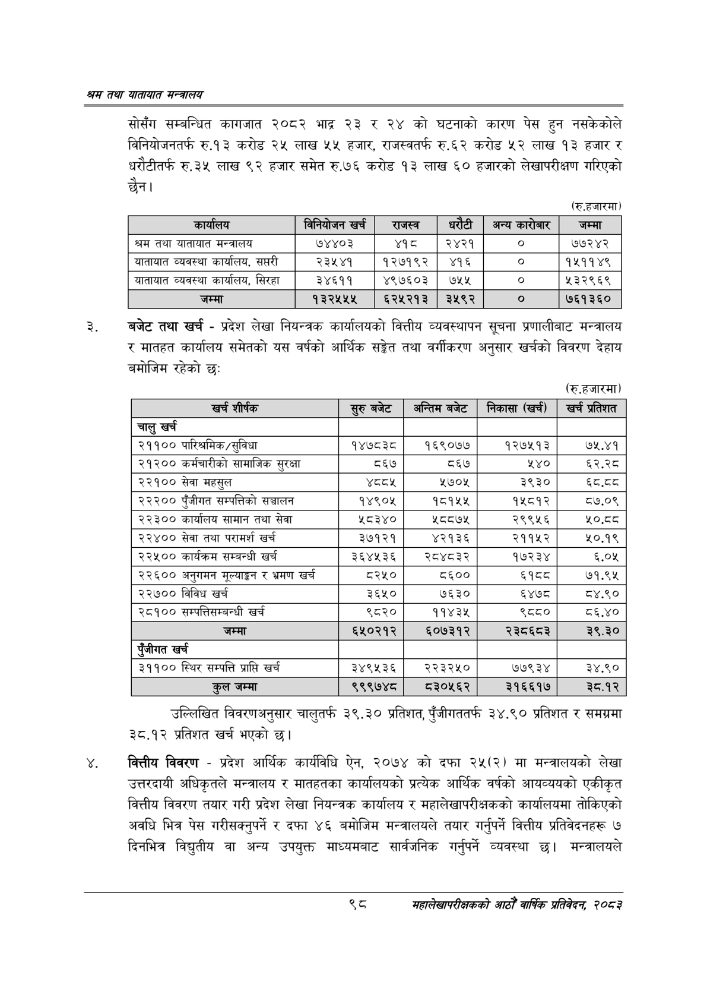

# Page 120 QA

## Rendered page


## Extracted text

```text
खस तथा यातायात मन्त्रालय
सोसँग सम्बन्धित कागजात २०८२ भाद्र २३ र २४ को घटनाको कारण पेस हुन नसकेकोले विनियोजनतर्फ रु.१३ करोड लाख ५५ हजार, राजस्वतर्फ रु.६२ करोड ५२ लाख १३ हजार र धरौटीतर्फ रु.३५ लाख ९२ हजार समेत रु.७६ करोड १३ लाख ६० हजारको लेखापरीक्षण गरिएको छैन।
(रु.हजारमा)
बजेट तथा खर्च -प्रदेश लेखा नियन्त्रक कार्यालयको वित्तीय व्यवस्थापन सूचना प्रणालीबाट मन्त्रालय र मातहत कार्यालय समेतको यस वर्षको आर्थिक सङ्केत तथा वर्गीकरण अनुसार खर्चको विवरण देहाय बमोजिम रहेको छ:
(रु.हजारमा)
उल्लिखित विवरणअनुसार चालुतर्फ ३९. ३० प्रतिशत, पुँजीगततर्फ ३४.९० प्रतिशत र समग्रमा ३८.१२ प्रतिशत खर्च भएको छ।
वित्तीय विवरण -प्रदेश आर्थिक कार्यविधि ऐन, २०७४ को दफा २५(२) मा मन्त्रालयको लेखा उत्तरदायी अधिकृतले मन्त्रालय र मातहतका कार्यालयको प्रत्येक आर्थिक वर्षको आयव्ययको एकीकृत वित्तीय विवरण तयार गरी प्रदेश लेखा नियन्त्रक कार्यालय र महालेखापरीक्षकको कार्यालयमा तोकिएको अवधि भित्र पेस गरीसक्नुपर्ने र दफा ४६ बमोजिम मन्त्रालयले तयार गर्नुपर्ने वित्तीय प्रतिवेदनहरू ७ दिनभित्र विद्युतीय वा अन्य उपयुक्त माध्यमबाट सार्वजनिक गर्नुपर्ने व्यवस्था छ। मन्त्रालयले
९्ट
महालेखापरीक्षकको आठौ वाषिकि प्रतिवेदन २०८२

|  | बिनियोजन खरी | राजस्व |  | अन्य पारेगार | जम्मा |
| --- | --- | --- | --- | --- | --- |
| श्रम तथा थाताबात मन्त्रालय | ७४४०३ | ४१८ | २४२१ |  | ७७२४२ |
| बाताबात व्यवस्था कार्बालष, सप्तरी | २३५४१ | १२७१९२ | ४१६ | ० | १५११४९ |
| बाताबात व्यवस्था कार्वाल, सिरहा | ३४६११ | ४९७६०३ | ७१५ | ० | २३२९६९ |
| जम्मा | १३२५५५ | ६२५२१३ | २५९२ | ० | ७६१३६० |

| खर्च शीर्षक | सुरु बबेट | अन्तिम बजेट | निकासा (खर्च) |
| --- | --- | --- | --- |
| चालु खर्च |  |  |  |
| २११०० पारिश्रमिक/सुविधा | १४७८३८ | १६९०७४ | १२७५१३ |
| २१२०० कर्मचारीको सामाजिक सुरक्षा | ८६७ | ८६७ | १४० |
| २२१०० सेवा महसुल |  | ५७०४ | ३९३० |
| २२२०० पुँजीगत सम्पत्तिको सञ्चालन | १४९०४५ | १८१५४५ | १५८१२ |
| २२३०० कार्यालय सामान तथा सेवा | श८३४० | श८८७५ | २९९५६ |
| २२४०० सेवा तथा परामर्श खर्च | ३७१२१ | ४२१३६ | २११५२ |
| २२५०० कार्यक्रम सम्बन्धी खर्च | ३६४५३६ | २८४८३२ | १७२३४ |
| २२६०० अनुगमन मूल्याङ्कन र भ्रमण खर्च | ८२५० | ८६०० | ध्पेव्व |
| २२७०० विविध खर्च | ३६५० | ७६३० | ६४७८ |
| २८१०० सम्पतिसम्जन्धी खर्च | ९८२० | ११४३४५ | ९८८० |
| जम्मा | ६५०२१२ | ६०७३१२ | २३८६८३ |
| एंजीगत खर्च |  |  |  |
| ३११०० स्थिर सम्पत्ति प्राप्ति खर्च | ३४९५३६ | २२३२५० | ७७९३४ |
| हल जम्मा | ९९९७४८ | ८३०५६२ | २१६६१७ |
```

## Flags
- table_page
- medium_quality_table
