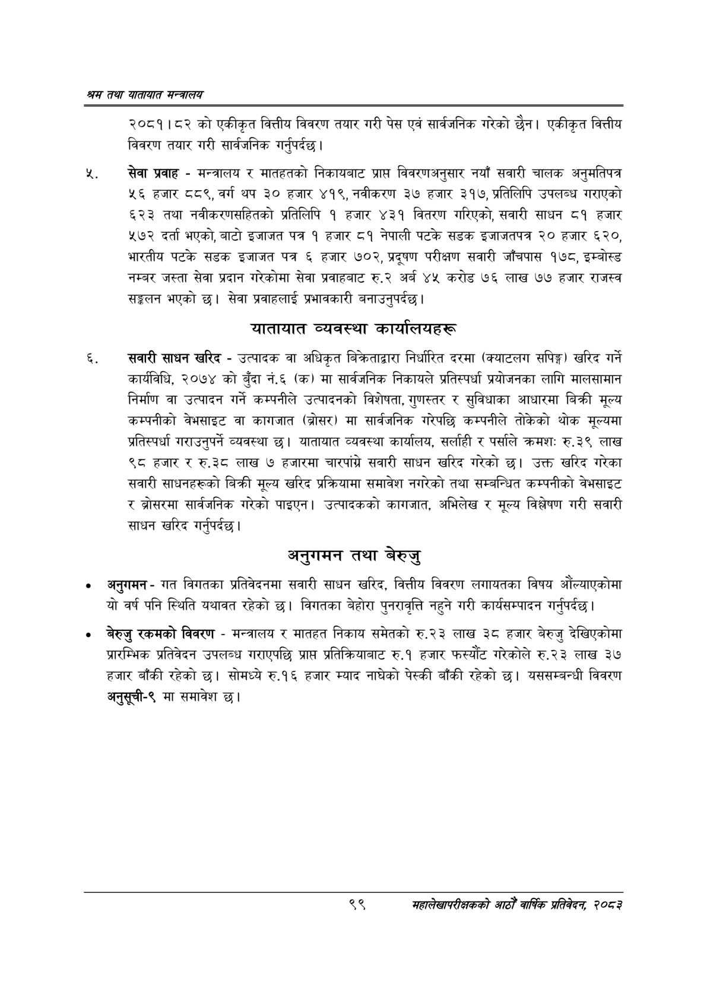

# Page 121 QA

## Rendered page


## Extracted text

```text
खस तथा यातायात मन्त्रालय
२०८१।८२ को एकीकृत वित्तीय विवरण तयार गरी पेस एवं सार्वजनिक गरेको छैन। एकीकृत वित्तीय विवरण तयार गरी सार्वजनिक गर्नुपर्दछ |
सेवा प्रवाह -मन्त्रालय र मातहतको निकायबाट प्राप्त विवरणअनुसार नयाँ सवारी चालक अनुमतिपत्र ४६ हजार ८८९, वर्ग थप ३० हजार ४१९, नवीकरण ३७ हजार ३१७, प्रतिलिपि उपलब्ध गराएको ६२३ तथा नवीकरणसहितको प्रतिलिपि १ हजार ४३१ वितरण गरिएको, सवारी साधन ८१ हजार ४७२ दर्ता भएको, बाटो इजाजत पत्र १ हजार ८१ नेपाली पटके सडक इजाजतपत्र २० हजार ६२०, भारतीय पटके सडक इजाजत पत्र ६ हजार ७०२, प्रदूषण परीक्षण सवारी जाँचपास १७८, इम्बोस्ड नम्बर जस्ता सेवा प्रदान गरेकोमा सेवा प्रवाहबाट रु.२ अर्ब ४५ करोड ७६ लाख ७७ हजार राजस्व सङ्कलन भएको | सेवा प्रवाहलाई प्रभावकारी बनाउनुपर्दछ |
यातायात व्यवस्था कार्यालयहरू
सवारी साधन खरिद -उत्पादक वा अधिकृत बिक्रेताद्वारा निर्धारित दरमा (क्याटलग सपिङ्ग) खरिद गर्ने कार्यविधि, २०७४ को बुँदा नं.६ (क) मा सार्वजनिक निकायले प्रतिस्पर्धा प्रयोजनका लागि मालसामान निर्माण वा उत्पादन गर्ने कम्पनीले उत्पादनको विशेषता, गुणस्तर र सुविधाका आधारमा बिक्री मूल्य कम्पनीको वेभसाइट वा कागजात (ब्रोसर) मा सार्वजनिक गरेपछि कम्पनीले तोकेको थोक मूल्यमा प्रतिस्पर्धा गराउनुपर्ने व्यवस्था छ। यातायात व्यवस्था कार्यालय, सर्लाही र पर्साले क्रमशः रु.३९ लाख ९८ हजार र रु.३८ लाख ७ हजारमा चारपांग्रे सवारी साधन खरिद गरेको छ। उक्त खरिद गरेका सवारी साधनहरूको बिक्री मूल्य खरिद प्रक्रियामा समावेश नगरेको तथा सम्बन्धित कम्पनीको वेभसाइट र ब्रोसरमा सार्वजनिक गरेको पाइएन। उत्पादकको कागजात, अभिलेख र मूल्य विश्लेषण गरी सवारी साधन खरिद गर्नुपर्दछ |
अनुगमन तथा बेरुजु
० अनुगमन -गत विगतका प्रतिवेदनमा सवारी साधन खरिद, वित्तीय विवरण लगायतका विषय औंल्याएकोमा यो वर्ष पनि स्थिति यथावत रहेको छ। विगतका बेहोरा पुनरावृत्ति नहुने गरी कार्यसम्पादन गर्नुपर्दछ |
बेरुजु रकमको विवरण -मन्त्रालय र मातहत निकाय समेतको रु.२३ लाख ३८ हजार बेरुजु देखिएकोमा प्रारम्भिक प्रतिवेदन उपलब्ध गराएपछि प्राप्त प्रतिक्रियाबाट रु.१ हजार फस्यौट गरेकोले रु.२३ लाख ३७ हजार बाँकी रहेको छ। सोमध्ये रु.१६ हजार म्याद नाघेको पेस्की बाँकी रहेको छ। यससम्बन्धी विवरण अनुसूची-९ मा समावेश छ।
९९
महालेखापरीक्षकको आठौ वाषिकि प्रतिवेदन २०८२
```

## Flags
- None
