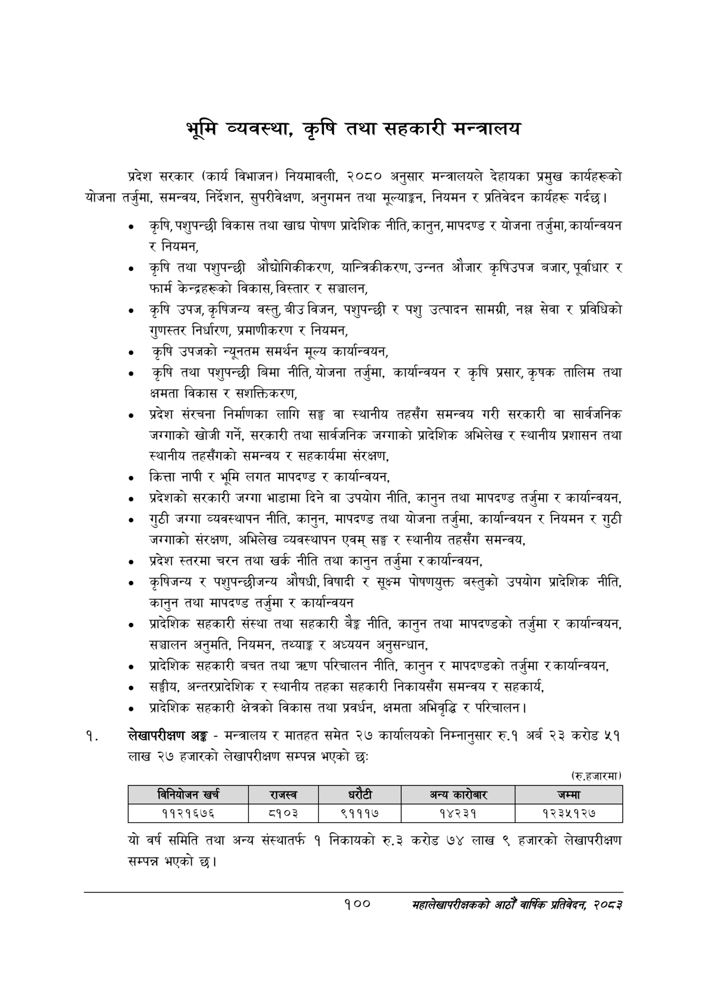

# Page 122 QA

## Rendered page


## Extracted text

```text
भूमि व्यवस्था, कृषि तथा सहकारी मन्त्रालय
प्रदेश सरकार (कार्य विभाजन) नियमावली, २०८० अनुसार मन्त्रालयले देहायका प्रमुख कार्यहरूको योजना तर्जुमा, समन्वय, निर्देशन, सुपरीवेक्षण, अनुगमन तथा मूल्याङ्कन, नियमन र प्रतिवेदन कार्यहरू गर्दछ।
कृषि, पशुपन्छी विकास तथा खाद्य पोषण प्रादेशिक नीति, कानुन, मापदण्ड र योजना तर्जुमा, कार्यान्वयन र नियमन,
कृषि तथा पशुपन्छी औद्योगिकीकरण, यान्त्रिकीकरण, उन्नत औजार कृषिउपज बजार, पूर्वाधार र फार्म केन्द्रहरूको विकास, विस्तार र सञ्चालन,
कृषि उपज, कृषिजन्य वस्तु, बीउ विजन, पशुपन्छी र पशु उत्पादन सामग्री, सेवा र प्रविधिको गुणस्तर निर्धारण, प्रमाणीकरण र नियमन,
कृषि उपजको न्यूनतम समर्थन मूल्य कार्यान्वयन,
कृषि तथा पशुपन्छी बिमा नीति, योजना तर्जुमा, कार्यान्वयन र कृषि प्रसार, कृषक तालिम तथा क्षमता विकास र सशक्तिकरण,
प्रदेश संरचना निर्माणका लागि सङ्घ वा स्थानीय तहसँग समन्वय गरी सरकारी वा सार्वजनिक जग्गाको खोजी गर्ने, सरकारी तथा सार्वजनिक जग्गाको प्रादेशिक अभिलेख र स्थानीय प्रशासन तथा स्थानीय तहसँगको समन्वय र सहकार्यमा संरक्षण,
कित्ता नापी र भूमि लगत मापदण्ड र कार्यान्वयन,
प्रदेशको सरकारी जग्गा भाडामा दिने वा उपयोग नीति, कानुन तथा मापदण्ड तर्जुमा र कार्यान्वयन,
गुठी जग्गा व्यवस्थापन नीति, कानुन, मापदण्ड तथा योजना तर्जुमा, कार्यान्वयन र नियमन र जग्गाको संरक्षण, अभिलेख व्यवस्थापन एवम्‌ सङ्घ र स्थानीय तहसँग समन्वय,
प्रदेश स्तरमा चरन तथा खर्क नीति तथा कानुन तर्जुमा र कार्यान्वयन,
कृषिजन्य र पशुपन्छीजन्य औषधी, विषादी र सूक्ष्म पोषणयुक्त बस्तुको उपयोग प्रादेशिक नीति, कानुन तथा मापदण्ड तर्जुमा र कार्यान्वयन
प्रादेशिक सहकारी संस्था तथा सहकारी बेङ्ग नीति, कानुन तथा मापदण्डको तर्जुमा र कार्यान्वयन, सञ्चालन अनुमति, नियमन, तथ्याङ्क र अध्ययन अनुसन्धान,
प्रादेशिक सहकारी बचत तथा त्रहण परिचालन नीति, कानुन र मापदण्डको तर्जुमा र कार्यान्वयन,
सङ्घीय, अन्तरप्रादेशिक र स्थानीय तहका सहकारी निकायसँग समन्वय र सहकार्य,
प्रादेशिक सहकारी क्षेत्रको विकास तथा प्रवर्धन, क्षमता अभिवृद्धि र परिचालन |
लेखापरीक्षण अङ्ग -मन्त्रालय र मातहत समेत २७ कार्यालयको निम्नानुसार रु.१ अर्ब २३ करोड ५१ लाख २७ हजारको लेखापरीक्षण सम्पन्न भएको छ:
(रू.हजारमा)
यो वर्ष समिति तथा अन्य संस्थातर्फ १ निकायको रु.३ करोड ७४ लाख ९ हजारको लेखापरीक्षण सम्पन्न भएको
गुठी
१००
महालेखापरीक्षकको आठौ वाषिकि प्रतिवेदन २०८२

| िनिवोजन खर्च | राजस्व | धरेटी |  | अन्य कारोबार | जम्मा |
| --- | --- | --- | --- | --- | --- |
| ११२१६७६ | ८१०३ | ९१११७ |  | १४२३१ | १२३५१२७ |
```

## Flags
- table_page
- medium_quality_table
