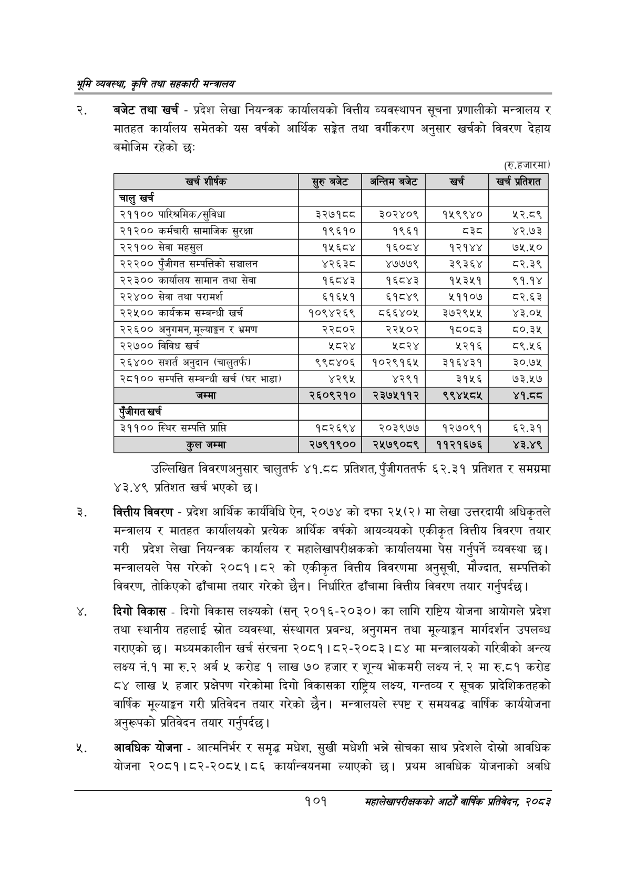

# Page 123 QA

## Rendered page


## Extracted text

```text
श्रृमि व्यवस्था; कृषि तथा सहकारी सन्वालय
बजेट तथा खर्च -प्रदेश लेखा नियन्त्रक कार्यालयको वित्तीय व्यवस्थापन सूचना प्रणालीको मन्त्रालय र मातहत कार्यालय समेतको यस वर्षको आर्थिक सङ्ेत तथा वर्गीकरण अनुसार खर्चको विवरण देहाय बमोजिम रहेको छः
(रू.हजारमा
उल्लिखित विवरणअनुसार चालुतर्फ ४१.८८ प्रतिशत, पुँजीगततर्फ ६२.३१ प्रतिशत र समग्रमा ४३.४९ प्रतिशत खर्च भएको |
वित्तीय विवरण -प्रदेश आर्थिक कार्यविधि ऐन, २०७४ को दफा २५(२) मा लेखा उत्तरदायी अधिकृतले मन्त्रालय र मातहत कार्यालयको प्रत्येक आर्थिक वर्षको आयव्ययको एकीकृत वित्तीय विवरण तयार गरी प्रदेश लेखा नियन्त्रक कार्यालय र महालेखापरीक्षकको कार्यालयमा पेस गर्नुपर्ने व्यवस्था छ। मन्त्रालयले पेस गरेको २०८१।८२ को एकीकृत वित्तीय विवरणमा अनुसूची, मौज्दात, सम्पत्तिको विवरण, तोकिएको ढाँचामा तयार गरेको छैन। निर्धारित ढाँचामा वित्तीय विवरण तयार गर्नुपर्दछ।
दिगो विकास -दिगो विकास लक्ष्यको (सन्‌ २०१६-२०३०) का लागि राष्ट्रिय योजना आयोगले प्रदेश तथा स्थानीय तहलाई स्रोत व्यवस्था, संस्थागत प्रबन्ध, अनुगमन तथा मूल्याङ्कन मार्गदर्शन उपलब्ध गराएको | मध्यमकालीन खर्च संरचना २०८१।८२-२०८३। ८४ मा मन्त्रालयको गरिबीको अन्त्य लक्ष्य नं.१मा रु.२ अर्ब ५ करोड १ लाख ७० हजार र शून्य भोकमरी लक्ष्य नं.२ मा रु.८१ करोड ८४ लाख ५ हजार प्रक्षेपण गरेकोमा दिगो विकासका राष्ट्रिय लक्ष्य, गन्तव्य र सूचक प्रादेशिकतहको वार्षिक मूल्याङ्कन गरी प्रतिवेदन तयार गरेको | मन्त्रालयले स्पष्ट र समयवद्ध वार्षिक कार्ययोजना अनुरूपको प्रतिवेदन तयार गर्नुपर्दछ |
आवधिक योजना -आत्मनिर्भर र समृद्ध मधेश, सुखी मधेशी भन्ने सोचका साथ प्रदेशले दोस्रो आवधिक योजना २०८१।८२-२०८५४५।८६ कार्यान्वयनमा ल्याएको छ। प्रथम आवधिक योजनाको अवधि
१०१
महालेखापरीक्षकको आठौ वाषिकि प्रतिवेदन २०८२

| खर्च शीर्षक | सुरु बबेट | अन्तिम बजेट | खर्च | खर्च प्रतिशत |
| --- | --- | --- | --- | --- |
| चालु खर्च |  |  |  |  |
| २११०० पारिश्रमिक/सुविधा | ३२७१८८ | ३०२४०९ | १५९९४० | ५२.८९ |
| २१२०० कर्बचारी सामाजिक सुरक्षा | १९६१० | १९६१ | दश | ४२.७३ |
| २२१०० सेवा महसुल | १५६८४ | १६०८४ | १२१४४ | ७५.५० |
| २२२०० रृंजीगत खन्पत्तिको सञ्चालन | ४२६३८ | ४७७७९ | ३९३६४ | ८२.३९ |
| २२३०० कार्ालष सामान तथा सेवा | १६८४३ | १६८४३ | १५३४५१ | ९१.१४ |
| २२४०० सेवा तथा परामर्श | ६१६५१ | ६१८४९ | ५११०७ | ८२.६३ |
| २२५०० कार्वक्रन सम्बन्धी खर्च | १०९४२६९ | व६६४०५ | ३७२९५५ | ४३.०५ |
| २२६०० अनुनमन, मूल्याङ्कन र भ्रमण | २२८०२ | २२५०२ | १८०८३ | ८०.३४५ |
| २२७०० विविध खर्च | ५८२४ | ५८२४ | ५२१६ | ८९.५६ |
| २६४०० अनुदान (चालुतफ) | ९९८४०६ | १०२९१६४५ | ३१६४३१ | ३०.७५ |
| २८१०० सम्पत्ति सम्बन्धी खर्च (घर भाडा) | ४२९५ | ४२९१ | ३१५६ | ७३.५७ |
| जम्मा | २६०९२१० | २३७५११२ | ९९४४५८४५ | ४१.ठठ |
|  |  |  |  |  |
| ३११०० स्थिर सम्पत्ति प्राप्त | १८२६९४ | २०३९७७ | १२७०९१ | ६२.३१ |
| जम्मा | २७९१९०० | २५७९०८९ | ११२१६७६ | ४३.४९ |
```

## Flags
- table_page
- medium_quality_table
