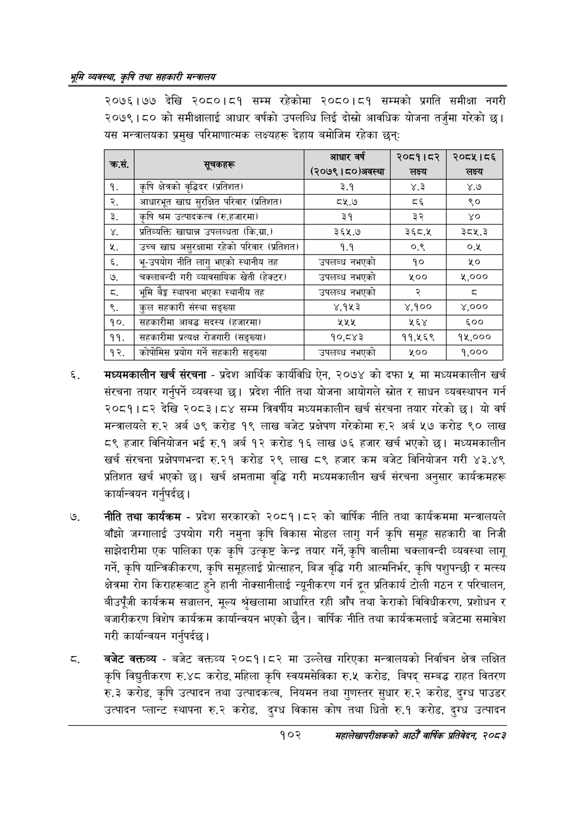

# Page 124 QA

## Rendered page


## Extracted text

```text
श्रृमि व्यवस्था; कृषि तथा सहकारी सन्वालय
२०७६।७७ देखि २०८०।८१ सम्म रहेकोमा २०८०।८१ सम्मको प्रगति समीक्षा नगरी २०७९।८० को समीक्षालाई आधार वर्षको उपलब्धि लिई दोस्रो आवधिक योजना तर्जुमा गरेको छ। यस मन्त्रालयका प्रमुख परिमाणात्मक लक्ष्यहरू देहाय बमोजिम रहेका छन्‌ः
मध्यमकालीन खर्च संरचना -प्रदेश आर्थिक कार्यविधि ऐन, २०७४ को दफा ५ मा मध्यमकालीन खर्च संरचना तयार गर्नुपर्ने व्यवस्था छ। प्रदेश नीति तथा योजना आयोगले स्रोत र साधन व्यवस्थापन गर्न २०८१।८२ देखि २०८३।८४ सम्म त्रिवर्षीय मध्यमकालीन खर्च संरचना तयार गरेको छ। यो वर्ष मन्त्रालयले रु.२ अर्ब ७९ करोड १९ लाख बजेट प्रक्षेपण गरेकोमा रु.२ अर्ब ५७ करोड ९० लाख ८९ हजार विनियोजन भई रु.१ अर्ब १२ करोड १६ लाख ७६ हजार खर्च भएको छ। मध्यमकालीन खर्च संरचना प्रक्षेपणभन्दा रु.२१ करोड २९ लाख ८९ हजार कम बजेट विनियोजन गरी ४३.४९ प्रतिशत खर्च भएको छ। खर्च क्षमतामा वृद्धि गरी मध्यमकालीन खर्च संरचना अनुसार कार्यक्रमहरू कार्यान्वयन गर्नुपर्दछ |
नीति तथा कार्यक्रम -प्रदेश सरकारको २०८१।८२ को वार्षिक नीति तथा कार्यक्रममा मन्त्रालयले बाँझो जग्गालाई उपयोग गरी नमुना कृषि विकास मोडल लागु गर्न कृषि समूह सहकारी वा निजी साझेदारीमा एक पालिका एक कृषि उत्कृष्ट केन्द्र तयार गर्ने, कृषि वालीमा चक्लावन्दी व्यवस्था लागू गर्ने, कृषि यान्त्रिकीकरण, कृषि समूहलाई प्रोत्साहन, बिज वृद्धि गरी आत्मनिर्भर, कृषि पशुपन्छी र मत्स्य क्षेत्रमा रोग किराहरूबाट हुने हानी नोक्सानीलाई न्यूनीकरण गर्न ५ प्रतिकार्य टोली गठन र परिचालन, बीउपूँजी कार्यक्रम सञ्चालन, मूल्य श्रृखलामा आधारित रही आँप तथा केराको विविधीकरण, प्रशोधन र बजारीकरण विशेष कार्यक्रम कार्यान्वयन भएको छैन। वार्षिक नीति तथा कार्यक्रमलाई बजेटमा समावेश गरी कार्यान्वयन गर्नुपर्दछ |
बजेट क्क्तव्य -बजेट वक्तव्य २०८१।८२ मा उल्लेख गरिएका मन्त्रालयको निर्वाचन क्षेत्र लक्षित कृषि विद्युतीकरण रु.४८ करोड, महिला कृषि स्वयमसेविका रु.५ करोड, विपद्‌ सम्बद्ध राहत वितरण रु.३ करोड, कृषि उत्पादन तथा उत्पादकत्व, नियमन तथा गुणस्तर सुधार रु.२ करोड, दुग्ध पाउडर उत्पादन प्लान्ट स्थापना रु.२ करोड, दुग्ध विकास कोष तथा घितो रु.१ करोड, दुग्ध उत्पादन
१०२
महालेखापरीक्षकको आठौ वाषिकि प्रतिवेदन २०८२

| . क्रस. | सूचकहरू | आधार वर्ष (२०७९।८०)अवस्था | २०८१।८२ लक्ष्य | २०८५।८६ लक्ष्य |
| --- | --- | --- | --- | --- |
| १ | कृषि क्षेत्रको वृद्धिदर (प्रतिशत) | ३.१ | ४.३ | ४.७ |
| २ | आधारभूत खाद्य सुरक्षित परिवार (प्रतिशत) | ८५.७ | ८६ | ९० |
| ३ | कृषि श्रम उत्पादकत्व (रु.हजारमा) | ३१ | ३२ | ४० |
| ४ | श्रतिव्वत्ति खाद्यान्न उपलब्धता (कि.ग्रा.) | ३६५.७ | ३६८.५ | ३८५.३ |
| ५ | उच्च खाद्य असुरक्षामा रहेको परिवार (प्रतिशत) | १.१ | ०.९ | ०.५ |
| ६ | भू-उपयोग नीति लागु भएको स्थानीय तह | उपलन्ध नभएको | १० | १० |
| ७ | चक्लाबन्दी गरी न्यावसाथिक खेती (हेक्टर) | उपलब्ध नभएको | ५०० | ४,००० |
| ८ | भूमि वैङ्ग स्थापना भएका स्थानीय तह | उपलब्ध नभएको | २ | ३ |
| ९ | कुल स६करी संस्था सङ्ख्या | ४,१५३ | ४,१०० | ४,००० |
| १० | सहकारीमा आबद्ध सदस्य (हजारमा) | २५५ | ५६४ | ६०० |
| ११ | सहकारीमा प्रत्यक्ष रोजगारी (सङ्ख्या) | १०,८४३ | ११,१६९ | १५,००० |
| १२ | कोषोभिल्ल प्रयोग गर्ने ६%१० सङ्ख्या | उपलब्ध नभएको | ५०० | १,००० |
```

## Flags
- table_page
- medium_quality_table
