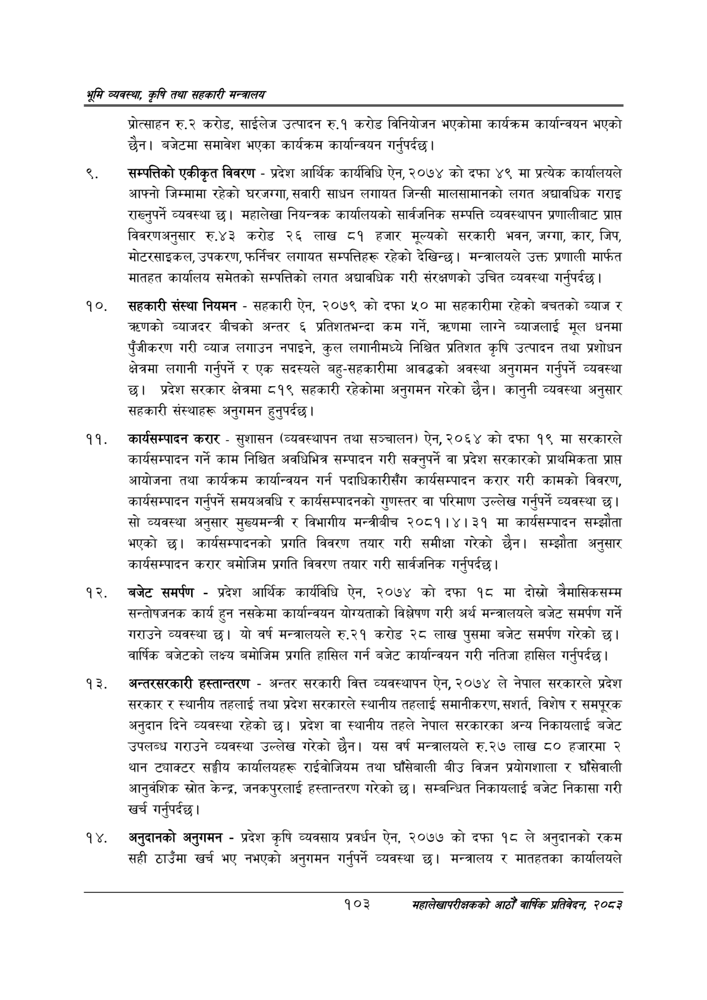

# Page 125 QA

## Rendered page


## Extracted text

```text
श्रृमि व्यवस्था; कृषि तथा सहकारी सन्वालय
प्रोत्साहन रु.२ करोड, साईलेज उत्पादन रु.१ करोड विनियोजन भएकोमा कार्यक्रम कार्यान्वयन भएको छैन। बजेटमा समावेश भएका कार्यक्रम कार्यान्वयन गर्नुपर्दछ |
सम्पत्तिको एकीकृत विवरण -प्रदेश आर्थिक कार्यविधि ऐन, २०७४ को दफा ४९ मा प्रत्येक कार्यालयले आफ्नो जिम्मामा रहेको घरजग्गा, सवारी साधन लगायत जिन्सी मालसामानको लगत अद्यावधिक गराइ राख्नुपर्ने व्यवस्था | महालेखा नियन्त्रक कार्यालयको सार्वजनिक सम्पत्ति व्यवस्थापन प्रणालीबाट प्राप्त विवरणअनुसार रु.४३ करोड २६ लाख ८१ हजार मूल्यको सरकारी भवन, जग्गा, कार, जिप, मोटरसाइकल, उपकरण, फर्निचर लगायत सम्पत्तिहरू रहेको देखिन्छ। मन्त्रालयले उक्त प्रणाली मार्फत मातहत कार्यालय समेतको सम्पत्तिको लगत अद्यावधिक गरी संरक्षणको उचित व्यवस्था गर्नुपर्दछ।
सहकारी संस्था नियमन -सहकारी ऐन, २०७९ को दफा ५० मा सहकारीमा रहेको बचतको ब्याज र च्रणको ब्याजदर बीचको अन्तर ६ प्रतिशतभन्दा कम गर्ने, त्रहणमा लाग्ने ब्याजलाई मूल धनमा पुँजीकरण गरी व्याज लगाउन नपाइने, कुल लगानीमध्ये निश्चित प्रतिशत कृषि उत्पादन तथा प्रशोधन क्षेत्रमा लगानी गर्नुपर्ने र एक सदस्यले बहु-सहकारीमा आवद्धको अवस्था अनुगमन गर्नुपर्ने व्यवस्था छ। प्रदेश सरकार क्षेत्रमा ८१९ सहकारी रहेकोमा अनुगमन गरेको छैन। कानुनी व्यवस्था अनुसार सहकारी संस्थाहरू अनुगमन हुनुपर्दछ |
कार्यसम्पादन करार -सुशासन (व्यवस्थापन तथा सञ्चालन) ऐन, २०६४ को दफा १९ मा सरकारले कार्यसम्पादन गर्ने काम निश्चित अवधिभित्र सम्पादन गरी सक्नुपर्ने वा प्रदेश सरकारको प्राथमिकता प्राप्त आयोजना तथा कार्यक्रम कार्यान्वयन गर्न पदाधिकारीसँग कार्यसम्पादन करार गरी कामको विवरण, कार्यसम्पादन गर्नुपर्ने समयअवधि र कार्यसम्पादनको गुणस्तर वा परिमाण उल्लेख गर्नुपर्ने व्यवस्था छ। सो व्यवस्था अनुसार मुख्यमन्त्री र विभागीय मन्त्रीबीच २०८१।४। ३१ मा कार्यसम्पादन सम्झौता भएको छ। कार्यसम्पादनको प्रगति विवरण तयार गरी समीक्षा गरेको छैन। सम्झौता अनुसार कार्यसम्पादन करार बमोजिम प्रगति विवरण तयार गरी सार्वजनिक गर्नुपर्दछ।
बजेट समर्पण -प्रदेश आर्थिक कार्यविधि ऐन, २०७४ को दफा १८ मा दोस्रो तरैमासिकसम्म सन्तोषजनक कार्य हुन नसकेमा कार्यान्वयन योग्यताको विश्लेषण गरी अर्थ मन्त्रालयले बजेट समर्पण गर्ने गराउने व्यवस्था | यो वर्ष मन्त्रालयले रु.२१ करोड २८ लाख पुसमा बजेट समर्पण गरेको | वार्षिक बजेटको लक्ष्य बमोजिम प्रगति हासिल गर्न बजेट कार्यान्वयन गरी नतिजा हासिल गर्नुपर्दछ |
अन्तरसरकारी हस्तान्तरण -अन्तर सरकारी वित्त व्यवस्थापन ऐन, २०७४ ले नेपाल सरकारले प्रदेश सरकार र स्थानीय तहलाई तथा प्रदेश सरकारले स्थानीय तहलाई समानीकरण, सशर्त, विशेष र समपूरक अनुदान दिने व्यवस्था रहेको छ। प्रदेश वा स्थानीय तहले नेपाल सरकारका अन्य निकायलाई बजेट उपलब्ध गराउने व्यवस्था उल्लेख गरेको छैन। यस वर्ष मन्त्रालयले रु.२७ लाख ८० हजारमा २ थान ट्याक्टर सङ्घीय कार्यालयहरू राईवोजियम तथा घाँसेबाली बीउ विजन प्रयोगशाला र घाँसेवाली आनुवंशिक स्रोत केन्द्र, जनकपुरलाई हस्तान्तरण गरेको | सम्बन्धित निकायलाई बजेट निकासा गरी खर्च गर्नुपर्दछ |
अनुदानको अनुगमन -प्रदेश कृषि व्यवसाय प्रवर्धन ऐन, २०७७ को दफा १८ ले अनुदानको रकम सही ठाउँमा खर्च भए नभएको अनुगमन गर्नुपर्ने व्यवस्था छ। मन्त्रालय र मातहतका कार्यालयले
१०३
महालेखापरीक्षकको आठौ वाषिकि प्रतिवेदन २०८२
```

## Flags
- None
