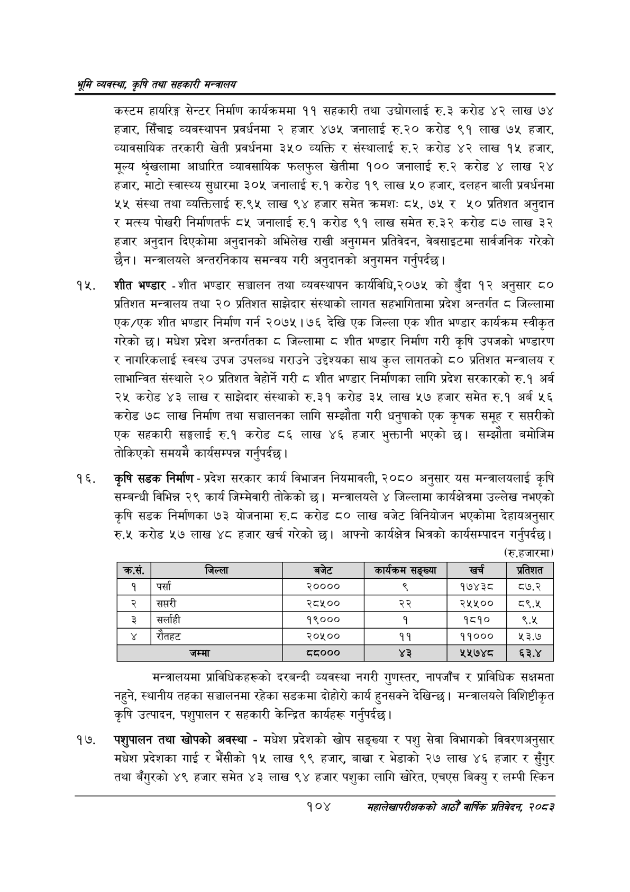

# Page 126 QA

## Rendered page


## Extracted text

```text
श्रृमि व्यवस्था; कृषि तथा सहकारी सन्वालय
कस्टम हायरिङ्ग सेन्टर निर्माण कार्यक्रममा ११ सहकारी तथा उद्योगलाई रु.३ करोड ४२ लाख ७४ हजार, सिँचाइ व्यवस्थापन प्रवर्धनमा २ हजार ४७५ जनालाई रु.२० करोड ९१ लाख ७५ हजार, व्यावसायिक तरकारी खेती प्रवर्धनमा ३५० व्यक्ति र संस्थालाई रु.२ करोड ४२ लाख १५ हजार, मूल्य श्रेखलामा आधारित व्यावसायिक फलफुल खेतीमा १०० जनालाई रु.२ करोड ४ लाख २४ हजार, माटो स्वास्थ्य सुधारमा ३०५ जनालाई रु.१ करोड १९ लाख ५० हजार, दलहन बाली प्रवर्धनमा ५५ संस्था तथा व्यक्तिलाई रु.९५ लाख ९४ हजार समेत क्रमशः ८५, ७५ र ५० प्रतिशत अनुदान र मत्स्य पोखरी निर्माणतर्फ ८५ जनालाई रु.१ करोड ९१ लाख समेत रु.३२ करोड ८७ लाख ३२ हजार अनुदान दिएकोमा अनुदानको अभिलेख राखी अनुगमन प्रतिवेदन, वेबसाइटमा सार्वजनिक गरेको छैन। मन्त्रालयले अन्तरनिकाय समन्वय गरी अनुदानको अनुगमन गर्नुपर्दछ |
शीत भण्डार -शीत भण्डार सञ्चालन तथा व्यवस्थापन कार्यविधि,२०७५ को बुँदा १२ अनुसार ८० प्रतिशत मन्त्रालय तथा २० प्रतिशत साझेदार संस्थाको लागत सहभागितामा प्रदेश अन्तर्गत ८ जिल्लामा एक/एक शीत भण्डार निर्माण गर्न २०७५।७६ देखि एक जिल्ला एक शीत भण्डार कार्यक्रम स्वीकृत गरेको छ। मधेश प्रदेश अन्तर्गतका ८ जिल्लामा ८ शीत भण्डार निर्माण गरी कृषि उपजको भण्डारण र नागरिकलाई स्वस्थ उपज उपलब्ध गराउने उद्देश्यका साथ कुल लागतको ८० प्रतिशत मन्त्रालय र लाभान्वित संस्थाले २० प्रतिशत बेहोर्ने गरी ८ शीत भण्डार निर्माणका लागि प्रदेश सरकारको रु.१ अर्ब २५ करोड ४३ लाख र साझेदार संस्थाको रु.३१ करोड ३५ लाख ५७ हजार समेत रु.१ अर्ब ५६ करोड ७८ लाख निर्माण तथा सञ्चालनका लागि सम्झौता गरी धनुषाको एक कृषक समूह र सप्तरीको एक सहकारी सङ्घलाई रु.१ करोड ८६ लाख ४६ हजार भुक्तानी भएको छ। सम्झौता बमोजिम तोकिएको समयमै कार्यसम्पन्न गर्नुपर्दछ |
कृषि सडक निर्माण -प्रदेश सरकार कार्य विभाजन नियमावली, २०८० अनुसार यस मन्त्रालयलाई कृषि सम्बन्धी विभिन्न २९ कार्य जिम्मेवारी तोकेको छ। मन्त्रालयले ४ जिल्लामा कार्यक्षेत्रमा उल्लेख नभएको कृषि सडक निर्माणका ७३ योजनामा रु.८ करोड ८० लाख बजेट विनियोजन भएकोमा देहायअनुसार रु.५ करोड ५७ लाख ४८ हजार खर्च गरेको छ। आफ्नो कार्यक्षेत्र भित्रको कार्यसम्पादन गर्नुपर्दछ | (रु.हजारमा)
मन्त्रालयमा प्राविधिकहरूको दरबन्दी व्यवस्था नगरी गुणस्तर, नापजाँच र प्राविधिक सक्षमता नहुने, स्थानीय तहका सञ्चालनमा रहेका सडकमा दोहोरो कार्य हुनसक्ने देखिन्छु। मन्त्रालयले विशिष्टीकृत कृषि उत्पादन, पशुपालन र सहकारी केन्द्रित कार्यहरू गर्नुपर्दछ |
पशुपालन तथा खोपको अवस्था -मधेश प्रदेशको खोप सङ्ख्या र पशु सेवा विभागको विवरणअनुसार मधेश प्रदेशका गाई र भैंसीको १५ लाख ९९ हजार, बाख्रा र भेडाको २७ लाख ४६ हजार र सुँगुर तथा ४९ हजार समेत ४३ लाख ९४ हजार पशुका लागि खोरेत, एचएस बिक्यु र लम्पी स्किन
१०४
महालेखापरीक्षकको आठौ वाषिकि प्रतिवेदन २०८२

| क्रस. | जिल्ला | बजेट | कार्यक्रल सङ्ख्या | खर्च | प्रतिशत |
| --- | --- | --- | --- | --- | --- |
| १ | पर्सा | २०००० | ९ | १७४३८ | ८७.२ |
| २ | सप्तरी | २८५०० | २२ | २५५०० | ९.५ |
| ३ | सर्लाही | १९००० | १ | १८१० | ९.१ |
| ४ | रौतहट | २०५०० | ११ | ११००० | १३.७ |
| ५ | जम्मा | ५५००० | ३ | ५५२७४४८ | ६३.४ |
```

## Flags
- table_page
- medium_quality_table
