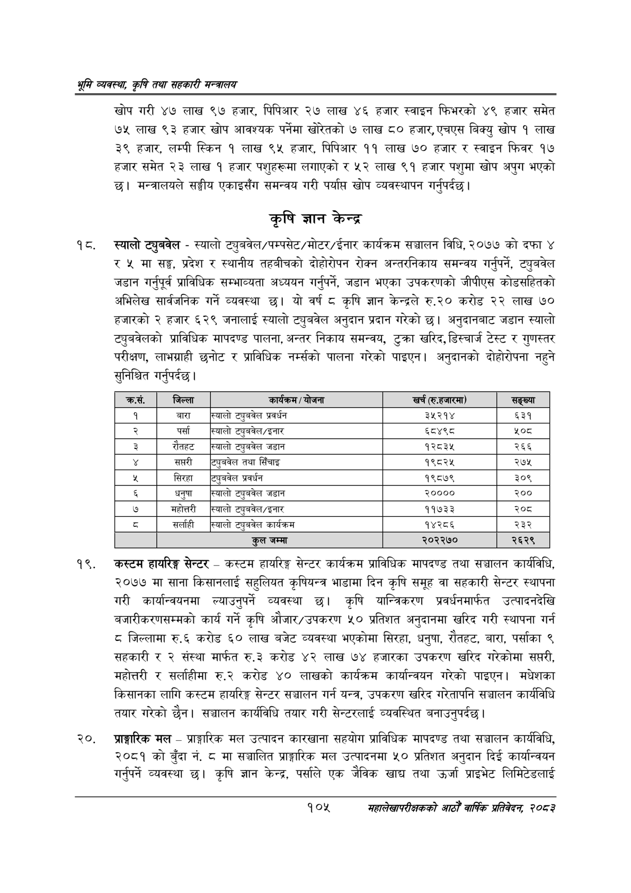

# Page 127 QA

## Rendered page


## Extracted text

```text
श्रृमि व्यवस्था; कृषि तथा सहकारी सन्वालय
खोप गरी ४७ लाख ९७ हजार, पिपिआर २७ लाख ४६ हजार स्वाइन फिभरको ४९ हजार समेत ७५ लाख ९३ हजार खोप आवश्यक पर्नेमा खोरतको ७ लाख ८० हजार, एचएस बिक्यु खोप १ लाख ३९ हजार, लम्पी स्किन १ लाख ९५ हजार, पिपिआर ११ लाख ७० हजार र स्वाइन फिवर १७ हजार समेत २३ लाख १ हजार पशुहरूमा लगाएको र ५२ लाख ९१ हजार पशुमा खोप अपुग भएको छ। मन्त्रालयले सङ्घीय एकाइसँग समन्वय गरी पर्याप्त खोप व्यवस्थापन गर्नुपर्दछ |
कृषि ज्ञान केन्द्र
स्यालो ट्युबवेल -स्यालो ट्युबवेल/पम्पसेट/मोटर/ईनार कार्यक्रम सञ्चालन विधि, २०७७ को दफा ४ मा सङ्ग, प्रदेश र स्थानीय तहबीचको दीहीरीपन रोक्न अन्तरनिकाय समन्वय गर्नुपर्ने, ट्युबवेल जडान गर्नुपूर्व प्राविधिक सम्भाव्यता अध्ययन गर्नुपर्ने, जडान भएका उपकरणको जीपीएस कोडसहितको अभिलेख सार्वजनिक गर्ने व्यवस्था छ। यो वर्ष ८ कृषि ज्ञान केन्द्रले रु.२० करोड २२ लाख ९० हजारको २ हजार ६२९ जनालाई स्यालो ट्युबवेल अनुदान प्रदान गरेको | अनुदानबाट जडान स्यालो ट्युबवेलको प्राविधिक मापदण्ड पालना, अन्तर निकाय समन्वय, टुक्रा खरिद, डिस्चार्ज टेस्ट र गुणस्तर परीक्षण, लाभग्राही छनोट र प्राविधिक नम्सको पालना गरेको पाइएन। अनुदानको दोहोरोपना नहुने सुनिश्चित गर्नुपर्दछ |
कस्टम हायरिङ्ग सेन्टर -कस्टम हायरिङ्ग सेन्टर कार्यक्रम प्राविधिक मापदण्ड तथा सञ्चालन कार्यविधि, २०७७ मा साना किसानलाई सहुलियत कृषियन्त्र भाडामा दिन कृषि समूह वा सहकारी सेन्टर स्थापना गरी कार्यान्वयनमा ल्याउनुपर्ने व्यवस्था छ। कृषि यान्त्रिकरण प्रवर्धनमार्फत उत्पादनदेखि बजारीकरणसम्मको कार्य गर्ने कृषि औजार/उपकरण ५० प्रतिशत अनुदानमा खरिद गरी स्थापना गर्न जिल्लामा रु.६ करोड ६० लाख बजेट व्यवस्था भएकोमा सिरहा, धनुषा, रौतहट, बारा, पर्साका ९ सहकारी र २ संस्था मार्फत रु.३ करोड ४२ लाख ७४ हजारका उपकरण खरिद गरेकोमा सप्तरी, महोत्तरी र सर्लाहीमा रु.२ करोड ४० लाखको कार्यक्रम कार्यान्वयन गरेको पाइएन। मधेशका किसानका लागि कस्टम हायरिङ्ग सेन्टर सञ्चालन गर्न यन्त्र, उपकरण खरिद गरेतापनि सञ्चालन कार्यविधि तयार गरेको छैन। सञ्चालन कार्यविधि तयार गरी सेन्टरलाई व्यवस्थित बनाउनुपर्दछ |
२०, प्राङ्गारिक मल -प्राङ्गारिक मल उत्पादन कारखाना सहयोग प्राविधिक मापदण्ड तथा सञ्चालन कार्यविधि, २०८१ को बुँदा नं. ८ मा सञ्चालित प्राङ्गारिक मल उत्पादनमा ५० प्रतिशत अनुदान दिई कार्यान्वयन गर्नुपर्ने व्यवस्था छ। कृषि ज्ञान केन्द्र, पर्साले एक जेविक खाद्य तथा उर्जा प्राइभेट लिमिटेडलाई
१०५
महालेखापरीक्षकको आठौ वाषिकि प्रतिवेदन २०८२

| कस. | जिल्ला | / योजना | खर्च [रु.हजारमा) | सङ्ख्या |
| --- | --- | --- | --- | --- |
| १ | बारा | स्यालो खुबवेल प्रवर्धन | ३५२१४ | ६५३१ |
| २ | पर्सा | स्यालो ट्युबवेल/इनार | ६८४९८ | ५०८ |
| ३ | रौतहट | स्यालो टुबवेल जडान | १२८३४५ | २६६ |
|  | सप्तरी | ट्युबवेल तथा सिँचाइ | १९८२४५ | २७५ |
| २ | सिरहा | टुबवेल प्रवर्धन | १९८७९ | ३०९ |
| ६ | धनुषा | स्यालो टखुबवेल जडान | २०००० | २०० |
| ७ | महोत्तरी | स्यालो टुबवेल/इनार | ११७३३ | २०८ |
| ५ | सर्लाही | स्यालो खुबवेल कार्यक्रम | १४२८६ | २३२ |
|  |  | कुल जम्मा | २०२२७० | २६२९ |
```

## Flags
- table_page
- medium_quality_table
