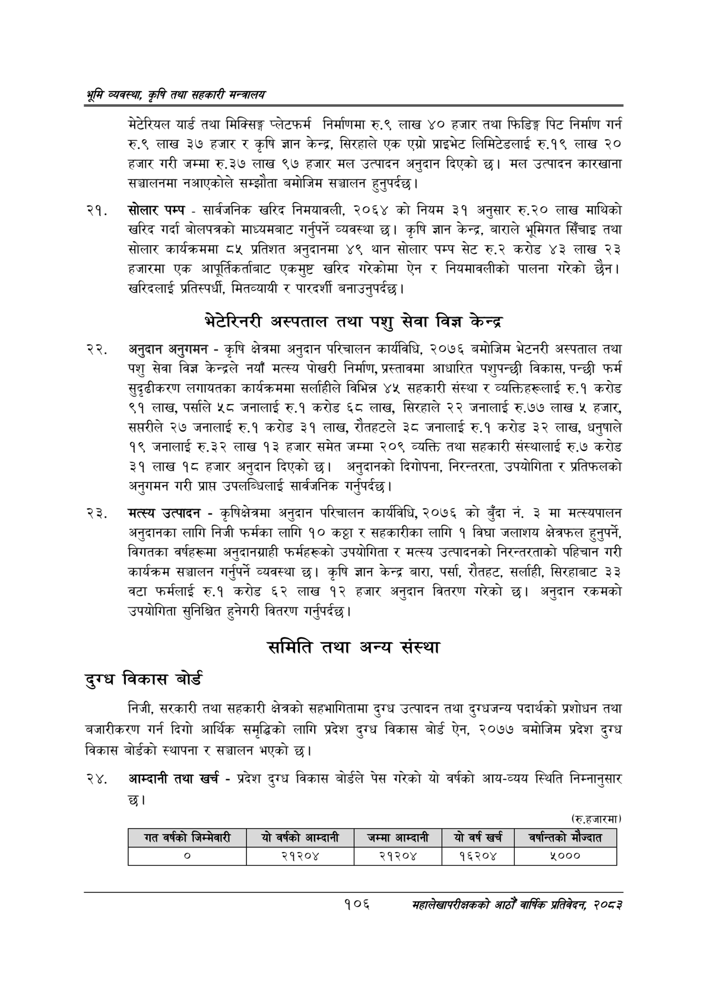

# Page 128 QA

## Rendered page


## Extracted text

```text
श्रृमि व्यवस्था; कृषि तथा सहकारी सन्वालय
मेटेरियल यार्ड तथा मिक्सिङ्ग प्लेटफर्म निर्माणमा रु.९ लाख ४० हजार तथा फिडिङ्ग पिट निर्माण गर्न रु.९ लाख ३७ हजार र कृषि ज्ञान केन्द्र, सिरहाले एक एग्रो प्राइभेट लिमिटेडलाई रु.१९ लाख २० हजार गरी जम्मा रु.३७ लाख ९७ हजार मल उत्पादन अनुदान दिएको छ। मल उत्पादन कारखाना सञ्चालनमा नआएकोले सम्झौता बमोजिम सञ्चालन हुनुपर्दछ |
सोलार पम्प -सार्वजनिक खरिद निमयावली, २०६४ को नियम ३१ अनुसार रु.२० लाख माथिको खरिद गर्दा बोलपत्रको माध्यमबाट गर्नुपर्ने व्यवस्था छ। कृषि ज्ञान केन्द्र, बाराले भूमिगत सिँचाइ तथा सोलार कार्यक्रममा ८५ प्रतिशत अनुदानमा ४९ थान सोलार पम्प सेट रु.२ करोड ४३ लाख २३ हजारमा एक आपूर्तिकर्ताबाट एकमुष्ट खरिद गरेकोमा ऐन र नियमावलीको पालना गरेको छैन। खरिदलाई प्रतिस्पर्धी, मितव्यायी र पारदर्शी बनाउनुपर्दछ |
भेटेरिनरी अस्पताल तथा पशु सेवा विज्ञ केन्द्र
अनुदान अनुगमन -कृषि क्षेत्रमा अनुदान परिचालन कार्यविधि, २०७६ बमोजिम भेटनरी अस्पताल तथा पशु सेवा विज्ञ केन्द्रले नयाँ मत्स्य पोखरी निर्माण, प्रस्तावमा आधारित पशुपन्छी विकास, पन्छी फर्म सुदृढीकरण लगायतका कार्यक्रममा सर्ताहीले विभिन्न ४५ सहकारी संस्था र व्यक्तिहरूलाई रु.१ करोड ९१ लाख, पर्साले «५८ जनालाई रु.१ करोड ६८ लाख, सिरहाले २२ जनालाई रु.७७ लाख ५ हजार, सप्तरीले २७ जनालाई रु.१ करोड ३१ लाख, रौतहटले ३८ जनालाई रु.१ करोड ३२ लाख, धनुषाले १९ जनालाई रु.३२ लाख १३ हजार समेत जम्मा २०९ व्यक्ति तथा सहकारी संस्थालाई रु.७ करोड ३१ लाख १८ हजार अनुदान दिएको छ। अनुदानको दिगोपना, निरन्तरता, उपयोगिता र प्रतिफलको अनुगमन गरी प्रापत उपलब्धिलाई सार्वजनिक गर्नुपर्दछ |
मत्स्य उत्पादन -कृषिक्षेत्रमा अनुदान परिचालन कार्यविधि, २०७६ को बुँदा नं. ३ मा मत्स्यपालन अनुदानका लागि निजी फर्मका लागि १० कट्ठा र सहकारीका लागि १ विघा जलाशय क्षेत्रफल हुनुपर्ने, विगतका वर्षहरूमा अनुदानग्राही फर्महरूको उपयोगिता र मत्स्य उत्पादनको निरन्तरताको पहिचान गरी कार्यक्रम सञ्चालन गर्नुपर्ने व्यवस्था छ। कृषि ज्ञान केन्द्र बारा, पर्सा, रौतहट, सर्लाही, सिरहाबाट ३३ वटा फर्मलाई रु.१ करोड ६२ लाख १२ हजार अनुदान वितरण गरेको छ। अनुदान रकमको उपयोगिता सुनिश्चित हुनेगरी वितरण गर्नुपर्दछ |
समिति तथा अन्य संस्था
दुरध विकास बोर्ड
निजी, सरकारी तथा सहकारी क्षेत्रको सहभागितामा दुग्ध उत्पादन तथा दुग्धजन्य पदार्थको प्रशोधन तथा बजारीकरण गर्न दिगो आर्थिक समृद्धिको लागि प्रदेश दुग्ध विकास बोर्ड ऐन, २०७७ बमोजिम प्रदेश दुग्ध विकास बोर्डको स्थापना र सञ्चालन भएको छ।
आम्दानी तथा खर्च -प्रदेश दुग्ध विकास बोर्डले पेस गरेको यो वर्षको आय-व्यय स्थिति निम्नानुसार छ।
(रु.हजारमा)
१०६
महालेखापरीक्षकको आठौ वाषिकि प्रतिवेदन २०८२

|  |  |  |  |  |  |  |  |  |  |
| --- | --- | --- | --- | --- | --- | --- | --- | --- | --- |
| गत वर्षको | (जन्मवारी | यो | वर्षको आन्दानी | जम्मा आन्दानी | यो वर्ष खरी |  | बर्ष | न्तको भै | ज्वात |
|  |  |  | २१२०४ | २१२०४ | १६२०४ |  |  | ४००० |  |
```

## Flags
- table_page
- medium_quality_table
