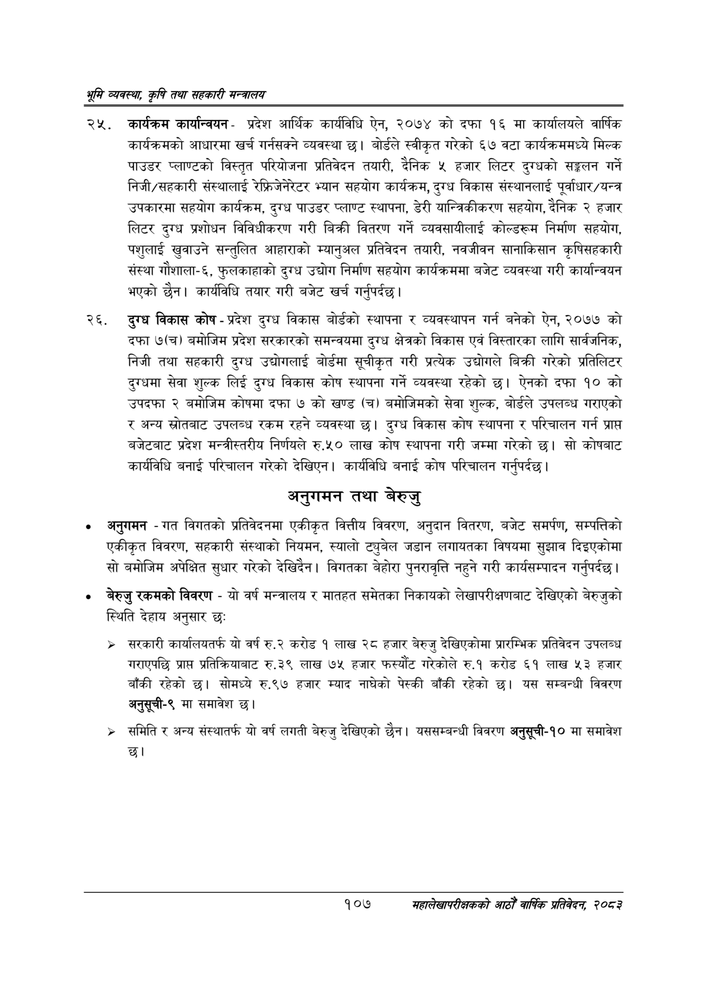

# Page 129 QA

## Rendered page


## Extracted text

```text
श्रृमि व्यवस्था; कृषि तथा सहकारी सन्वालय
कार्यक्रम कार्यान्वयनप्रदेश आर्थिक कार्यविधि ऐन, २०७४ को दफा १६ मा कार्यालयले वार्षिक कार्यक्रमको आधारमा खर्च गर्नसक्ने व्यवस्था छ। बोर्डले स्वीकृत गरेको ६७ वटा कार्यक्रममध्ये मिल्क पाउडर प्लाण्टको विस्तृत परियोजना प्रतिवेदन तयारी, दैनिक ५ हजार लिटर दुग्धको सङ्कलन गर्ने निजी/सहकारी संस्थालाई रेफ्रिजेनेरटर भ्यान सहयोग कार्यक्रम, दुग्ध विकास संस्थानलाई पूर्वाधार/यन्त्र उपकारमा सहयोग कार्यक्रम, दुग्ध पाउडर प्लाण्ट स्थापना, डेरी यान्त्रिकीकरण सहयोग, दैनिक २ हजार लिटर दुग्ध प्रशोधन विविधीकरण गरी बिक्री वितरण गर्ने व्यवसायीलाई कोल्डरूम निर्माण सहयोग, पशुलाई खुवाउने सन्तुलित आहाराको म्यानुअल प्रतिवेदन तयारी, नवजीवन सानाकिसान कृषिसहकारी संस्था गौशाला-६, फुलकाहाको दुग्ध उद्योग निर्माण सहयोग कार्यक्रममा बजेट व्यवस्था गरी कार्यान्वयन भएको छैन। कार्यविधि तयार गरी बजेट खर्च गर्नुपर्दछ |
दुग्ध विकास कोष -प्रदेश दुग्ध विकास बोर्डको स्थापना र व्यवस्थापन गर्न बनेको ऐन, २०७७ को दफा ७(च) बमोजिम प्रदेश सरकारको समन्वयमा दुग्ध क्षेत्रको विकास एवं विस्तारका लागि सार्वजनिक, निजी तथा सहकारी दुग्ध उद्योगलाई बोर्डमा सूचीकृत गरी प्रत्यक उद्योगले बिक्री गरेको प्रतिलिटर दुग्धमा सेवा शुल्क लिई दुग्ध विकास कोष स्थापना गर्ने व्यवस्था रहेको छ। ऐनको दफा १० को उपदफा २ बमोजिम कोषमा दफा ७ को खण्ड (च) बमोजिमको सेवा शुल्क, बोर्डले उपलब्ध गराएको र अन्य स्रोतबाट उपलब्ध रकम रहने व्यवस्था छ। दुग्ध विकास कोष स्थापना र परिचालन गर्न प्राप्त बजेटबाट प्रदेश मन्त्रीस्तरीय निर्णयले रु.५० लाख कोष स्थापना गरी जम्मा गरेको छ। सो कोषबाट कार्यविधि बनाई परिचालन गरेको देखिएन। कार्यविधि बनाई कोष परिचालन गर्नुपर्दछ |
अनुगमन तथा बेरुजु
अनुगमन -गत विगतको प्रतिवेदनमा एकीकृत वित्तीय विवरण, अनुदान वितरण, बजेट समर्पण, सम्पत्तिको एकीकृत विवरण, सहकारी संस्थाको नियमन, स्यालो ट्युबेल जडान लगायतका विषयमा सुझाव दिइएकोमा सो बमोजिम अपेक्षित सुधार गरेको देखिदैन। विगतका बेहोरा पुनरावृत्ति नहुने गरी कार्यसम्पादन गर्नुपर्दछ |
बेरुजु रकमको विवरण -यो वर्ष मन्त्रालय र मातहत समेतका निकायको लेखापरीक्षणबाट देखिएको बेरुजुको स्थिति देहाय अनुसार छः:
भर सरकारी कार्यालयतर्फ यो वर्ष रु.२ करोड १ लाख २८ हजार बेरुजु देखिएकोमा प्रारम्भिक प्रतिवेदन उपलब्ध गराएपछि प्राप्त प्रतिक्रियाबाट रु.३९ लाख ७५ हजार फस्यौट गरेकोले रु.१ करोड ६१ लाख ५३ हजार बाँकी रहेको छ। सोमध्ये रु.९७ हजार म्याद नाघेको पेस्की बाँकी रहेको छ। यस सम्बन्धी विवरण अनुसूची-९ मा समावेश छ।
समिति र अन्य संस्थातर्फ यो वर्ष लगती बेरुजु देखिएको छैन। यससम्बन्धी विवरण अनुसूची-१० मा समावेश छ।
१०७
महालेखापरीक्षकको आठौ वाषिकि प्रतिवेदन २०८२
```

## Flags
- None
