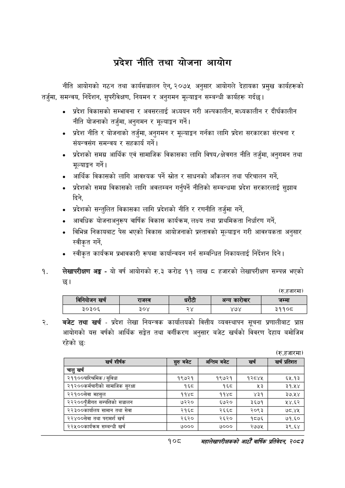

# Page 130 QA

## Rendered page


## Extracted text

```text
प्रदेश नीति तथा योजना आयोग
नीति आयोगको गठन तथा कार्यसञ्चालन ऐन, २०७५ अनुसार आयोगले देहायका प्रमुख कार्यहरूको तर्जुमा, समन्वय, निर्देशन, सुपरीवेक्षण, नियमन र अनुगमन मूल्याङ्कन सम्बन्धी कार्यहरू गर्दछ।
० प्रदेश विकासको सम्भावना र अवसरलाई अध्ययन गरी अल्पकालीन, मध्यकालीन र दीर्घकालीन नीति योजनाको तर्जुमा, अनुगमन र मूल्याङ्कन गर्ने |
० प्रदेश नीति र योजनाको तर्जुमा, अनुगमन र मूल्याङ्कन गर्नका लागि प्रदेश सरकारका संरचना र संयन्त्रसंग समन्वय र सहकार्य गर्ने |
० प्रदेशको समग्र आर्थिक एवं सामाजिक विकासका लागि विषय/क्षेत्रगत नीति तर्जुमा, अनुगमन तथा मूल्याङ्कन गर्ने |
० आर्थिक विकासको लागि आवश्यक पर्ने स्रोत र साधनको आँकलन तथा परिचालन गर्ने,
० प्रदेशको समग्र विकासको लागि अवलम्बन गर्नुपर्ने नीतिको सम्बन्धमा प्रदेश सरकारलाई सुझाब दिने,
«० प्रदेशको सन्तुलित विकासका लागि प्रदेशको नीति र रणनीति तर्जुमा गर्ने,
० आवधिक योजनाअनुरूप वार्षिक विकास कार्यक्रम, लक्ष्य तथा प्राथमिकता निर्धारण गर्ने,
० विभिन्न निकायबाट पेस भएको विकास आयोजनाको प्रस्तावको मूल्याङ्कन गरी आवश्यकता अनुसार स्वीकृत गर्ने,
स्वीकृत कार्यक्रम प्रभावकारी रूपमा कार्यान्वयन गर्न सम्बन्धित निकायलाई निर्देशन दिने।
लेखापरीक्षण अङ्ग -यो वर्ष आयोगको रु.३ करोड ११ लाख हजारको लेखापरीक्षण सम्पन्न भएको छ।
(रु.हजारमा)
बजेट तथा खर्च -प्रदेश लेखा नियन्त्रक कार्यालयको वित्तीय व्यवस्थापन सूचना प्रणालीबाट प्राप्त आयोगको यस वर्षको आर्थिक सङ्गेत तथा वर्गीकरण अनुसार बजेट खर्चको विवरण देहाय बमोजिम रहेको छ:
(रु.हजारमा)
१०८
महालेखापरीक्षकको आठौ वाषिकि प्रतिवेदन २०८२

|  | नानिकोणन खर्च | राजस्व |  | धरेटी | अन्य | जम्मा |
| --- | --- | --- | --- | --- | --- | --- |
|  | ३०३०६ | ३०४ | २४ |  | ४७४ | ३११०८ |

| खर्च शीर्षक | सुरु बजेट | अन्तिम बजेट | खर्च | खर्च प्रतिशत |
| --- | --- | --- | --- | --- |
| चालु खर्च |  |  |  |  |
| २११००पारिश्रमिक / सुविधा | १९७२१ | १९७२१ | १२८४४५ | ६५.१३ |
| २१२००कर्मचारीको सामाजिक सुरक्षा | १६८ | १६८ | %३ | ३१.५४ |
| २२१००सेवा महसुल | ११४८ | ११४८ | ४३१ | ३७.५४ |
| २२२००पुँजीगत कन्पत्तिको सञ्चालन | ७२२० | ६७२० | ३६७१ | ५४.६२ |
| २२३००कार्थालष सामान तथा सेवा | २१६८ | २६६८ | २०९३ | ७८.४५ |
| २२४००सेवा तथा परामर्श खर्च | २६२० | २६२० | १८७६ | ७१.६० |
| २२५००कार्यक्रभ सम्बन्धी खर्च | ७००० | ७००० | २७७५ | ३९.६४ |
```

## Flags
- table_page
- medium_quality_table
