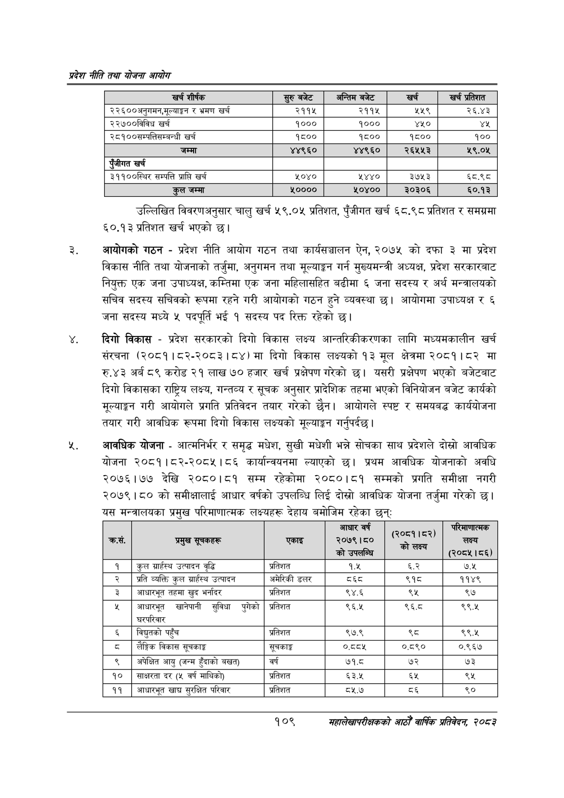

# Page 131 QA

## Rendered page


## Extracted text

```text
प्रदेश नीति तथा योजना आयोग
उल्लिखित विवरणअनुसार चालु खर्च ५९.०५ प्रतिशत, पुँजीगत खर्च ६८.९८ प्रतिशत र समग्रमा ६०.१३ प्रतिशत खर्च भएको छ।
आयोगको गठन -प्रदेश नीति आयोग गठन तथा कार्यसञ्चालन ऐन, २०७५ को दफा ३ मा प्रदेश विकास नीति तथा योजनाको तर्जुमा, अनुगमन तथा मूल्याङ्कन गर्न मुख्यमन्त्री अध्यक्ष, प्रदेश सरकारबाट नियुक्त एक जना उपाध्यक्ष, कम्तिमा एक जना महिलासहित बढीमा ६ जना सदस्य र अर्थ मन्त्रालयको सचिव सदस्य सचिवको रूपमा रहने गरी आयोगको गठन हुने व्यवस्था | आयोगमा उपाध्यक्ष र ६ जना सदस्य मध्ये ५ पदपूर्ति १ सदस्य पद रिक्त रहेको छ।
दिगो विकास -प्रदेश सरकारको दिगो विकास लक्ष्य आन्तरिकीकरणका लागि मध्यमकालीन खर्च संरचना (२०८१।८२-२०८३।८४) मा दिगो विकास लक्ष्यको १३ मूल क्षेत्रमा २०८१।८२ मा रु.४३ अर्ब ८९ करोड २१ लाख ७० हजार खर्च प्रक्षेपण गरेको छ। यसरी प्रक्षेपण भएको बजेटबाट दिगो विकासका राष्ट्रिय लक्ष्य, गन्तव्य र सूचक अनुसार प्रादेशिक तहमा भएको विनियोजन बजेट कार्यको मूल्याङ्कन गरी आयोगले प्रगति प्रतिवेदन तयार गरेको छैन। आयोगले स्पष्ट र समयबद्ध कार्ययोजना तयार गरी आवधिक रूपमा दिगो विकास लक्ष्यको मूल्याङ्कन गर्नुपर्दछ |
आवधिक योजना -आत्मनिर्भर र समृद्ध मधेश, सुखी मधेशी भन्ने सोचका साथ प्रदेशले दोस्रो आवधिक योजना २०८१।८२-२०८५।८६ कार्यान्वयनमा ल्याएको छ। प्रथम आवधिक योजनाको अवधि २०७६।७७ देखि २०८०।८१ सम्म रहेकोमा २०८०।८१ सम्मको प्रगति समीक्षा नगरी २०७९।८० को समीक्षालाई आधार वर्षको उपलब्धि लिई दोस्रो आवधिक योजना तर्जुमा गरेको छ। यस मन्त्रालयका प्रमुख परिमाणात्मक लक्ष्यहरू देहाय बमोजिम रहेका छन्‌
१०९
महालेखापरीक्षकको आठौ वाषिकि प्रतिवेदन २०८२

| खर्च शीर्षक | सुरु बजेट | अन्तिम बजेट | खर्च | खर्च प्रतिशत |
| --- | --- | --- | --- | --- |
| २२६००अनुगमन,मूल्याङ्गन र भ्रमण खर्च | २११५ | २११५ | २२५९ | २६.४३ |
| २२७००विविध खर्च | १००० | १००० | ४५० | यश |
| २८१००सम्पत्तिसम्बन्धी खर्च | १८०० | १८०० | १८०० | १०० |
| जम्मा | ४४९६० | ४४९६० | २६५५३ | %.०% |
| एंजीगत खर्च |  |  |  |  |
| ३११००स्थिर सम्पत्ति प्राप्ति खर्च | ५०४० | ५४४० | ३७५३ | ८५५ |
| जम्मा | %०००० | ५०४०० | ३०३०६ | ६०.१३ |

| . क्रस. | प्रमुख धूनकहरू | एकाइ | आधार वर्ष २०७९।८० 'को उपलन्धि | (२०८१।८२) को लक्ष्य | लक्ष्य (२०८५।८६) |
| --- | --- | --- | --- | --- | --- |
| १ | कुल ग्राहस्थ उत्पादन वृद्धि | प्रतिशत | १.५ | ३ | ७.५ |
| २ | प्रति व्यक्ति कुल ग्राहस्थ उत्पादन | अमेरिकी डलर | ५६८ | ९१८ | ११४९ |
| ३ | आधारभूत तहमा खुद भर्नादर | प्रतिशत | ९४.६ | ९५ | ९७ |
| ५ | आधारभूत ढानेपानी सुविधा पुगेको घरपरिवार | प्रतिशत | ९६.४५ | ९६व | ९९.४५ |
| ६ | विद्युतको पहुँच | प्रतिशत | ९७.९ | %५ | ९९.४५ |
| ८ | लैङ्गिक विकास सूचकाङ्क | सूचकाङ्क | ०.८८५ | ०.८९० | ०.९६७ |
| ९ | अपेक्षित आयु (जन्म हुँदाको बखत) | वर्ष | ७१.८ | ७२ | ७३ |
| १० | साक्षरता दर (५ वर्ष माथिको) | प्रतिशत | ६३.५ | ६५ | ९५ |
| ११ | आधारभूत खाद्य सुरक्षित परिवार | प्रतिशत | ८५.७ |  | ९० |
```

## Flags
- table_page
- medium_quality_table
