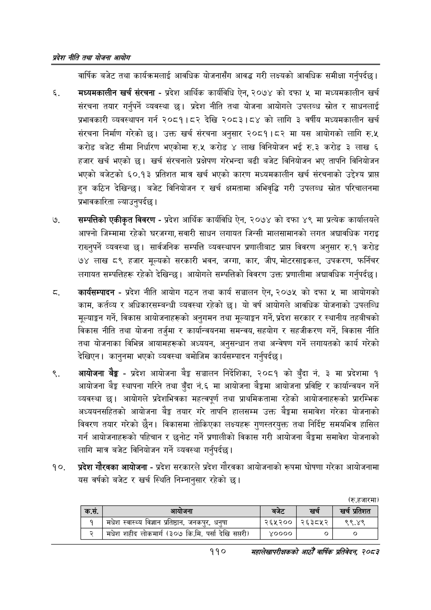

# Page 132 QA

## Rendered page


## Extracted text

```text
प्रदेश नीति तथा योजना आयोग
वार्षिक बजेट तथा कार्यक्रमलाई आवधिक योजनासँग आवद्ध गरी लक्ष्यको आवधिक समीक्षा गर्नुपर्दछ |
मध्यमकालीन खर्च संरचना -प्रदेश आर्थिक कार्यविधि ऐन, २०७४ को दफा ५ मा मध्यमकालीन खर्च संरचना तयार गर्नुपर्ने व्यवस्था छ। प्रदेश नीति तथा योजना आयोगले उपलब्ध स्रोत र साधनलाई प्रभावकारी व्यवस्थापन गर्न २०८१।८२ देखि २०८३।८४ को लागि ३ वर्षीय मध्यमकालीन खर्च संरचना निर्माण गरेको छ। उक्त खर्च संरचना अनुसार २०८१।८२ मा यस आयोगको लागि रु.५ करोड बजेट सीमा निर्धारण भएकोमा रु.५ करोड ४ लाख विनियोजन भई रु.३ करोड ३ लाख ६ हजार खर्च भएको छ। खर्च संरचनाले प्रक्षेपण गरेभन्दा बढी बजेट विनियोजन भए तापनि विनियोजन भएको बजेटको ६०.१३ प्रतिशत मात्र खर्च भएको कारण मध्यमकालीन खर्च संरचनाको उद्देश्य प्राप्त हुन कठिन देखिन्छ। बजेट विनियोजन र खर्च क्षमतामा अभिवृद्धि गरी उपलब्ध स्रोत परिचालनमा प्रभावकारिता ल्याउनुपर्दछ।
सम्पत्तिको एकीकृत विवरण -प्रदेश आर्थिक कार्यविधि ऐन, २०७४ को दफा ४९ मा प्रत्येक कार्यालयले आफ्नो जिम्मामा रहेको घरजग्गा, सवारी साधन लगायत जिन्सी मालसामानको लगत अद्यावधिक गराइ राख्नुपर्ने व्यवस्था | सार्वजनिक सम्पत्ति व्यवस्थापन प्रणालीबाट प्राप्त विवरण अनुसार रु.१ करोड ७४ लाख ८९ हजार मूल्यको सरकारी भवन, जग्गा, कार, जीप, मोटरसाइकल, उपकरण, फर्निचर लगायत सम्पत्तिहरू रहेको देखिन्छ। आयोगले सम्पत्तिको विवरण उक्त प्रणालीमा अद्यावधिक गर्नुपर्दछ।
कार्यसम्पादन -प्रदेश नीति आयोग गठन तथा कार्य सञ्चालन ऐन, २०७५ को दफा ५ मा आयोगको काम, कर्तव्य र अधिकारसम्बन्धी व्यवस्था रहेको छ। यो वर्ष आयोगले आवधिक योजनाको उपलब्धि मूल्याङ्कन गर्ने, विकास आयोजनाहरूको अनुगमन तथा मूल्याङ्कन गर्ने, प्रदेश सरकार र स्थानीय तहबीचको विकास नीति तथा योजना तर्जुमा र कार्यान्वयनमा समन्वय, सहयोग र सहजीकरण गर्ने, विकास नीति तथा योजनाका विभिन्न आयामहरूको अध्ययन, अनुसन्धान तथा अन्वेषण गर्ने लगायतको कार्य गरेको देखिएन। कानुनमा भएको व्यवस्था बमोजिम कार्यसम्पादन गर्नुपर्दछ |
आयोजना बेङ्ग -प्रदेश आयोजना बैङ्क सञ्चालन निर्देशिका, २०८१ को बुँदा नं. ३ मा प्रदेशमा १ आयोजना बैङ्क स्थापना गरिने तथा बुँदा नं.६ मा आयोजना बैङ्कमा आयोजना प्रविष्टि र कार्यान्वयन गर्ने व्यवस्था | आयोगले प्रदेशभित्रका महत्वपूर्ण तथा प्राथमिकतामा रहेको आयोजनाहरूको प्रारम्भिक अध्ययनसहितको आयोजना बैङ्क तयार गरे तापनि हालसम्म उक्त बैङ्कमा समावेश गरेका योजनाको विवरण तयार गरेको छैन। विकासमा तोकिएका लक्ष्यहरू गुणस्तरयुक्त तथा निर्दिष्ट समयभित्र हासिल गर्न आयोजनाहरूको पहिचान र छनोट गर्ने प्रणालीको विकास गरी आयोजना बैङ्कमा समावेश योजनाको लागि मात्र बजेट विनियोजन गर्ने व्यवस्था गर्नुपर्दछ |
प्रदेश गौरवका आयोजना -प्रदेश सरकारले प्रदेश गौरवका आयोजनाको रूपमा घोषणा गरेका आयोजनामा यस वर्षको बजेट र खर्च स्थिति निम्नानुसार रहेको छ।
(रु.हजारमा)
११०
महालेखापरीक्षकको आठौ वाषिकि प्रतिवेदन २०८२

| कस. | आधोजना | बजेट | खच | खर प्रतिशत |
| --- | --- | --- | --- | --- |
| १ | मधेश स्वास्थ्य विज्ञान प्रतिष्ठान, जनक५९, धनुषा | २६५२०० | २६३८५२ | ९९.४९ |
| २ | मधेश शहीद लोकमार्ग (३०७ कि.मि. पर्सा देखि सप्तरी) | ४०००० |  | ० |
```

## Flags
- table_page
- medium_quality_table
