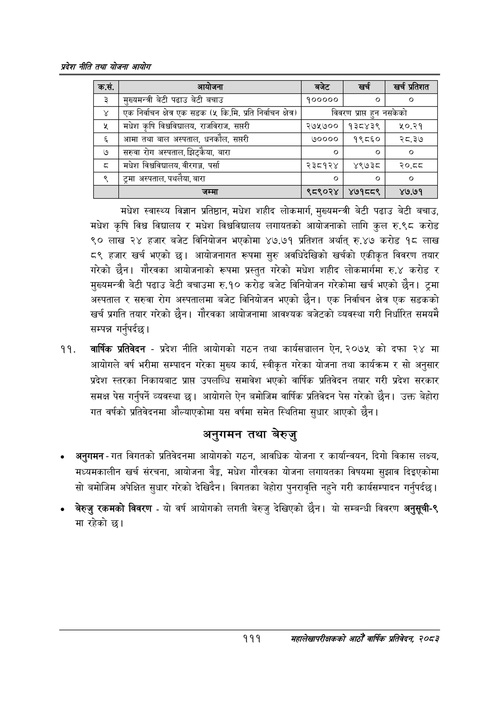

# Page 133 QA

## Rendered page


## Extracted text

```text
प्रदेश नीति तथा योजना आयोग
मधेश स्वास्थ्य विज्ञान प्रतिष्ठान, मधेश शहीद लोकमार्ग, मुख्यमन्त्री बेटी पढाउ बेटी बचाउ, मधेश कृषि विश्व विद्यालय र मधेश विश्वविद्यालय लगायतको आयोजनाको लागि कुल रु.९८ करोड ९० लाख २४ हजार बजेट विनियोजन भएकोमा ४७.७१ प्रतिशत अर्थात्‌ रु.४७ करोड १८ लाख ८९ हजार खर्च भएको | आयोजनागत रूपमा सुरु अवधिदेखिको खर्चको एकीकृत विवरण तयार गरेको छैन। गौरवका आयोजनाको रूपमा प्रस्तुत गरेको मधेश शहीद लोकमार्गमा रु.४ करोड र मुख्यमन्त्री बेटी पढाउ बेटी बचाउमा रु.१० करोड बजेट विनियोजन गरेकोमा खर्च भएको छैन। ट्रमा अस्पताल र सरुवा रोग अस्पतालमा बजेट विनियोजन भएको छैन। एक निर्वाचन क्षेत्र एक सडकको खर्च प्रगति तयार गरेको छैन। गौरवका आयोजनामा आवश्यक बजेटको व्यवस्था गरी निर्धारित समयमै सम्पन्न गर्नुपर्दछ |
वार्षिक प्रतिवेदन -प्रदेश नीति आयोगको गठन तथा कार्यसञ्चालन ऐन, २०७५ को दफा २४ मा आयोगले वर्ष भरीमा सम्पादन गरेका मुख्य कार्य, स्वीकृत गरेका योजना तथा कार्यक्रम र सो अनुसार प्रदेश स्तरका निकायबाट प्राप्त उपलब्धि समावेश भएको वार्षिक प्रतिवेदन तयार गरी प्रदेश सरकार समक्ष पेस गर्नुपर्ने व्यवस्था | आयोगले ऐन बमोजिम वार्षिक प्रतिवेदन पेस गरेको छैन। उक्त बेहोरा गत वर्षको प्रतिवेदनमा औल्याएकोमा यस वर्षमा समेत स्थितिमा सुधार आएको छैन।
अनुगमन तथा बेरुजु
० अनुगमन -गत विगतको प्रतिवेदनमा आयोगको गठन, आवधिक योजना र कार्यान्वयन, दिगो विकास लक्ष्य, मध्यमकालीन खर्च संरचना, आयोजना बेैङ्ग, मधेश गौरवका योजना लगायतका विषयमा सुझाव दिइएकोमा सो बमोजिम अपेक्षित सुधार गरेको देखिदैन। विगतका बेहोरा पुनरावृत्ति नहुने गरी कार्यसम्पादन गर्नुपर्दछ |
बेरुजु रकमको विवरण -यो वर्ष आयोगको लगती बेरुजु देखिएको छैन। यो सम्बन्धी विवरण अनुसूची-९ मा रहेको छ।
१११
महालेखापरीक्षकको आठौ वाषिकि प्रतिवेदन २०८२

| कस. | आधोजना | बजेट | खर्च | खर प्रतेशत |
| --- | --- | --- | --- | --- |
| ३ | मुष्यमन्त्री बेटी पढाउ बेटी बचाउ | १००००० |  | ० |
| ४ | एक निर्वाचन क्षेत्रएक सडक (५ कि.मि. प्रति निर्वाचन क्षेत्र) | विवरण | प्राप्त हुन | नसकेको |
| ५ | मधेश कृषि विचविचालष, राजनिराज, सप्तरी | २७५७०० | १३८४३९ | ५०.२१ |
| ६ | अआमा तथा बाल अस्पताल, धनकौल, सप्तरी | ७०००० | १९८६० | २८.३७ |
| ७ | सरुवा रोग अस्पताल, झिट्केथा, बारा |  |  |  |
| ८ | मधेश वि्वानचालय, वीरगञ्ज, पर्सा | २३८१२४ | ४९७३८ | २०.व८ |
| ९ | ट्रमा अस्पताल, पथलैया, बारा | ० |  | ० |
|  | जम्मा | ९८९०२४ | ४७१८०९ | ४७.७१ |
```

## Flags
- table_page
- medium_quality_table
