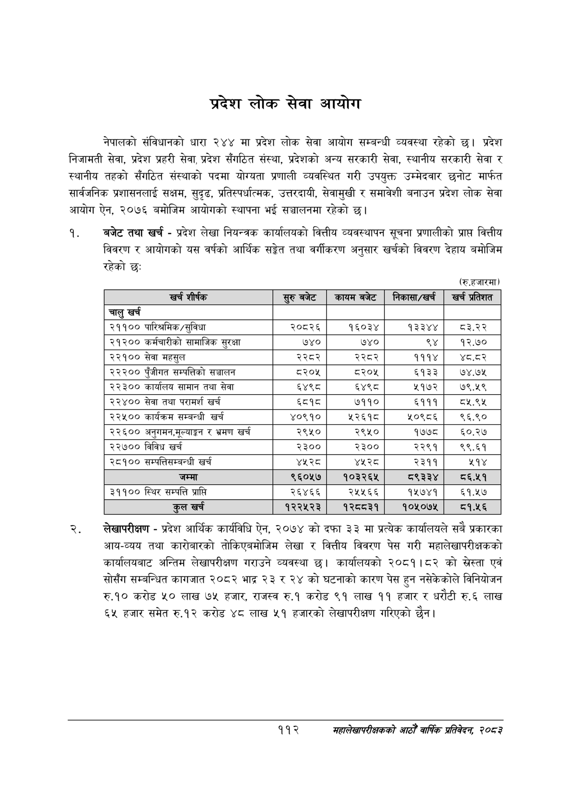

# Page 134 QA

## Rendered page


## Extracted text

```text
प्रदेश लोक सेवा आयोग
नेपालको संविधानको धारा २४४ मा प्रदेश लोक सेवा आयोग सम्बन्धी व्यवस्था रहेको छ। प्रदेश निजामती सेवा, प्रदेश प्रहरी सेवा, प्रदेश सँगठित संस्था, प्रदेशको अन्य सरकारी सेवा, स्थानीय सरकारी सेवा र स्थानीय तहको सँगठित संस्थाको पदमा योग्यता प्रणाली व्यवस्थित गरी उपयुक्त उम्मेदवार छनोट मार्फत सार्वजनिक प्रशासनलाई सक्षम, सुदृढ, प्रतिस्पर्धात्मक, उत्तरदायी, सेवामुखी र समावेशी बनाउन प्रदेश लोक सेवा आयोग ऐन, २०७६ बमोजिम आयोगको स्थापना भई सञ्चालनमा रहेको छ।
बजेट तथा खर्च -प्रदेश लेखा नियन्त्रक कार्यालयको वित्तीय व्यवस्थापन सूचना प्रणालीको प्राप्त वित्तीय विवरण र आयोगको यस वर्षको आर्थिक सङ्गेत तथा वर्गीकरण अनुसार खर्चको विवरण देहाय बमोजिम रहेको छ:
(रु.हजारमा)
लेखापरीक्षण -प्रदेश आर्थिक कार्यविधि ऐन, २०७४ को दफा ३३ मा प्रत्येक कार्यालयले सबै प्रकारका आय-व्यय तथा कारोबारको तोकिएबमोजिम लेखा र वित्तीय विवरण पेस गरी महालेखापरीक्षकको कार्यालयबाट अन्तिम लेखापरीक्षण गराउने व्यवस्था छ। कार्यालयको २०८१।८२ को स्रेस्ता एवं सोसँग सम्बन्धित कागजात २०८२ भाद्र २३ र २४ को घटनाको कारण पेस हुन नसेकेकोले विनियोजन रु.१० करोड ५० लाख ७५ हजार, राजस्व रु.१ करोड ९१ लाख ११ हजार र धरौटी रु.६ लाख ६५ हजार समेत रु.१२ करोड ४८ लाख ५१ हजारको लेखापरीक्षण गरिएको छैन।
११२
महालेखापरीक्षकको आठौ वाषिकि प्रतिवेदन २०८२

| खर्च शीर्षक | सुरुबबेट | कायम बजेट | निकासा/खर्च | खर्च प्रतिशत |
| --- | --- | --- | --- | --- |
| चालु खर्च |  |  |  |  |
| २११०० पारिश्रमिक/सुविधा | २०८२६ | १६०३४ | १३३४४ | ८३.२२ |
| २१२०० कर्मचारीको सामाजिक सुरक्षा | ७४० | ७४० | ९४ | १२.७० |
| २२१०० सेवा महसुल | २२८२ | २२८२ | १११४ | ४८.दर |
| २२२०० पुँजीगत सम्पत्तिको सञ्चालन | ८२०५ | ८२०५ | ६१३३ | ७४.७५ |
| २२३०० कार्यालय सामान तथा सेवा | ६४९८ | ६४९८ | ५१७२ | ७९.५९ |
| २२४०० सेवा तथा परामर्श खर्च | ६८१८ | ७११० | ६१११ | ८५.९५ |
| २२५०० कार्यक्रष सम्बन्धी खर्च | ४०९१० | ५२६१८ | ५२०९८६ | ९६.९० |
| २२६०० अनुगमन,५९४ङ१ र भ्रमण खर्च | २९५० | २९५० | १७७८ | ६०.२७ |
| २२७०० विविध खर्च | २३०० | २३०० | २२९१ | ९९.६१ |
| २८१०० चन्पत्तिकम्बन्धी खर्च | ४५२८ | ४५२८ | २३११ | २१४ |
| जम्मा | ९६०५७ | १०३२६५ | ९३३४ | ८६.२५१ |
| ३११०० स्थिर सम्पत्ति प्राप्त | २६४६६ | २५५६६ | १५७४१ | ६१.१७ |
| कुल खर्च | १२२५२३ | १२८८३१ | १०५०७५ |  |
```

## Flags
- table_page
- medium_quality_table
