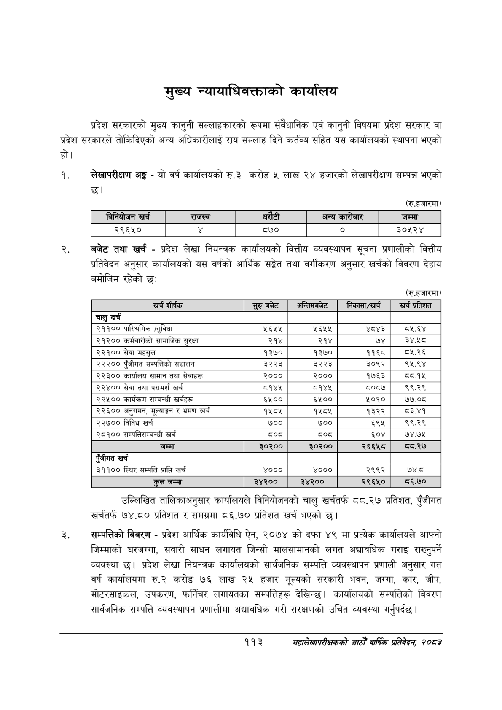

# Page 135 QA

## Rendered page


## Extracted text

```text
मुख्य न्यायाधिवक्ताको कार्यालय
प्रदेश सरकारको मुख्य कानुनी सल्लाहकारको रूपमा संवैधानिक एवं कानुनी विषयमा प्रदेश सरकार वा प्रदेश सरकारले तोकिदिएको अन्य अधिकारीलाई राय सल्लाह दिने कर्तव्य सहित यस कार्यालयको स्थापना भएको हो।
लेखापरीक्षण अङ्ग -यो वर्ष कार्यालयको रु.३ करोड ५ लाख २४ हजारको लेखापरीक्षण सम्पन्न भएको
(रु.हजारमा)
बजेट तथा खर्च -प्रदेश लेखा नियन्त्रक कार्यालयको वित्तीय व्यवस्थापन सूचना प्रणालीको वित्तीय प्रतिवेदन अनुसार कार्यालयको यस वर्षको आर्थिक सङ्केत तथा वर्गीकरण अनुसार खर्चको विवरण देहाय बमोजिम रहेको छ:
(रु.हजारमा)
उल्लिखित तालिकाअनुसार कार्यालयले विनियोजनको चालु खर्चतर्फ ८८.२७ प्रतिशत, पुँजीगत खर्चतर्फ ७४.८० प्रतिशत र समग्रमा ८६.७० प्रतिशत खर्च भएको छ।
सम्पत्तिको विवरण -प्रदेश आर्थिक कार्यविधि ऐन, २०७४ को दफा ४९ मा प्रत्येक कार्यालयले आफ्नो जिम्माको घरजग्गा, सवारी साधन लगायत जिन्सी मालसामानको लगत अद्यावधिक गराइ राख्नुपर्ने व्यवस्था | प्रदेश लेखा नियन्त्रक कार्यालयको सार्वजनिक सम्पत्ति व्यवस्थापन प्रणाली अनुसार गत वर्ष कार्यालयमा रु.२ करोड ७६ लाख २५ हजार मूल्यको सरकारी भवन, जग्गा, कार, जीप, मोटरसाइकल, उपकरण, फर्निचर लगायतका सम्पत्तिहरू देखिन्छ। कार्यालयको सम्पत्तिको विवरण सार्वजनिक सम्पत्ति व्यवस्थापन प्रणालीमा अद्यावधिक गरी संरक्षणको उचित व्यवस्था गर्नुपर्दछ |
११३
महालेखापरीक्षकको आठौ वाषिकि प्रतिवेदन २०८२

|  |  | 'ननवोजन खरी |  | राजस्व |  | ५ १ १ १ १ ५ ५५१ १२ ३२ १४ ९३.१५९९२० अन्य ५ १ १ १ १ ६ ५९१ ६ ५७ २० ३२.६४९७८० ५ १ १ १ १ ७ ७३८ १२ ४१ १४ ८४.६०४१९५ जम्मा ४ १ १ १ २ ० ५९ ४२ ७३२ १६ -१ ५ १ १ १ २ १ ५९ ४२ ६२ १६ ८२.१०६२७० २९६५० ५ १ १ १ २ २ २५६ ४३ ११ १३ ८७.५७४३१० ५ १ १ १ २ ३ ४११ ४४ ३६ १२ ५७.४८१३८८ ८७० ५ १ १ १ २ ४ ५९४ ४४ ९ १० ८१.२४४५३० ५ १ १ १ २ ५ ७२८ ४२ ६३ १५ ९२.२९१३१३ ३०५२४ |  |  |
| --- | --- | --- | --- | --- | --- | --- | --- | --- |
|  |  |  |  |  |  |  |  |  |

| खर्च शीर्षक | सुरु बबेट | भन्तिबबणट | निकासा/खर्च | खर्च प्रतिशत |
| --- | --- | --- | --- | --- |
| चालु खर्च |  |  |  |  |
| २११०० पारिश्रमिक /सुविधा | ५६५५ | ५६५५ | ४८४३ | ८५.६४ |
| २१२०० कर्मचारीको सामाजिक सुरक्षा | २१४ | २१४ | ७४ | ३४.१२८ |
| २२१०० सेवा महसुल | १३७० | १३७० | ११६८ | ८५.२६ |
| २३२०० पुँजीगत “्पत्तिको सञ्चालन | ३२२३ | ३२२३ | ३०९२ | ९५.९४ |
| २२३०० कार्यालय सामान तथा सेवाहरू | २००० | २००० | १७६३ | ८०.१५ |
| '२२४०० सेवा तथा परामर्श खर्च | ८१४५ | ८१४५ | ८०८७ | ९९.२९ |
| २२५०० कार्यक्रम सम्बन्धी खर्चहरू | ६५०० | ६१०० | ५०१० | ७७.०८ |
| २२६०० अनुगमन, मूल्याङ्कन र भ्रमण खर्च | १५८५ | १५८५ | १३२२ | ८३.४१ |
| २२७०० विविध खर्च | ७०० | ७०० | ६९५ | ९९.२९ |
| २८१०० सन्पत्तिकषन्जन्धी खर्च | द्०्द |  | ६०४ | ७४.७५ |
| जम्मा | ३०२०० | ३०२०० | २६६९८० |  |
| पुँजीगत खर्च |  |  |  |  |
| ३११०० स्थिर सम्पत्ति प्राप्ति खर्च | ४००० | ४००० | २९९२ | ७४.८ |
| कुल जम्मा | ३४२०० | ३४२०० | २९६५० | ८६.७० |
```

## Flags
- table_page
- medium_quality_table
