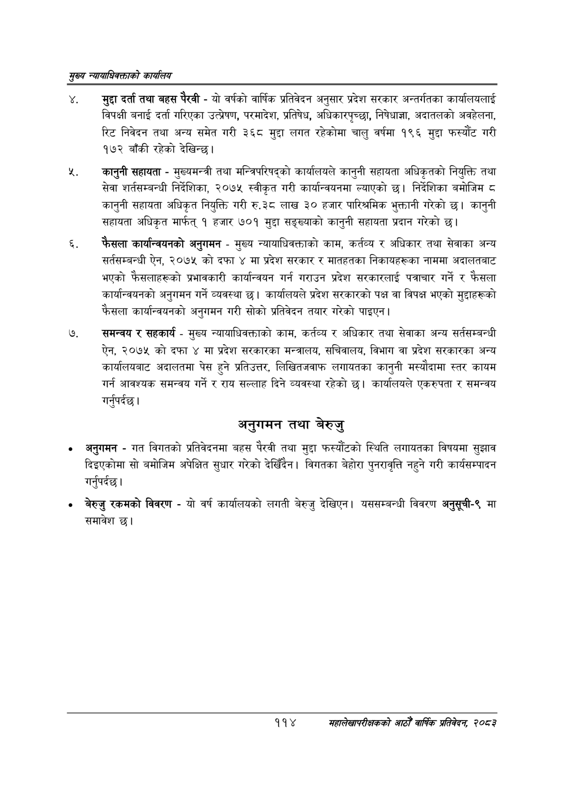

# Page 136 QA

## Rendered page


## Extracted text

```text
सृख्य न्यायाधिकक्ताको कायलिय
मुद्दा दर्ता तथा बहस पैरवी -यो वर्षको वार्षिक प्रतिवेदन अनुसार प्रदेश सरकार अन्तर्गतका कार्यालयलाई विपक्षी बनाई दर्ता गरिएका उत्प्रेषण, परमादेश, प्रतिषेध, अधिकारपृच्छा, निषेधाज्ञा, अदातलको अवहेलना, रिट निवेदन तथा अन्य समेत गरी ३६८ मुद्दा लगत रहेकोमा चालु वर्षमा १९६ मुद्दा फस्यौट गरी १७२ बाँकी रहेको देखिन्छ।
कानुनी सहायता -मुख्यमन्त्री तथा मन्ट्रिपरिषद्को कार्यालयले कानुनी सहायता अधिकृतको नियुक्ति तथा सेवा शर्तसम्बन्धी निर्देशिका, २०७५ स्वीकृत गरी कार्यान्वयनमा ल्याएको छ। निर्देशिका बमोजिम ८ कानुनी सहायता अधिकृत नियुक्ति गरी रु.३८ लाख ३० हजार पारिश्रमिक भुक्तानी गरेको छ। कानुनी सहायता अधिकृत मार्फत्‌ १ हजार ७०१ मुद्दा सङ्ख्याको कानुनी सहायता प्रदान गरेको छ।
फैसला कार्यान्वयनको अनुगमन -मुख्य न्यायाधिवक्ताको काम, कर्तव्य र अधिकार तथा सेवाका अन्य सर्तसम्बन्धी ऐन, २०७५ को दफा ४ मा प्रदेश सरकार र मातहतका निकायहरूका नाममा अदालतबाट भएको फैसलाहरूको प्रभावकारी कार्यान्वयन गर्न गराउन प्रदेश सरकारलाई पत्राचार गर्ने र फैसला कार्यान्वयनको अनुगमन गर्ने व्यवस्था छ। कार्यालयले प्रदेश सरकारको पक्ष वा विपक्ष भएको मुद्दाहरूको फैसला कार्यान्वयनको अनुगमन गरी सोको प्रतिवेदन तयार गरेको पाइएन |
समन्वय र सहकार्य -मुख्य न्यायाधिवक्ताको काम, कर्तव्य र अधिकार तथा सेवाका अन्य सर्तसम्बन्धी ऐन, २०७५ को दफा ४ मा प्रदेश सरकारका मन्त्रालय, सचिवालय, विभाग वा प्रदेश सरकारका अन्य कार्यालयबाट अदालतमा पेस हुने प्रतिउत्तर, लिखितजवाफ लगायतका कानुनी मस्यौदामा स्तर कायम गर्न आवश्यक समन्वय गर्ने र राय सल्लाह दिने व्यवस्था रहेको छ। कार्यालयले एकरुपता र समन्वय गर्नुपर्दछ |
अनुगमन तथा बेरुजु
अनुगमन -गत विगतको प्रतिवेदनमा बहस पैरवी तथा मुद्दा फस्यौटको स्थिति लगायतका विषयमा सुझाव दिइएकोमा सो बमोजिम अपेक्षित सुधार गरेको देखिँदैन। विगतका बेहोरा पुनरावृत्ति नहुने गरी कार्यसम्पादन गर्नुपर्दछ |
बेरुजु रकमको विवरण -यो वर्ष कार्यालयको लगती बेरुजु देखिएन। यससम्बन्धी विवरण अनुसूची-९ मा समावेश छ।
११४
महालेखापरीक्षकको आठौ वाषिकि प्रतिवेदन २०८२
```

## Flags
- None
