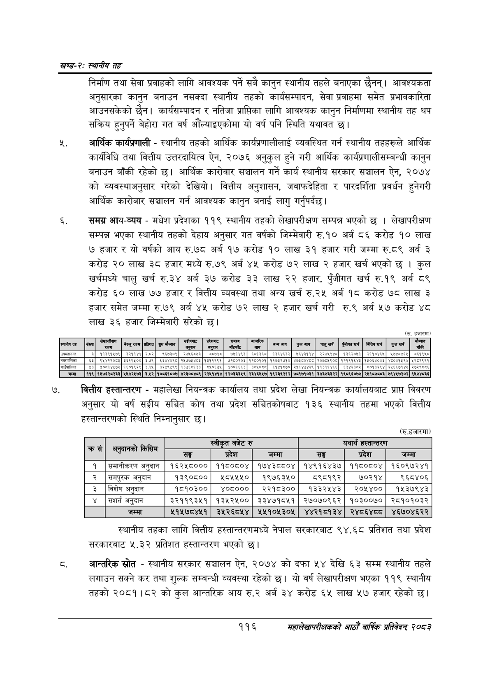

# Page 140 QA

## Rendered page


## Extracted text

```text
खण्ड-२स्थानीय तह
निर्माण तथा सेवा प्रवाहको लागि आवश्यक पर्ने सबै कानुन स्थानीय तहले बनाएका छैनन्‌। आवश्यकता अनुसारका कानुन बनाउन नसक्दा स्थानीय तहको कार्यसम्पादन, सेवा प्रवाहमा समेत प्रभावकारिता आउनसकेको छैन। कार्यसम्पादन र नतिजा प्राप्तिका लागि आवश्यक कानुन निर्माणमा स्थानीय तह थप सक्रिय हुनुपर्ने बेहोरा गत वर्ष औँल्याइएकोमा यो वर्ष पनि स्थिति यथावत छ।
आर्थिक कार्यप्रणाली -स्थानीय तहको आर्थिक कार्यप्रणालीलाई व्यवस्थित गर्न स्थानीय तहहरूले आर्थिक कार्यविधि तथा वित्तीय उत्तरदायित्व ऐन, २०७६ अनुकुल हुने गरी आर्थिक कार्यप्रणालीसम्बन्धी कानुन बनाउन बाँकी रहेको छ। आर्थिक कारोवार सञ्चालन गर्ने कार्य स्थानीय सरकार सञ्चालन ऐन, २०७४ को व्यवस्थाअनुसार गरेको देखियो। वित्तीय अनुशासन, जवाफदेहिता र पारदर्शिता प्रवर्धन हुनेगरी आर्थिक कारोबार सञ्चालन गर्न आवश्यक कानुन बनाई लागु गर्नुपर्दछ |
६, समग्र आय-व्यय -मधेश प्रदेशका ११९ स्थानीय तहको लेखापरीक्षण सम्पन्न भएको छ। लेखापरीक्षण सम्पन्न भएका स्थानीय तहको देहाय अनुसार गत वर्षको जिम्मेवारी रु.१० अर्ब ८६ करोड १० लाख ७ हजार र यो वर्षको आय रु.७८ अर्ब १७ करोड १० लाख ३१ हजार गरी जम्मा रु.८९ अर्ब ३ करोड २० लाख ३८ हजार मध्ये रु.७९ अर्ब ४५ करोड ७२ लाख २ हजार खर्च भएको छ। कुल खर्चमध्ये चालु खर्च रु.३४ अर्ब ३७ करोड ३३ लाख २२ हजार, पुँजीगत खर्च रु.१९ अर्ब ८९ करोड ६० लाख ७७ हजार र वित्तीय व्यवस्था तथा अन्य खर्च रु.२५ अर्ब १८ करोड ७८ लाख ३ हजार समेत जम्मा रु.७९ अर्ब ४५ करोड ७२ लाख २ हजार खर्च गरी रु.९ अर्ब ५७ करोड ४८ लाख ३६ हजार जिम्मेवारी सरेको
(रु. हजारमा)
वित्तीय हस्तान्तरण -महालेखा नियन्त्रक कार्यालय तथा प्रदेश लेखा नियन्त्रक कार्यालयबाट प्राप्त विवरण अनुसार यो वर्ष सङ्घीय सञ्चित कोष तथा प्रदेश सञ्चितकोषबाट १३६ स्थानीय तहमा भएको वित्तीय हस्तान्तरणको स्थिति निम्नानुसार छ।
(रु.हजारमा)
स्थानीय तहका लागि वित्तीय हस्तान्तरणमध्ये नेपाल सरकारबाट ९४. ६८ प्रतिशत तथा प्रदेश सरकारबाट ५.३२ प्रतिशत हस्तान्तरण भएको छ।
अन्तरिक स्रोत -स्थानीय सरकार सञ्चालन ऐन, २०७४ को दफा ५४ देखि ६३ सम्म स्थानीय तहले लगाउन सक्ने कर तथा शुल्क सम्बन्धी व्यवस्था रहेको छ। यो वर्ष लेखापरीक्षण भएका ११९ स्थानीय तहको २०८१।८२ को कुल आन्तरिक आय रु.२ अर्ब ३४ करोड ६५ लाख ५७ हजार रहेको छ।
११६
महालेखापरीक्षकको आठौं वाषिकि प्रतिवेदन २०८२

| यानी कत | झा |  | लु रकम | प्रतिशत |  | बाट | काट | पु | कारक | कन्चबाय |  |  | शुबीगत बर्ष | गित बर्ष | कुसबा्ष |  |
| --- | --- | --- | --- | --- | --- | --- | --- | --- | --- | --- | --- | --- | --- | --- | --- | --- |
| ३ |  |  |  | पर | २६७३०९। |  |  | पाए | ६३६० |  | ६४३४ |  | १ | सक | पठाई |  |
|  |  |  |  |  |  |  |  |  |  | १७३२७१० | अक | २०७०४९०८ | ब९१४३ | १४०६४०४३ | श००७१४९४ | अ९०२६९१ |
|  | ५३ | ४००१४४७२ | १६१०३० |  | ३४९९ | पदलाई | ० | ४००१६६३) | १० | बिन | सहर | बकप | बिहरकयर |  | २४६६७१४२ | २७: |
|  | ११९ | १४७६२८२३३ | ४४४२४७३ | ३४२ | १०८६१००७ | ४२३००४८९ | २२४१४१४ | १२०३३३४९ | २३४६४४७ | १९२३९२१२ | ७८१७१०३१ | ३४३७३३२२ | १९८९६०७७ | २४१८७८०३ | ७९४४७२०२ | ९४७४३६ |

| कस | किसिम |  | स्वीकृत बजेट रु |  |  | यथार्थ हस्तान्तरण |  |
| --- | --- | --- | --- | --- | --- | --- | --- |
|  | नतुबानो | सङ्घ | प्रदेश | जम्मा | सङ्घ | प्रदेश | जम्मा |
| १ | समानीकरण अनुदान | १६२५८००० | ११८०८०४ | १७४३८८०४ | १४९१६४३७ | ११८०८०४ | १६०९७२४१ |
| २ | समपुरक अनुदान | १३९०८०० | ८५५५० | १९७६३४५० | ८९८१९२ | ७०२१४ | ९६८४०६ |
| ३ | विशेष अनुदान | १८१०३०० | ४०८००० | २२१८३०० | १३३२५४३ | २०५४०० | १४५३७९४३ |
| ४ | सशर्त अनुदान | ३२११९३५१ | १३४५२५०० | ३३४७१८५१ | २७०७०९६२ | १०३००७० | २८१०१०३२ |
|  | जम्मा | २१५७८४५१ | ३५२६८५४ | २५१०५३०५ | ४४२१८१३४ | २४८६४८८ | ४६७०४६२२ |
```

## Flags
- table_page
- low_quality_table
