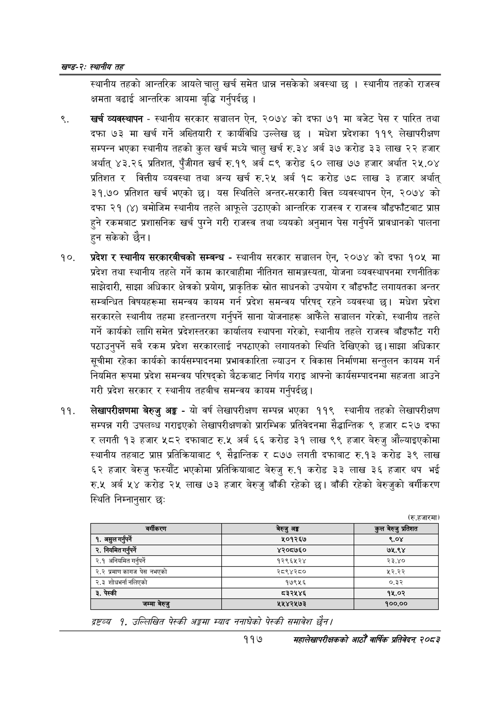

# Page 141 QA

## Rendered page


## Extracted text

```text
खण्ड-२स्थानीय तह
स्थानीय तहको आन्तरिक आयले चालु खर्च समेत धान्न नसकेको अवस्था छ। स्थानीय तहको राजस्व क्षमता बढाई आन्तरिक आयमा बृद्धि गर्नुपर्दछ |
खर्च व्यवस्थापन -स्थानीय सरकार सञ्चालन ऐन, २०७४ को दफा ७१ मा बजेट पेस र पारित तथा दफा ७३ मा खर्च गर्ने अख्तियारी र कार्यविधि उल्लेख छ। मधेश प्रदेशका ११९ लेखापरीक्षण सम्पन्न भएका स्थानीय तहको कुल खर्च मध्ये चालु खर्च रु.३४ अर्ब ३७ करोड ३३ लाख २२ हजार अर्थात्‌ ४३.२६ प्रतिशत, पुँजीगत खर्च रु.१९ अर्ब ८९ करोड ६० लाख ७७ हजार अर्थात २५.०४ प्रतिशत र वित्तीय व्यवस्था तथा अन्य खर्च रु.२५ अर्ब १८ करोड ७८ लाख ३ हजार अर्थात्‌ ३१.७० प्रतिशत खर्च भएको छ। यस स्थितिले अन्तर-सरकारी वित्त व्यवस्थापन ऐन, २०७४ को दफा २१ (४) बमोजिम स्थानीय तहले आफूले उठाएको आन्तरिक राजस्व र राजस्व बाँडफाँटबाट प्राप्त हुने रकमबाट प्रशासनिक खर्च पुग्ने गरी राजस्व तथा व्ययको अनुमान पेस गर्नुपर्ने प्रावधानको पालना हुन सकेको छैन।
प्रदेश र स्थानीय सरकारबीचको सम्बन्ध -स्थानीय सरकार सञ्चालन ऐन, २०७४ को दफा १०५ मा प्रदेश तथा स्थानीय तहले गर्ने काम कारबाहीमा नीतिगत सामञ्जस्यता, योजना व्यवस्थापनमा रणनीतिक साझेदारी, साझा अधिकार क्षेत्रको प्रयोग, प्राकृतिक स्रोत साधनको उपयोग र बाँडफाँट लगायतका अन्तर सम्बन्धित विषयहरूमा समन्वय कायम गर्न प्रदेश समन्वय परिषद्‌ रहने व्यवस्था छ। मधेश प्रदेश सरकारले स्थानीय तहमा हस्तान्तरण गर्नुपर्ने साना योजनाहरू आफैंले सञ्चालन गरेको, स्थानीय तहले गर्ने कार्यको लागि समेत प्रदेशस्तरका कार्यालय स्थापना गरेको, स्थानीय तहले राजस्व बाँडफाँट गरी पठाउनुपर्ने सबै रकम प्रदेश सरकारलाई नपठाएको लगायतको स्थिति देखिएको छ। साझा अधिकार सूचीमा रहेका कार्यको कार्यसम्पादनमा प्रभावकारिता ल्याउन र विकास निर्माणमा सन्तुलन कायम गर्न नियमित रूपमा प्रदेश समन्वय परिषद्को बैठकबाट निर्णय गराइ आफ्नो कार्यसम्पादनमा सहजता आउने गरी प्रदेश सरकार र स्थानीय तहबीच समन्वय कायम गर्नुपर्दछ |
लेखापरीक्षणमा बेरुजु अङ्ग -यो वर्ष लेखापरीक्षण सम्पन्न भएका ११९ स्थानीय तहको लेखापरीक्षण सम्पन्न गरी उपलब्ध गराइएको लेखापरीक्षणको प्रारम्भिक प्रतिवेदनमा सैद्धान्तिक ९ हजार ८२७ दफा र लगती १३ हजार ५८२ दफाबाट रु.५ अर्ब ६६ करोड ३१ लाख ९९ हजार बेरुजु औंल्याइएकोमा स्थानीय तहबाट प्राप्त प्रतिक्रियाबाट ९ सेद्वान्तिक र ८७७ लगती दफाबाट रु.१३ करोड ३९ लाख ६२ हजार बेरुजु फस्यौट भएकोमा प्रतिक्रियाबाट बेरुजु रु.१ करोड ३३ लाख ३६ हजार थप भई रु.५ अर्ब ५४ करोड २५ लाख ७३ हजार बेरुजु बाँकी रहेको छ। बाँकी रहेको बेरुजुको वर्गीकरण स्थिति निम्नानुसार छः
(रु.हजारमा)
द्रष्टव्य १. उल्लिखित पेस्की अङ्गमा स्याद ननाघेको पेस्की समावेश
११७
महालेखापरीक्षकको आठौं वाषिकि प्रतिवेदन २०८२

| वर्गीकरण | बेरुजु अङ्ग | कुल बेरुजु प्रतिशत |
| --- | --- | --- |
| १, अधुल गएन | ५०१२६७ | ९.०४ |
| २. निमित नरे | ४२०६७६० | ७५.९४ |
| २.९ अनियमित गर्नपर्ने | १२९६४५२४ | २३.४० |
| २.२ प्रमाण कागज पेस नभएको | २८९४२८० | ५२.२२ |
| २.३ शोधभर्ना नलिएको | १७९५६ | ०.३२ |
| ३. पेस्की | ८३२५४६ | १५.०२ |
| जम्मा बेरुजु | ५४५४२५७३ | १००.०० |
```

## Flags
- table_page
- medium_quality_table
