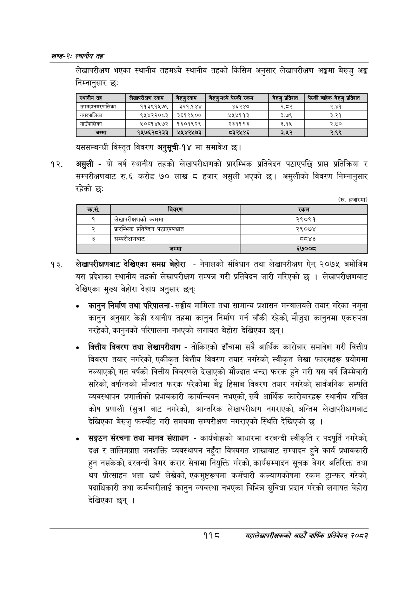

# Page 142 QA

## Rendered page


## Extracted text

```text
खण्ड-२स्थानीय तह
लेखापरीक्षण भएका स्थानीय तहमध्ये स्थानीय तहको किसिम अनुसार लेखापरीक्षण अङ्कमा बेरुजु अङ्ग निम्नानुसार छः
यससम्बन्धी विस्तृत विवरण अनुसूची-१४ मा समावेश |
असुली -यो वर्ष स्थानीय तहको लेखापरीक्षणको प्रारम्भिक प्रतिवेदन पठाएपछि प्राप्त प्रतिक्रिया र सम्परीक्षणबाट रु.६ करोड ७० लाख हजार असुली भएको छ। असुलीको विवरण निम्नानुसार रहेको छ:
लेखापरीक्षणबाट देखिएका समग्र बेहोरा -नेपालको संविधान तथा लेखापरीक्षण ऐन, २०७५ बमोजिम यस प्रदेशका स्थानीय तहको लेखापरीक्षण सम्पन्न गरी प्रतिवेदन जारी गरिएको छ। लेखापरीक्षणबाट देखिएका मुख्य बेहोरा देहाय अनुसार छन्‌ः
० कानुन निर्माण तथा परिपालना -सङ्घीय मामिला तथा सामान्य प्रशासन मन्त्रालयले तयार गरेका नमूना कानुन अनुसार केही स्थानीय तहमा कानुन निर्माण गर्न बाँकी रहेको, मौजुदा कानुनमा एकरुपता नरहेको, कानुनको परिपालना नभएको लगायत बेहोरा देखिएका छन्‌।
वित्तीय विवरण तथा लेखापरीक्षण -तोकिएको ढाँचामा सबै आर्थिक कारोबार समावेश गरी वित्तीय विवरण तयार नगरेको, एकीकृत वित्तीय विवरण तयार नगरेको, स्वीकृत लेखा फारमहरू प्रयोगमा नल्याएको, गत वर्षको वित्तीय विवरणले देखाएको मौज्दात भन्दा फरक हुने गरी यस वर्ष जिम्मेवारी सारेको, वर्षान्तको मौज्दात फरक परेकोमा बेङ्ग हिसाब विवरण तयार नगरेको, सार्वजनिक सम्पत्ति व्यवस्थापन प्रणालीको प्रभावकारी कार्यान्वयन नभएको, सबै आर्थिक कारोबारहरू स्थानीय सञ्चित कोष प्रणाली (सुत्र) बाट नगरेको, आन्तरिक लेखापरीक्षण नगराएको, अन्तिम लेखापरीक्षणबाट देखिएका बेरुजु फस्यौट गरी समयमा सम्परीक्षण नगराएको स्थिति देखिएको छ।
० सङ्गठन संरचना तथा मानव संशाधन -कार्यबोझको आधारमा दरबन्दी स्वीकृति र पदपूर्ति नगरेको, दक्ष र तालिमप्रापत जनशक्ति व्यवस्थापन नहुँदा विषयगत शाखाबाट सम्पादन हुने कार्य प्रभावकारी हुन नसकेको, दरबन्दी बेगर करार सेवामा नियुक्ति गरेको, कार्यसम्पादन सूचक बेगर अतिरिक्त तथा थप प्रोत्साहन भत्ता खर्च लेखेको, एकमुष्टरूपमा कर्मचारी कल्याणकोषमा रकम ट्रान्फर गरेको, पदाधिकारी तथा कर्मचारीलाई कानुन व्यवस्था नभएका बिभिन्न सुविधा प्रदान गरेको लगायत बेहोरा देखिएका छन्‌।
(रु. हजारमा)
११८
महालेखापरीक्षकको आठौं वाषिकि प्रतिवेदन २०८२

| स्थानीय तह | सेखापरीकण रकम | नेल्जुस्कनण | नेरजु पेस्की रकम | बेरुजु प्रतिशत |
| --- | --- | --- | --- | --- |
| उपनहानबरकालिका | ११३९१५७९ | ३२१,१४४ | ४६२४० | रर |
| ननर्कालिका | ९५४२२०८३ | ३६१९४५०० | ५५५११३ | ३.७९ |
| नाउँबालिका | ५०८१४५७२ | १६०१९२९ | २३११९३ | ३.१५ |
| जम्मा | १५७६२८२३३ | १५४५४२५७३ | ८३२५४६ | ३.५२ |

| कस. | विवरण | 'रकम |
| --- | --- | --- |
| १ | 'लेखापरीक्षणको क्रममा | २९०९१ |
| २ | प्रारम्भिक प्रतिवेदन ५८।एपपच्चात | २९०७४ |
| ३ | 'सम्परीक्षणबाट | द्व४३ |
| ४ | जम्मा | ६७००८ |
```

## Flags
- table_page
- medium_quality_table
