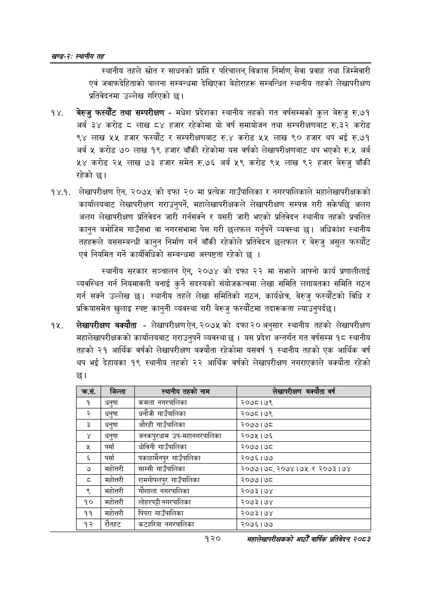

# Page 144 QA

## Rendered page


## Extracted text

```text
खण्ड-२स्थानीय तह
स्थानीय तहले स्रोत र साधनको प्राप्ति र परिचालन, विकास निर्माण, सेवा प्रवाह तथा जिम्मेवारी एवं जवाफदेहिताको पालना सम्बन्धमा देखिएका बेहोराहरू सम्बन्धित स्थानीय तहको लेखापरीक्षण प्रतिवेदनमा उल्लेख गरिएको छ।
१४, बेरुजु फस्यौट तथा सम्परीक्षण -मधेश प्रदेशका स्थानीय तहको गत वर्षसम्मको कुल बेरुजु रु.७१ अर्ब ३४ करोड ८ लाख ८४ हजार रहेकोमा यो वर्ष समायोजन तथा सम्परीक्षणबाट रु.३२ करोड ९४ लाख ५५ हजार फस्यौट र सम्परीक्षणबाट रु.४ करोड ५५ लाख ९० हजार थप भई रु.७१ अर्ब ४ करोड ७० लाख १९ हजार बाँकी रहेकोमा यस वर्षको लेखापरीक्षणबाट थप भएको रु.५ अर्ब ५४ करोड २५ लाख ७३ हजार समेत रु.७६ अर्ब ५९ करोड ९५ लाख ९२ हजार बेरुजु बाँकी रहेको छ।
१४.१. लेखापरीक्षण ऐन, २०७५ को दफा २० मा प्रत्येक गाउँपालिका र नगरपालिकाले महालेखापरीक्षकको कार्यालयबाट लेखापरीक्षण गराउनुपर्ने, महालेखापरीक्षकले लेखापरीक्षण सम्पन्न गरी सकेपछि अलग अलग लेखापरीक्षण प्रतिवेदन जारी गर्नसक्ने र यसरी जारी भएको प्रतिवेदन स्थानीय तहको प्रचलित कानुन बमोजिम गाउँसभा वा नगरसभामा पेस गरी छलफल गर्नुपर्ने व्यवस्था छ। अधिकांश स्थानीय तहहरूले यससम्बन्धी कानुन निर्माण गर्न बाँकी रहेकोले प्रतिवेदन छलफल र बेरुजु असुल फस्यौट एवं नियमित गर्ने कार्यविधिको सम्बन्धमा अस्पष्टता रहेको छ।
स्थानीय सरकार सञ्चालन ऐन, २०७४ को दफा २२ मा सभाले आफ्नो कार्य प्रणालीलाई व्यवस्थित गर्न नियमावली बनाई कुनै सदस्यको संयोजकत्वमा लेखा समिति लगायतका समिति गठन गर्न सक्ने उल्लेख छ। स्थानीय तहले लेखा समितिको गठन, कार्यक्षेत्र, बेरुजु फस्यौटको विधि र प्रक्रियासमेत खुलाइ स्पष्ट कानुनी व्यवस्था गरी बेरुजु फस्यौटमा तदारूकता ल्याउनुपर्दछ।
लेखापरीक्षण बक्यौता -लेखापरीक्षण ऐन, २०७५ को दफा २० अनुसार स्थानीय तहको लेखापरीक्षण महालेखापरीक्षकको कार्यालयबाट गराउनुपर्ने व्यवस्था छ। यस प्रदेश अन्तर्गत गत वर्षसम्म १८ स्थानीय तहको २१ आर्थिक वर्षको लेखापरीक्षण बक्यौता रहेकोमा यसवर्ष १ स्थानीय तहको एक आर्थिक वर्ष थप भई देहायका १९ स्थानीय तहको २२ आर्थिक वर्षको लेखापरीक्षण नगराएकाले बक्यौता रहेको छ।
१२०
महालेखापरीक्षकको आठौं वाषिकि प्रतिवेदन २०८२

| क्रस. | जिल्ला | ल्यानी४ तहको नाम | लेखापरीक्षण ता वर्ष |
| --- | --- | --- | --- |
| १ | धनुषा | कमला नभरपालिका | २०७८।७९ |
| २ | धनुषा | घनौजी ॥॥उंपालिका | २०७८।७९ |
| ३ | धनुषा | औरही।उपालिका | २०७७।७८ |
| ४ | धनुषा | जनकपुरचाम उप-महानगरपालिका | २०७५।७६ |
| ५ | पर्सा | घोविनी थाउपालिका | २०७७।७८ |
| ६ | पर्सा | पकाहामैनपुर गाउँपालिका | २०७६।७७ |
| ७ | महेत्तरी | साम्सी गाउँपालिका | २०७७।७८, २०७४।७५ र २०७३।७४ |
| ८ | महोत्तरी | रामगोषलपुर गाउँपालिका | २०७७।७८ |
| ९ | महोत्तरी | गौशाला नगरपालिका | २०७३।७४ |
| १० | भमहोत्तरी | ! नगरपालिका | २०७३।७४ |
| ११ | महोत्तरी | पिपरा भाउँपालिका | २०७३।७४ |
| १२ | रौतहट | कटहरिबा नगरपालिका | २०७६।७७ |
```

## Flags
- table_page
- medium_quality_table
