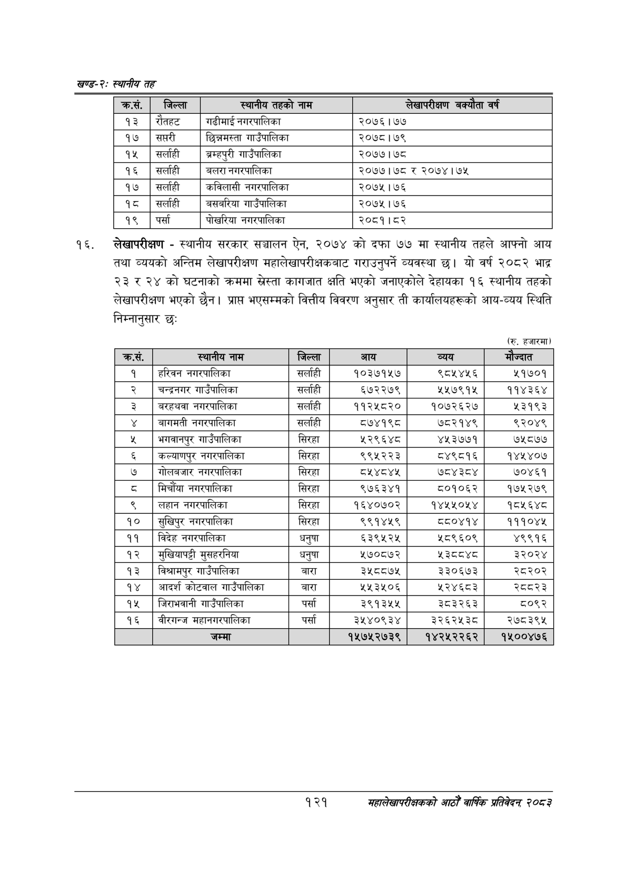

# Page 145 QA

## Rendered page


## Extracted text

```text
खण्ड-२स्थानीय तह
लेखापरीक्षण -स्थानीय सरकार सञ्चालन ऐन, २०७४ को दफा ७७ मा स्थानीय तहले आफ्नो आय तथा व्ययको अन्तिम लेखापरीक्षण महालेखापरीक्षकबाट गराउनुपर्ने व्यवस्था | यो वर्ष २०८२ भाद्र २३ र २४ को घटनाको क्रममा स्रेस्ता कागजात क्षति भएको जनाएकोले देहायका १६ स्थानीय तहको लेखापरीक्षण भएको छैन। प्राप्त भएसम्मको वित्तीय विवरण अनुसार ती कार्यालयहरूको आय-व्यय स्थिति निम्नानुसार छः:
(रु. हजारमा)
१२१
महालेखापरीक्षकको आठौं वाषिकि प्रतिवेदन २०८२

|   क्र.सं. | जिल्ला        | स्थानीय तहको नाम      | लेखापरीक्षण बक्योता वर्ष   |
|-----------|---------------|-----------------------|----------------------------|
|        93 | रोतहट         | गढीमाई नगरपालिका      | २०७६।1७७                   |
|        १७ | सप्तरी        | छिन्नमस्ता गाउँपालिका | २०७८।७९                    |
|        १५ | &#124;सर्ताही | ्रम्हपुरी गाउँपालिका  | २०७७। ७८                   |
|        १६ | सर्लाही       | बलरा नगरपालिका        | २०७७।७८ र २०७४। ७५         |
|        १७ | सर्लाही       | कविलासी नगरपालिका     | २०७५।७६                    |
|        १८ | सर्लाही       | बसबरिया गाउँपालिका    | २०७५।७६                    |
|        १९ | पर्सा         | पोखरिया नगरपालिका     | २०८१।८२                    |

| क्रस. | स्थानीय नाम | जिल्ला | आय | व्यय |  |
| --- | --- | --- | --- | --- | --- |
| १ | हरिवन नभरपालिका | सर्लाही | १०३७१५७ | ९८५४५६ | २१७०१ |
| २ | नन्द्रनगर माउँपालिका | सर्लाही | ६७२२७९ | ५५७९१५ | ११४३६४ |
| ३ | बरहथवा नगरपालिका | सर्लाही | ११२५८२० | १०७२६२७ | %३९४३ |
| ४ | नागभती नगरपालिका | सर्लाही | ८७४१९८ | ७८२१४९ | ९२०४९ |
| ५ | भनवानपुर गाउँपालिका | सिरहा | ५२९६४८ | ४५३७७१ | ७५८७७ |
| ६ | कल्याणपुर नगरपालिका | सिरहा | ९९५२२३ | ८४९८१६ | १४५४०७ |
| ७ | नोलनजार नगरपालिका | सिरहा | ८४४५ | ७८४३८४ | ७०४६१ |
| ८ | मिर्चौया नगरपालिका | सिरहा | ९७६३४१ | ८०१०६२ | १७५२७९ |
| ९ | लहान नगरपालिका | सिरहा | १६४०७०२ | १४५५०५४ | १८४५६४८ |
| १० | सुखिपुर नगरपालिका | सिरहा | ९९१४५९ | दद०४१४ | १११०४५ |
| ११ | बिदेह नगरपालिका | धनुषा | ६३९५२५ | श८९६०९ | ४९९१६ |
| १२ | मुखियापड्टी मुसहरनेया | घनुषा | ५७०८७२ | ४१०१ | ३२०२४ |
| १३ | विश्चामपुर भाउपालिका | बारा | ३५८८७५ | ३३०६७३ | २८२०२ |
| १४ | आदर्श कोटबाल गाउँपालिका | बारा | ५५३५०६ | ५२४६८३ | २८२३ |
| १५ | जिराभवानी ५।उँपा।लिका | पर्सा | ३९१३५५ | ३८३२६३ | ८०९२ |
| १६ | वीरगन्ज महानगरपालिका | पर्सा | ३५४०९३४ | ३२६२५३८ | २७८३९५ |
| १७ | जम्मा |  | १५७५२७३९ | १४२५२२६२ | १४१००४७६ |
```

## Flags
- table_page
- medium_quality_table
