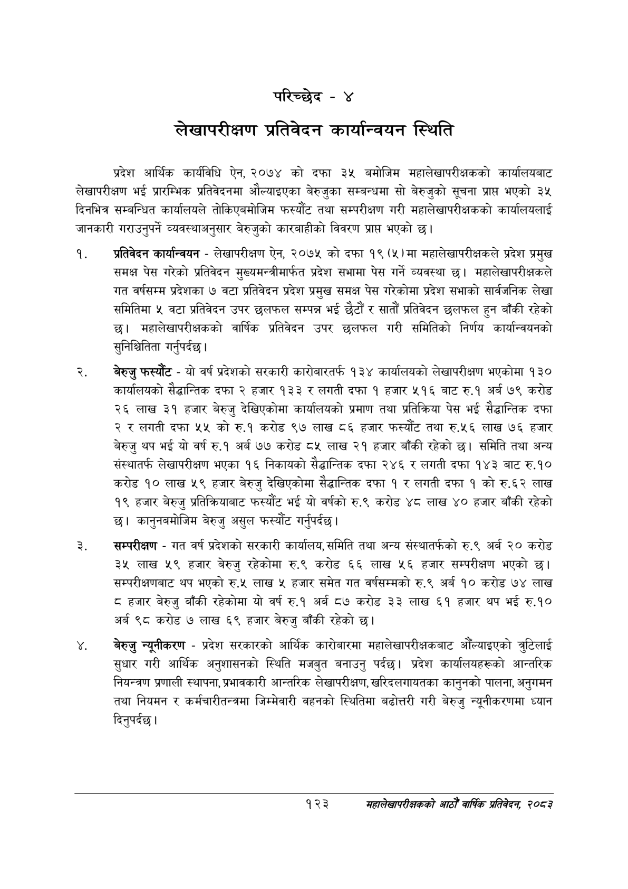

# Page 149 QA

## Rendered page


## Extracted text

```text
परिच्छेद -४
लेखापरीक्षण प्रतिवेदन कार्यान्वयन स्थिति
प्रदेश आर्थिक कार्यविधि ऐन, २०७४ को दफा ३५ बमोजिम महालेखापरीक्षकको कार्यालयबाट लेखापरीक्षण भई प्रारम्भिक प्रतिवेदनमा औल्याइएका बेरुजुका सम्बन्धमा सो बेरुजुको सूचना प्रापत भएको ३५ दिनभित्र सम्बन्धित कार्यालयले तोकिएबमोजिम फस्यौट तथा सम्परीक्षण गरी महालेखापरीक्षकको कार्यालयलाई जानकारी गराउनुपर्ने व्यवस्थाअनुसार बेरुजुको कारबाहीको विवरण प्राप्त भएको छ।
प्रतिवेदन कार्यान्वयन -लेखापरीक्षण ऐन, २०७५ को दफा १९ (५) मा महालेखापरीक्षकले प्रदेश प्रमुख समक्ष पेस गरेको प्रतिवेदन मुख्यमन्त्रीमार्फत प्रदेश सभामा पेस गर्ने व्यवस्था | महालेखापरीक्षकले गत वर्षसम्म प्रदेशका ७ वटा प्रतिवेदन प्रदेश प्रमुख समक्ष पेस गरेकोमा प्रदेश सभाको सार्वजनिक लेखा समितिमा ५ वटा प्रतिवेदन उपर छलफल सम्पन्न भई छैटौं र सातौं प्रतिवेदन छलफल हुन बाँकी रहेको छ। महालेखापरीक्षकको वार्षिक प्रतिवेदन उपर छलफल गरी समितिको निर्णय कार्यान्वयनको सुनिश्चितिता गर्नुपर्दछ |
बेरुजु फस्यौट -यो वर्ष प्रदेशको सरकारी कारोबारतर्फ १३४ कार्यालयको लेखापरीक्षण भएकोमा १३० कार्यालयको सैद्धान्तिक दफा २ हजार ४३३ र लगती दफा १ हजार ५१६ बाट रु.१ अर्ब ७९ करोड २६ लाख ३९ हजार बेरुजु देखिएकोमा कार्यालयको प्रमाण तथा प्रतिक्रिया पेस भई सैद्धान्तिक दफा २ र लगती दफा ५५ को रु.१ करोड ९७ लाख ८६ हजार फस्यौट तथा रु.५६ लाख ७६ हजार बेरुजु थप भई यो वर्ष रु.१ अर्ब ७७ करोड ८५ लाख २१ हजार बाँकी रहेको छ। समिति तथा अन्य संस्थातर्फ लेखापरीक्षण भएका १६ निकायको सैद्धान्तिक दफा २४६ र लगती दफा १४३ बाट रु.१० करोड १० लाख ५९ हजार बेरुजु देखिएकोमा सैद्धान्तिक दफा १ र लगती दफा १ को रु.६२ लाख १९ हजार बेरुजु प्रतिक्रियाबाट फस्यौट भई यो वर्षको रु.९ करोड ४८ लाख ४० हजार बाँकी रहेको छ। कानुनबमोजिम बेरुजु असुल फस्यौंट गर्नुपर्दछ |
सम्परीक्षण -गत वर्ष प्रदेशको सरकारी कार्यालय, समिति तथा अन्य संस्थातर्फको रु.९ अर्ब २० करोड ३५ लाख ५९ हजार बेरुजु रहेकोमा रु.९ करोड ६६ लाख ५६ हजार सम्परीक्षण भएको छ। सम्परीक्षणबाट थप भएको रु.५ लाख ५ हजार समेत गत वर्षसम्मको रु.९ अर्ब १० करोड ७४ लाख हजार बेरुजु बाँकी रहेकोमा यो वर्ष रु.१ अर्ब ८७ करोड ३३ लाख ६१ हजार थप भई रु.१० अर्ब ९८ करोड ७ लाख ६९ हजार बेरुजु बाँकी रहेको छ।
बेरुजु न्यूनीकरण -प्रदेश सरकारको आर्थिक कारोबारमा महालेखापरीक्षकबाट औँल्याइएको तुटिलाई सुधार गरी आर्थिक अनुशासनको स्थिति मजबुत बनाउनु पर्दछ। प्रदेश कार्यालयहरूको आन्तरिक नियन्त्रण प्रणाली स्थापना, प्रभावकारी आन्तरिक लेखापरीक्षण, खरिदलगायतका कानुनको पालना, अनुगमन तथा नियमन र कर्मचारीतन्त्रमा जिम्मेवारी वहनको स्थितिमा बढोत्तरी गरी बेरुजु न्यूनीकरणमा ध्यान दिनुपर्दछ |
१२३
महालेखापरीक्षकको आठौ वाषिकि प्रतिवेदन २०८२
```

## Flags
- None
