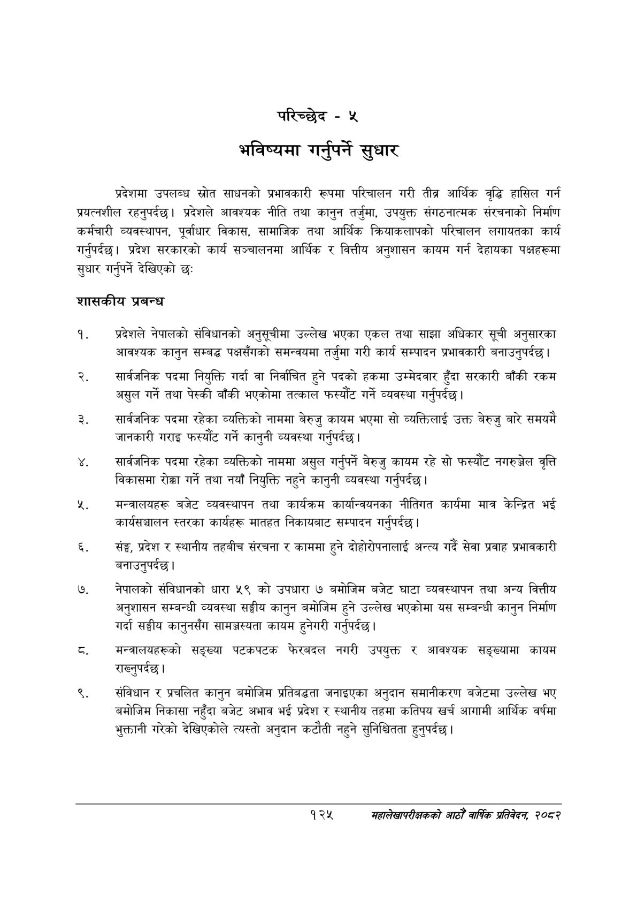

# Page 153 QA

## Rendered page


## Extracted text

```text
परिच्छेद -५
भविष्यमा गर्नुपर्ने सुधार
प्रदेशमा उपलब्ध स्रोत साधनको प्रभावकारी रूपमा परिचालन गरी तीब्र आर्थिक वृद्धि हासिल गर्न प्रयत्नशील रहनुपर्दछ। प्रदेशले आवश्यक नीति तथा कानुन तर्जुमा, उपयुक्त संगठनात्मक संरचनाको निर्माण कर्मचारी व्यवस्थापन, पूर्वाधार विकास, सामाजिक तथा आर्थिक क्रियाकलापको परिचालन लगायतका कार्य गर्नुपर्दछ। प्रदेश सरकारको कार्य सञ्चालनमा आर्थिक र वित्तीय अनुशासन कायम गर्न देहायका पक्षहरूमा सुधार गर्नुपर्ने देखिएको छः
शासकीय प्रबन्ध
प्रदेशले नेपालको संविधानको अनुसूचीमा उल्लेख भएका एकल तथा साझा अधिकार सूची अनुसारका आवश्यक कानुन सम्बद्ध पक्षसँगको समन्वयमा तर्जुमा गरी कार्य सम्पादन प्रभावकारी बनाउनुपर्दछ |
सार्वजनिक पदमा नियुक्ति गर्दा वा निर्वाचित हुने पदको हकमा उम्मेदवार हुँदा सरकारी बाँकी रकम असुल गर्ने तथा पेस्की बाँकी भएकोमा तत्काल फस्यौट गर्ने व्यवस्था गर्नुपर्दछ |
सार्वजनिक पदमा रहेका व्यक्तिको नाममा बेरुजु कायम भएमा सो व्यक्तिलाई उक्त बेरुजु बारे समयमै जानकारी गराइ फस्यौट गर्ने कानुनी व्यवस्था गर्नुपर्दछ |
सार्वजनिक पदमा रहेका व्यक्तिको नाममा असुल गर्नुपर्ने बेरुजु कायम रहे सो फस्यौट नगरुञ्जेल वृत्ति विकासमा रोक्का गर्ने तथा नयाँ नियुक्ति नहुने कानुनी व्यवस्था गर्नुपर्दछ |
मन्त्रालयहरू बजेट व्यवस्थापन तथा कार्यक्रम कार्यान्वयनका नीतिगत कार्यमा मात्र केन्द्रित भई कार्यसञ्चालन स्तरका कार्यहरू मातहत निकायबाट सम्पादन गर्नुपर्दछ |
सङ्ग, प्रदेश र स्थानीय तहबीच संरचना र काममा हुने दोहोरोपनालाई अन्त्य गर्दै सेवा प्रवाह प्रभावकारी बनाउनुपर्दछ।
नेपालको संविधानको धारा ५९ को उपधारा ७ बमोजिम बजेट घाटा व्यवस्थापन तथा अन्य वित्तीय अनुशासन सम्बन्धी व्यवस्था सङ्घीय कानुन बमोजिम हुने उल्लेख भएकोमा यस सम्बन्धी कानुन निर्माण गर्दा सङ्घीय कानुनसँग सामञ्जस्यता कायम हुनेगरी गर्नुपर्दछ |
मन्त्रालयहरूको सङ्ख्या पटकपटक फेरबदल नगरी उपयुक्त र आवश्यक सङ्ख्यामा कायम राख्नुपर्दछ |
संविधान र प्रचलित कानुन बमोजिम प्रतिबद्धता जनाइएका अनुदान समानीकरण बजेटमा उल्लेख भए बमोजिम निकासा नहुँदा बजेट अभाव भई प्रदेश र स्थानीय तहमा कतिपय खर्च आगामी आर्थिक वर्षमा भुक्तानी गरेको देखिएकोले त्यस्तो अनुदान कटौती नहुने सुनिश्चितता हुनुपर्दछ |
१२५
महालेखापरीक्षकको आठौ वाषिकि प्रतिवेदन २०८२
```

## Flags
- None
