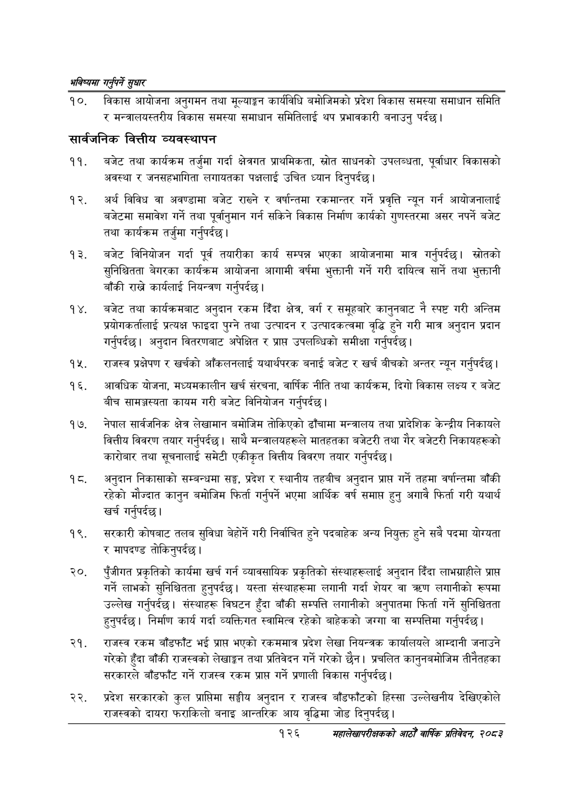

# Page 154 QA

## Rendered page


## Extracted text

```text
भविष्यमा गर्नुपर्ने सुक्षार
विकास आयोजना अनुगमन तथा मूल्याङ्कन कार्यविधि बमोजिमको प्रदेश विकास समस्या समाधान समिति र मन्त्रालयस्तरीय विकास समस्या समाधान समितिलाई थप प्रभावकारी बनाउनु पर्दछ।
सार्वजनिक वित्तीय व्यवस्थापन
बजेट तथा कार्यक्रम तर्जुमा गर्दा क्षेत्रगत प्राथमिकता, स्रोत साधनको उपलब्धता, पूर्वाधार विकासको अवस्था र जनसहभागिता लगायतका पक्षलाई उचित ध्यान दिनुपर्दछ।
अर्थ विविध वा अवण्डामा बजेट राख्ने र वर्षान्तमा रकमान्तर गर्ने प्रवृत्ति न्यून गर्न आयोजनालाई बजेटमा समावेश गर्ने तथा पूर्वानुमान गर्न सकिने विकास निर्माण कार्यको गुणस्तरमा असर नपर्ने बजेट तथा कार्यक्रम तर्जुमा गर्नुपर्दछ।
बजेट विनियोजन गर्दा पूर्व तयारीका कार्य सम्पन्न भएका आयोजनामा मात्र गर्नुपर्दछ। स्रोतको सुनिश्चितता बेगरका कार्यक्रम आयोजना आगामी वर्षमा भुक्तानी गर्ने गरी दायित्व सार्ने तथा भुक्तानी बाँकी राख्ने कार्यलाई नियन्त्रण गर्नुपर्दछ |
बजेट तथा कार्यक्रमबाट अनुदान रकम दिँदा क्षेत्र, वर्ग र समूहबारे कानुनबाट नै स्पष्ट गरी अन्तिम प्रयोगकर्तालाई प्रत्यक्ष फाइदा पुग्ने तथा उत्पादन र उत्पादकत्वमा वृद्धि हुने गरी मात्र अनुदान प्रदान गर्नुपर्दछ। अनुदान वितरणबाट अपेक्षित र प्रापत उपलब्धिको समीक्षा गर्नुपर्दछ |
राजस्व प्रक्षेपण र खर्चको आँकलनलाई यथार्थपरक बनाई बजेट र खर्च बीचको अन्तर न्यून गर्नुपर्दछ।
आवधिक योजना, मध्यमकालीन खर्च संरचना, वार्षिक नीति तथा कार्यक्रम, दिगो विकास लक्ष्य र बजेट बीच सामञ्जस्यता कायम गरी बजेट विनियोजन गर्नुपर्दछ।
नेपाल सार्वजनिक क्षेत्र लेखामान बमोजिम तोकिएको ढाँचामा मन्त्रालय तथा प्रादेशिक केन्द्रीय निकायले वित्तीय विवरण तयार गर्नुपर्दछ। साथै मन्त्रालयहरूले मातहतका बजेटरी तथा गैर बजेटरी निकायहरूको कारोबार तथा सूचनालाई समेटी एकीकृत वित्तीय विवरण तयार गर्नुपर्दछ |
अनुदान निकासाको सम्बन्धमा सङ्ग, प्रदेश र स्थानीय तहबीच अनुदान प्राप्त गर्ने तहमा वर्षान्तमा बाँकी रहेको मौज्दात कानुन बमोजिम फिर्ता गर्नुपर्ने भएमा आर्थिक वर्ष समाप्त हुनु अगावै फिर्ता गरी यथार्थ खर्च गर्नुपर्दछ |
सरकारी कोषबाट तलब सुविधा बेहोर्ने गरी निर्वाचित हुने पदबाहेक अन्य नियुक्त हुने सबै पदमा योग्यता र मापदण्ड तोकिनुपर्दछ।
२०, पुँजीगत प्रकृतिको कार्यमा खर्च गर्न व्यावसायिक प्रकृतिको संस्थाहरूलाई अनुदान दिँदा लाभग्राहीले प्रा गर्ने लाभको सुनिश्चितता हुनुपर्दछ। यस्ता संस्थाहरूमा लगानी गर्दा शेयर वा लगानीको रूपमा उल्लेख गर्नुपर्दछ। संस्थाहरू विघटन हुँदा बाँकी सम्पत्ति लगानीको अनुपातमा फिर्ता गर्ने सुनिश्चितता हुनुपर्दछ। निर्माण कार्य गर्दा व्यक्तिगत स्वामित्व रहेको बाहेकको जग्गा वा सम्पत्तिमा गर्नुपर्दछ |
राजस्व रकम बाँडफाँट भई प्रापत भएको रकममात्र प्रदेश लेखा नियन्त्रक कार्यालयले आम्दानी जनाउने गरेको हुँदा बाँकी राजस्वको लेखाङ्गन तथा प्रतिवेदन गर्ने गरेको छैन। प्रचलित कानुनबमोजिम तीनैतहका सरकारले बाँडफाँट गर्ने राजस्व रकम प्राप्त गर्ने प्रणाली विकास गर्नुपर्दछ |
प्रदेश सरकारको कुल प्राप्तिमा सङ्घीय अनुदान र राजस्व बाँडफाँटको हिस्सा उल्लेखनीय देखिएकोले राजस्वको दायरा फराकिलो बनाइ आन्तरिक आय वृद्धिमा जोड दिनुपर्दछ |
१२६
सहालेखापरीक्षकको आठौँ वाषिकि प्रतिवेदन २०८२
```

## Flags
- None
