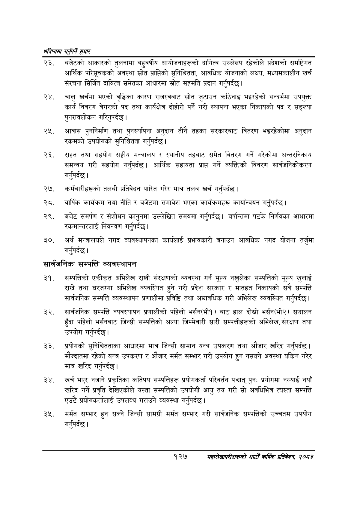

# Page 155 QA

## Rendered page


## Extracted text

```text
भविष्यमा गर्नुपर्ने सुक्षार
बजेटको आकारको तुलनामा बहुवर्षीय आयोजनाहरूको दायित्व उल्लेख्य रहेकोले प्रदेशको समष्टिगत आर्थिक परिसूचकको अवस्था स्रोत प्राप्तिको सुनिश्चितता, आवधिक योजनाको लक्ष्य, मध्यमकालीन खर्च संरचना सिर्जित दायित्व समेतका आधारमा स्रोत सहमति प्रदान गर्नुपर्दछ |
२४, चालु खर्चमा भएको वृद्धिका कारण राजस्वबाट स्रोत जुटाउन कठिनाइ भइरहेको सन्दर्भमा उपयुक्त कार्य विवरण बेगरको पद तथा कार्यक्षेत्र दोहोरो पर्ने गरी स्थापना भएका निकायको पद र सङ्ख्या पुनरावलोकन गरिनुपर्दछ |
आवास पुननिर्माण तथा पुनर्स्थापना अनुदान तीनै तहका सरकारबाट वितरण भइरहेकोमा अनुदान रकमको उपयोगको सुनिश्चितता गर्नुपर्दछ |
राहत तथा सहयोग सङ्घीय मन्त्रालय र स्थानीय तहबाट समेत वितरण गर्ने गरेकोमा अन्तरनिकाय समन्वय गरी सहयोग गर्नुपर्दछ। आर्थिक सहायता प्राप्त गर्ने व्यक्तिको विवरण सार्वजनिकीकरण गर्नुपर्दछ |
२७, कर्मचारीहरूको तलबी प्रतिवेदन पारित गरेर मात्र तलब खर्च गर्नुपर्दछ |
, वार्षिक कार्यक्रम तथा नीति र बजेटमा समावेश भएका कार्यक्रमहरू कार्यान्वयन गर्नुपर्दछ |
बजेट समर्पण र संशोधन कानुनमा उल्लेखित समयमा गर्नुपर्दछ। वर्षान्तमा पटके निर्णयका आधारमा रकमान्तरलाई नियन्त्रण गर्नुपर्दछ |
अर्थ मन्त्रालयले नगद व्यवस्थापनका कार्यलाई प्रभावकारी बनाउन आवधिक नगद योजना तर्जुमा गर्नुपर्दछ |
सार्वजनिक सम्पत्ति व्यवस्थापन
सम्पत्तिको एकीकृत अभिलेख राखी संरक्षणको व्यवस्था गर्न मूल्य नखुलेका सम्पत्तिको मूल्य खुलाई राखे तथा घरजग्गा अभिलेख व्यवस्थित हुने गरी प्रदेश सरकार र मातहत निकायको सबै सम्पत्ति सार्वजनिक सम्पत्ति व्यवस्थापन प्रणालीमा प्रविष्टि तथा अद्यावधिक गरी अभिलेख व्यवस्थित गर्नुपर्दछ |
सार्वजनिक सम्पत्ति व्यवस्थापन प्रणालीको पहिलो भर्सन(भीव) बाट हाल दोस्रो भर्सन(भी२) सञ्चालन हुँदा पहिलो भर्सनबाट जिन्सी सम्पत्तिको अल्या जिम्मेवारी सारी सम्पत्तीहरूको अभिलेख, संरक्षण तथा उपयोग गर्नुपर्दछ |
प्रयोगको सुनिश्चितताका आधारमा मात्र जिन्सी सामान यन्त्र उपकरण तथा औजार खरिद गर्नुपर्दछ। मौज्दातमा रहेको यन्त्र उपकरण र औजार मर्मत सम्भार गरी उपयोग हुन नसक्ने अवस्था यकिन गरेर मात्र खरिद गर्नुपर्दछ |
खर्च भएर नजाने प्रकृतिका कतिपय सम्पत्तिहरू प्रयोगकर्ता परिवर्तन पश्चात्‌ पुनः प्रयोगमा नल्याई नयाँ खरिद गर्ने प्रवृति देखिएकोले यस्ता सम्पत्तिको उपयोगी आयु तय गरी सो अवधिभित्र त्यस्ता सम्पत्ति एउटै प्रयोगकर्तालाई उपलब्ध गराउने व्यवस्था गर्नुपर्दछ |
मर्मत सम्भार हुन सक्ने जिन्सी सामग्री मर्मत सम्भार गरी सार्वजनिक सम्पत्तिको उच्चतम उपयोग गर्नुपर्दछ |
१२७
सहालेखापरीक्षकको आठौँ वाषिकि प्रतिवेदन २०८२
```

## Flags
- None
