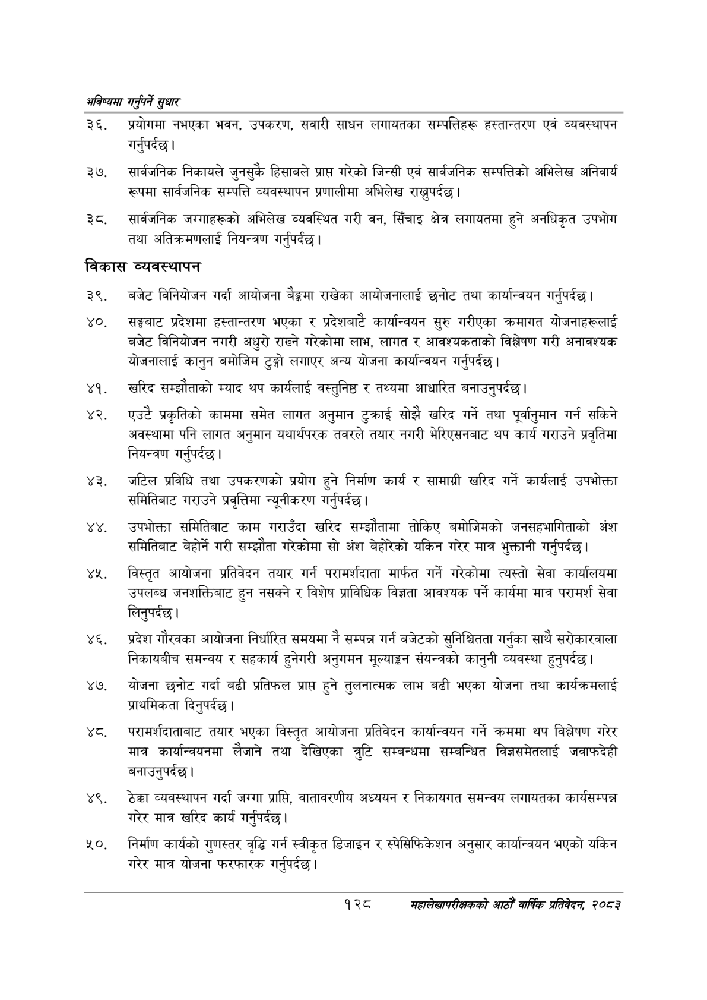

# Page 156 QA

## Rendered page


## Extracted text

```text
भविष्यमा गर्नुपर्ने सुक्षार
प्रयोगमा नभएका भवन, उपकरण, सवारी साधन लगायतका सम्पत्तिहरू हस्तान्तरण एवं व्यवस्थापन गर्नुपर्दछ |
सार्वजनिक निकायले जुनसुकै हिसाबले प्राप्त गरेको जिन्सी एवं सार्वजनिक सम्पत्तिको अभिलेख अनिवार्य रूपमा सार्वजनिक सम्पत्ति व्यवस्थापन प्रणालीमा अभिलेख राख्नुपर्दछ |
सार्वजनिक जग्गाहरूको अभिलेख व्यवस्थित गरी वन, सिँचाइ क्षेत्र लगायतमा हुने अनधिकृत उपभोग तथा अतिक्रमणलाई नियन्त्रण गर्नुपर्दछ |
विकास व्यवस्थापन
बजेट विनियोजन गर्दा आयोजना बैङ्कमा राखेका आयोजनालाई छनोट तथा कार्यान्वयन गर्नुपर्दछ।
सङ्घबाट प्रदेशमा हस्तान्तरण भएका र प्रदेशबाट कार्यान्वयन सुरु गरीएका क्रमागत योजनाहरूलाई बजेट विनियोजन नगरी अधुरो राख्ने गरेकोमा लाभ, लागत र आवश्यकताको विश्लेषण गरी अनावश्यक योजनालाई कानुन बमोजिम टुङ्गो लगाएर अन्य योजना कार्यान्वयन गर्नुपर्दछ |
९. खरिद सम्झौताको म्याद थप कार्यलाई वस्तुनिष्ठ र तथ्यमा आधारित बनाउनुपर्दछ |
एउटै प्रकृतिको काममा समेत लागत अनुमान टुक्राई सोझै खरिद गर्ने तथा पूर्वानुमान गर्न सकिने अवस्थामा पनि लागत अनुमान यथार्थपरक तवरले तयार नगरी भेरिएसनबाट थप कार्य गराउने प्रवृतिमा नियन्त्रण गर्नुपर्दछ |
जटिल प्रविधि तथा उपकरणको प्रयोग हुने निर्माण कार्य र सामाग्री खरिद गर्ने कार्यलाई उपभोक्ता समितिबाट गराउने प्रवृत्तिमा न्यूनीकरण गर्नुपर्दछ |
उपभोक्ता समितिबाट काम गराउँदा खरिद सम्झौतामा तोकिए बमोजिमको जनसहभागिताको अंश समितिबाट बेहोर्ने गरी सम्झौता गरेकोमा सो अंश बेहोरेको यकिन गरेर मात्र भुक्तानी गर्नुपर्दछ |
४ विस्तृत आयोजना प्रतिवेदन तयार गर्न परामर्शदाता मार्फत गर्ने गरेकोमा त्यस्तो सेवा कार्यालयमा उपलब्ध जनशक्तिबाट हुन नसक्ने र विशेष प्राविधिक विज्ञता आवश्यक पर्ने कार्यमा मात्र परामर्श सेवा लिनुपर्दछ |
प्रदेश गौरवका आयोजना निर्धारित समयमा नै सम्पन्न गर्न बजेटको सुनिश्चितता गर्नुका साथै सरोकारवाला निकायबीच समन्वय र सहकार्य हुनेगरी अनुगमन मूल्याङ्कन संयन्त्रको कानुनी व्यवस्था हुनुपर्दछ |
योजना छनोट गर्दा बढी प्रतिफल प्राप्त हुने तुलनात्मक लाभ बढी भएका योजना तथा कार्यक्रमलाई प्राथमिकता दिनुपर्दछ |
ष्ट. परामर्शदाताबाट तयार भएका विस्तृत आयोजना प्रतिवेदन कार्यान्वयन गर्ने क्रममा थप विश्लेषण गरेर मात्र कार्यान्वयनमा लैजाने तथा देखिएका त्रुटि सम्बन्धमा सम्बन्धित विज्ञसमेतलाई जवाफदेही बनाउनुपर्दछ।
ठेक्का व्यवस्थापन गर्दा जग्गा प्राप्ति, वातावरणीय अध्ययन र निकायगत समन्वय लगायतका कार्यसम्पन्न गरेर मात्र खरिद कार्य गर्नुपर्दछ |
निर्माण कार्यको गुणस्तर वृद्धि गर्न स्वीकृत डिजाइन र स्पेसिफिकेशन अनुसार कार्यान्वयन भएको यकिन गरेर मात्र योजना फरफारक गर्नुपर्दछ |
१२८
सहालेखापरीक्षकको आठौँ वाषिकि प्रतिवेदन २०८२
```

## Flags
- None
