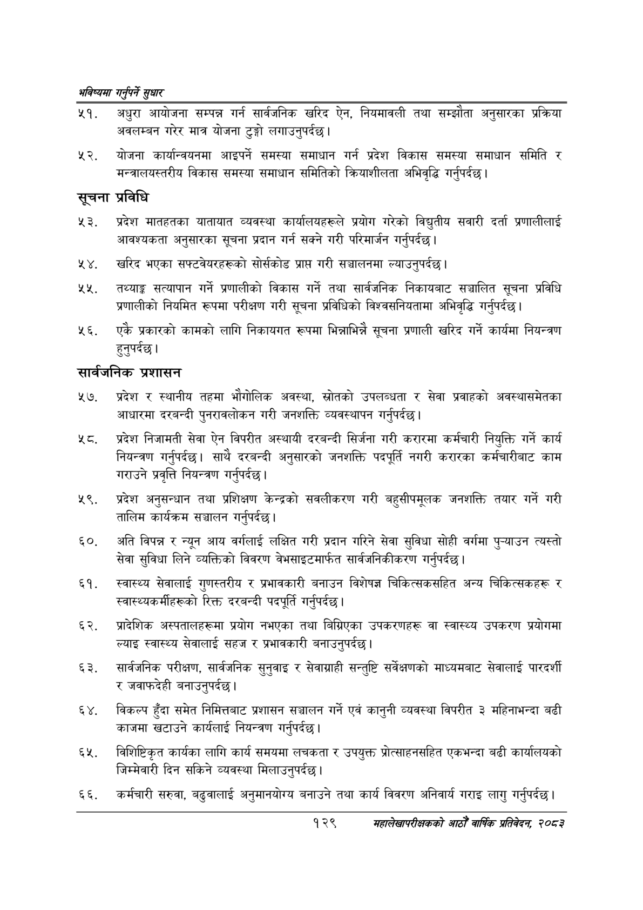

# Page 157 QA

## Rendered page


## Extracted text

```text
भविष्यमा गर्नुपर्ने सुक्षार
अधुरा आयोजना सम्पन्न गर्न सार्वजनिक खरिद ऐन, नियमावली तथा सम्झौता अनुसारका प्रक्रिया अवलम्बन गरेर मात्र योजना टुङ्गो लगाउनुपर्दछ।
योजना कार्यान्वयनमा आइपर्ने समस्या समाधान गर्न प्रदेश विकास समस्या समाधान समिति र मन्त्रालयस्तरीय विकास समस्या समाधान समितिको क्रियाशीलता अभिवृद्धि गर्नुपर्दछ |
सूचना प्रविधि
प्रदेश मातहतका यातायात व्यवस्था कार्यालयहरूले प्रयोग गरेको विद्युतीय सवारी दर्ता प्रणालीलाई आवश्यकता अनुसारका सूचना प्रदान गर्न सक्ने गरी परिमार्जन गर्नुपर्दछ |
खरिद भएका सफ्टवेयरहरूको सोर्सकोड प्राप्त गरी सञ्चालनमा ल्याउनुपर्दछ।
तथ्याङ्क सत्यापान गर्ने प्रणालीको विकास गर्ने तथा सार्वजनिक निकायबाट सञ्चालित सूचना प्रविधि प्रणालीको नियमित रूपमा परीक्षण गरी सूचना प्रविधिको विश्वसनियतामा अभिवृद्धि गर्नुपर्दछ |
एकै प्रकारको कामको लागि निकायगत रूपमा भिन्नाभिन्नै सूचना प्रणाली खरिद गर्ने कार्यमा नियन्त्रण हुनुपर्दछ।
सार्वजनिक प्रशासन
२७, प्रदेश र स्थानीय तहमा भौगोलिक अवस्था, स्रोतको उपलब्धता र सेवा प्रवाहको अवस्थासमेतका आधारमा दरबन्दी पुनरावलोकन गरी जनशक्ति व्यवस्थापन गर्नुपर्दछ |
नट. प्रदेश निजामती सेवा ऐन विपरीत अस्थायी दरबन्दी सिर्जना गरी करारमा कर्मचारी नियुक्ति गर्ने कार्य नियन्त्रण गर्नुपर्दछ। साथै दरबन्दी अनुसारको जनशक्ति पदपूर्ति नगरी करारका कर्मचारीबाट काम गराउने प्रवृत्ति नियन्त्रण गर्नुपर्दछ |
प्रदेश अनुसन्धान तथा प्रशिक्षण केन्द्रको सवलीकरण गरी बहुसीपमूलक जनशक्ति तयार गर्ने गरी तालिम कार्यक्रम सञ्चालन गर्नुपर्दछ |
अति विपन्न र न्यून आय वर्गलाई लक्षित गरी प्रदान गरिने सेवा सुविधा सोही वर्गमा पुन्याउन त्यस्तो सेवा सुविधा लिने व्यक्तिको विवरण वेभसाइटमार्फत सार्वजनिकीकरण गर्नुपर्दछ |
स्वास्थ्य सेवालाई गुणस्तरीय र प्रभावकारी बनाउन विशेषज्ञ चिकित्सकसहित अन्य चिकित्सकहरू र स्वास्थ्यकर्मीहरूको रिक्त दरबन्दी पदपूर्ति गर्नुपर्दछ |
प्रादेशिक अस्पतालहरूमा प्रयोग नभएका तथा बिग्रिएका उपकरणहरू वा स्वास्थ्य उपकरण प्रयोगमा ल्याइ स्वास्थ्य सेवालाई सहज र प्रभावकारी बनाउनुपर्दछ |
सार्वजनिक परीक्षण, सार्वजनिक सुनुवाइ र सेवाग्राही सन्तुष्टि सर्वेक्षणको माध्यमबाट सेवालाई पारदर्शी र जवाफदेही बनाउनुपर्दछ |
. विकल्प हुँदा समेत निमित्तबाट प्रशासन सञ्चालन गर्ने एवं कानुनी व्यवस्था विपरीत ३ महिनाभन्दा बढी काजमा खटाउने कार्यलाई नियन्त्रण गर्नुपर्दछ |
विशिष्टिकृत कार्यका लागि कार्य समयमा लचकता र उपयुक्त प्रोत्साहनसहित एकभन्दा बढी कार्यालयको जिम्मेवारी दिन सकिने व्यवस्था मिलाउनुपर्दछ।
कर्मचारी सरुवा, बढुवालाई अनुमानयोग्य बनाउने तथा कार्य विवरण अनिवार्य गराइ लागु गर्नुपर्दछ |
१२९
सहालेखापरीक्षकको आठौँ वाषिकि प्रतिवेदन २०८२
```

## Flags
- None
