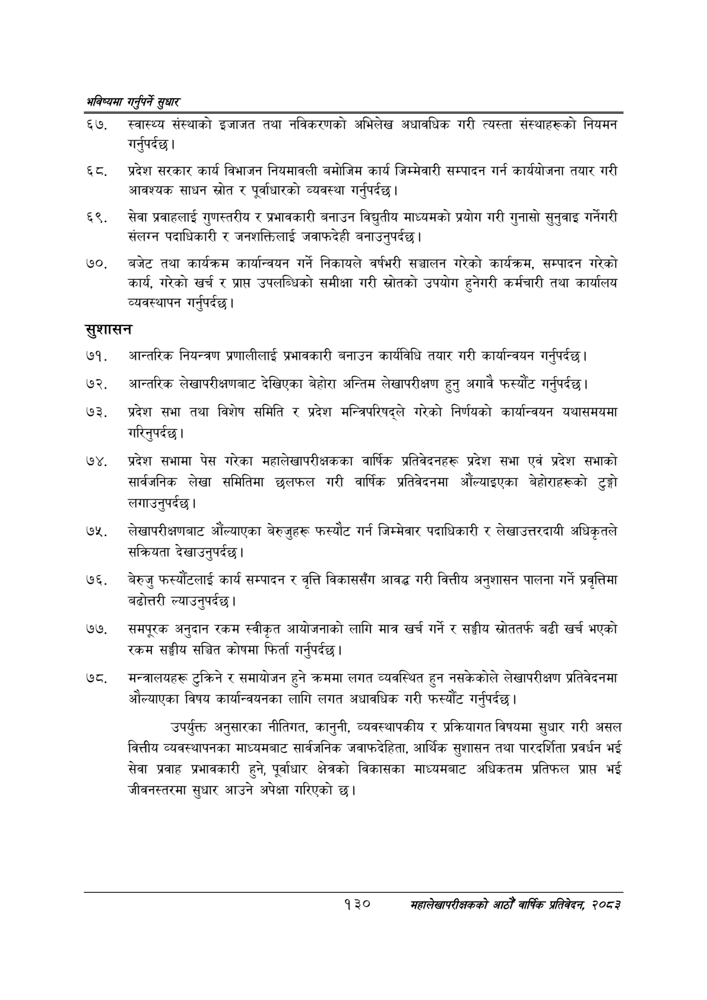

# Page 158 QA

## Rendered page


## Extracted text

```text
भविष्यमा गर्नुपर्ने सुक्षार
स्वास्थ्य संस्थाको इजाजत तथा नविकरणको अभिलेख अधावधिक गरी त्यस्ता संस्थाहरूको नियमन गर्नुपर्दछ |
प्रदेश सरकार कार्य विभाजन नियमावली बमोजिम कार्य जिम्मेवारी सम्पादन गर्न कार्ययोजना तयार गरी आवश्यक साधन स्रोत र पूर्वाधारको व्यवस्था गर्नुपर्दछ |
सेवा प्रवाहलाई गुणस्तरीय र प्रभावकारी बनाउन विद्युतीय माध्यमको प्रयोग गरी गुनासो सुनुवाइ गर्नेगरी संलग्न पदाधिकारी र जनशक्तिलाई जवाफदेही बनाउनुपर्दछ |
बजेट तथा कार्यक्रम कार्यान्वयन गर्ने निकायले वर्षभरी सञ्चालन गरेको कार्यक्रम, सम्पादन गरेको कार्य, गरेको खर्च र प्राप्त उपलब्धिको समीक्षा गरी स्रोतको उपयोग हुनेगरी कर्मचारी तथा कार्यालय व्यवस्थापन गर्नुपर्दछ |
सुशासन
आन्तरिक नियन्त्रण प्रणालीलाई प्रभावकारी बनाउन कार्यविधि तयार गरी कार्यान्वयन गर्नुपर्दछ |
आन्तरिक लेखापरीक्षणबाट देखिएका बेहोरा अन्तिम लेखापरीक्षण हुनु अगावै फस्यौंट गर्नुपर्दछ।
प्रदेश सभा तथा विशेष समिति र प्रदेश मन्त्रिपरिषद्ले गरेको निर्णयको कार्यान्वयन यथासमयमा गरिनुपर्दछ |
प्रदेश सभामा पेस गरेका महालेखापरीक्षकका वार्षिक प्रतिवेदनहरू प्रदेश सभा एवं प्रदेश सभाको सार्वजनिक लेखा समितिमा छलफल गरी वार्षिक प्रतिवेदनमा औंल्याइएका बेहोराहरूको टुङ्गो लगाउनुपर्दछ।
लेखापरीक्षणबाट औंल्याएका बेरुजुहरू फस्यौट गर्न जिम्मेवार पदाधिकारी र लेखाउत्तरदायी अधिकृतले सक्रियता देखाउनुपर्दछ।
७६, बेरुजु फ्स्यौटलाई कार्य सम्पादन र वृत्ति विकाससँग आवद्ध गरी वित्तीय अनुशासन पालना गर्ने प्रवृत्तिमा बढोत्तरी ल्याउनुपर्दछ।
समपूरक अनुदान रकम स्वीकृत आयोजनाको लागि मात्र खर्च गर्ने र सङ्घीय स्रोततर्फ बढी खर्च भएको रकम सङ्घीय सञ्चित कोषमा फिर्ता गर्नुपर्दछ |
मन्त्रालयहरू टुक्रिने र समायोजन हुने क्रममा लगत व्यवस्थित हुन नसकेकोले लेखापरीक्षण प्रतिवेदनमा औल्याएका विषय कार्यान्वयनका लागि लगत अधावधिक गरी फस्यौट गर्नुपर्दछ |
उपर्युक्त अनुसारका नीतिगत, कानुनी, व्यवस्थापकीय र प्रक्रियागत विषयमा सुधार गरी असल वित्तीय व्यवस्थापनका माध्यमबाट सार्वजनिक जवाफदेहिता, आर्थिक सुशासन तथा पारदर्शिता प्रवर्धन भई सेवा प्रवाह प्रभावकारी हुने, पूर्वाधार क्षेत्रको विकासका माध्यमबाट अधिकतम प्रतिफल प्राप्त भई जीवनस्तरमा सुधार आउने अपेक्षा गरिएको छ।
१३० सहालेखापरीक्षकको आठौँ वाषिकि प्रतिवेदन २०८२
```

## Flags
- None
