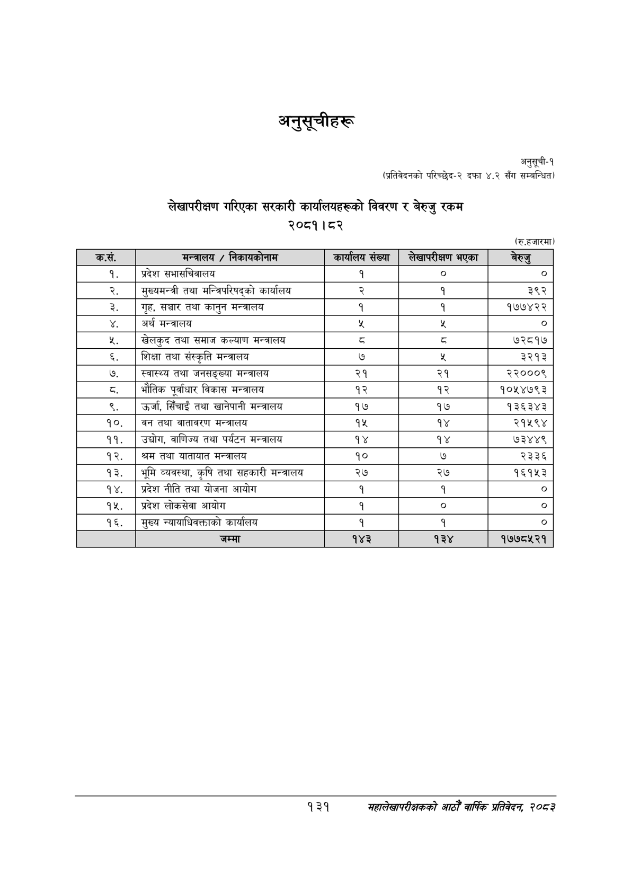

# Page 161 QA

## Rendered page


## Extracted text

```text
अनुसूचीहरू
अनुसूची-१
(प्रतिवेदनको परिच्छेद-२ दफा ४.२ सँग सम्बन्धित)
लेखापरीक्षण गरिएका सरकारी कार्यालयहरूको विवरण र बेरुजु रकम २०८१।८२
(रु.हजारमा)
१३१
महालेखापरीक्षकको आठौ वाषिकि प्रतिवेदन २०८२

| क.सं. | नन्नालय / निकाबकोनान | कार्षलष संख्या | लेखापरीक्षण भएका | बेरुङ |
| --- | --- | --- | --- | --- |
| १ | प्रदेश सभालघिवालय | १ | ० | ० |
| २ | नुल्बभन्त्री तथा सन्जिपरिषद्को कार्यालय | र्‌ | १ | ३९२ |
| ३ | गृह, सञ्चार तथा कानुन भन्त्रालय | १ | १ | १७७४२२ |
| ४ | अर्थ भन्त्रालय |  |  |  |
| ५ | खेलकुद तथा समाज कल्याण मन्त्रालय | ३ | द्‌ | ७२८१७ |
| ६ | शिक्षा तथा संस्कृति मन्त्रालय | ७ |  | ३२१३ |
| ७ | स्वास्थ्य तथा जनसङ्ख्या मन्त्रालय | २१ | २१ | २२०००९ |
| ८ | भौतिक पूर्वाधार विकास भन्त्रालय | १२ | १२ | १०१५४७९३ |
| ९ | उर्जा, सिँचाई तथा खानेपानी मन्त्रालय | १७ | १७ | १३६३४३ |
| १० | वन तथा वातावरण मन्त्रालय | १४५ | १४ | २१५९४ |
| ११ | उच्चोग, वाणिज्य तथा पर्यटन मन्त्रालय | १४ | १४ | ७३४४९ |
| १२ | श्रम तथा थाताबात भन्त्रालय | १० | ७ | २३३६ |
| १३ | भूमि व्यवस्था, कृषि तथा सहकारी मन्जालय | २७ | २७ | १६१५३ |
| १४ | प्रदेश नीति तथा योजना आयोग |  |  | ० |
| १५ | प्रदेश लोकसेवा आयोग | १ | ० | ० |
| १६ | मुख्य न्यायाधिवक्ताको कार्यालय | १ | १ | ० |
| १७ | जम्मा | १४३ | १३४ | १७७८५२१ |
```

## Flags
- table_page
- medium_quality_table
