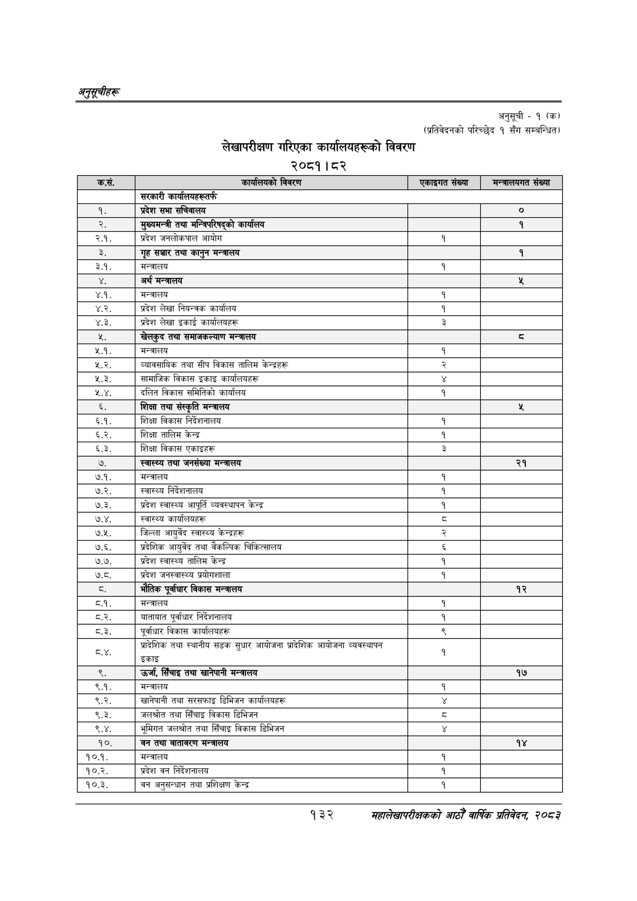

# Page 162 QA

## Rendered page


## Extracted text

```text
अनुतूचीहरू
लेखापरीक्षण गरिएका कार्यालयहरूको विवरण
२०८१। ८२
अनुसूची -१ (क) (प्रतिवेदनको परिच्छेद १ सँग सम्बन्धित)
१३२
महालेखापरीक्षकको आठौ वाषिकि प्रतिवेदन २०८२

| कस. | विवरण | \| एकाइगत संख्या | \| भन्न्रालषनत संख्या |
| --- | --- | --- | --- |
|  | सरकारी वार्वालबहरूतर्फ |  |  |
| १. | प्रदेश सभा सचिवालय |  | ० |
| र. | सुब्कनन्त्री तथा भन्तिपरिषद्‌को कार्यालय |  | १ |
| २.१. | प्रदेश जनलोकपाल आयोग | १ |  |
| डे. | गृह सञ्चार तथा कानुन मन्त्रालय |  | १ |
| ३.१. | मन्त्रालय | १ |  |
|  | अर्थ मन्त्रालय |  | शर |
| ४.१. | मन्त्रालय | १ |  |
| ४.२. | प्रदेश लेखा नियन्त्रक कार्यालय | १ |  |
| ४.३. | प्रदेश लेखा इकाई कार्यालयहरू | ३ |  |
| २ | खेलकुद तथा सभाजक०५० मन्त्रालय |  |  |
| २.१. | मन्त्रालय | १ |  |
| २.२. | व्यावसाथिक तथा सीप विकास तालिम केन्द्रहरू | २ |  |
| २.३. | सामाजिक विकास इकाइ कार्वालबहरू |  |  |
| २.४. | दलित विकास समितिको कार्यालय | १ |  |
| ६. | शिक्षा तथा संस्कृति मन्त्रालय |  |  |
| ६.१. | शिक्षा विकास निर्देशनालब | १ |  |
| ६.२. | शिक्षा तालिम केन्द्र | १ |  |
| ६.३. | शिक्षा विकास एकाइहरू | डे |  |
| ७. | स्वास्थ्य तथा जनसंख्या मन्त्रालय |  | २१ |
| ७.१. | मन्त्रालय | १ |  |
| ७.२. | स्वास्थ्य निर्देशनालय | १ |  |
| ७.३. | प्रदेश स्वास्थ्य आपूर्ति व्यवस्थापन केन्द्र | १ |  |
| ७.४. | स्वास्थ्य कार्यालयहरू |  |  |
| ७.५. | जिल्ला आयुर्वेद स्वास्थ्य केन्द्रहरू |  |  |
| ७.६. | प्रदेशिक आयुर्वेद तथा वैकल्पिक िकित्सालय | ६ |  |
| ७.७. | प्रदेश स्वास्थ्य तालिम केन्द्र | १ |  |
| [न | प्रदेश जनस्वास्थ्य | १ |  |
| [र | भौतिक पूर्वाधार विकास मन्त्रालय |  | १२ |
| ८.१. | मन्त्रालय | १ |  |
| ८.२. | यातायात पूर्वाधार निर्देशनालय | १ |  |
| द.३. | पूर्वाधार विकास कार्यालयहरू | ९ |  |
| ८.४. | प्रादेशिक तथा स्थानीय सडक सुधार आयोजना प्रादेशिक आयोजना व्ववल्थापन इकाइ |  |  |
|  | उर्जा, सिँचाइ तथा खानेपानी मन्त्रालय |  | १७ |
| ९.१. | मन्त्रालय | १ |  |
| ९.२. | 'खानेपानी तथा सरसफाइ डिभिजन कार्यालयहरू |  |  |
| ९.३. | जलश्रोत तथा सिँचाइ विकास डिभिजन | ३ |  |
| ९.४. | भूमिगत जलश्रोत तथा सिँचाइ विकास डिभिजन |  |  |
| १०. | 'वन तथा वातावरण मन्त्रालय |  | १४ |
| १०.१. | मन्त्रालय | १ |  |
| १०.२. | प्रदेश वन निर्देशनालय | १ |  |
| १०.३. | 'वन अनुसन्धान तथा प्रशिक्षण केन्द्र | १ |  |
```

## Flags
- table_page
- medium_quality_table
