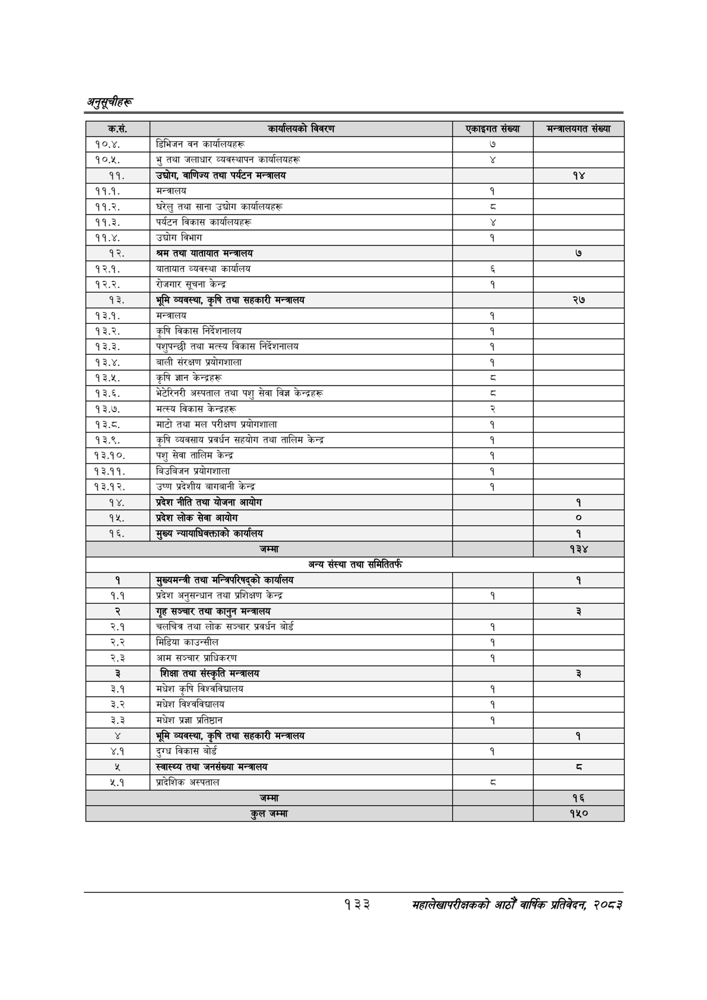

# Page 163 QA

## Rendered page


## Extracted text

```text
अनुतूचीहरू
१३३
महालेखापरीक्षकको आठौ वाषिकि प्रतिवेदन २०८२

| कस. | विवरण | 'एकाइगत संख्या | नन्नासकनत सँख्या |
| --- | --- | --- | --- |
| १०.४. | डिभिजन वन कार्यालबहरू | ७ |  |
| १०.५. | भु तथा जलाधार व्यवस्थापन कार्वालबहरू |  |  |
| ९९. | , वाणिज्य तथा पर्यटन मन्त्रालय |  | १४ |
| ११.१. | मन्त्रालय | १ |  |
| ११.२. | घरेलु तथा साना उद्योग कार्कालबहरू | ३ |  |
| ११.३. | पर्यटन विकास कार्कालबहरू |  |  |
| ११.४. | 'उच्चोग विभाग | १ |  |
| १२. | श्रम तथा यातायात मन्त्रालय |  | ७ |
| १२.१. | यातायात व्यवस्था कार्यालय |  |  |
| १२.२. | रोजगार सूचना केन्द्र | १ |  |
| १३. | भूमि व्यवस्था, कृषि तथा सहकारी मन्त्रालय |  | २७ |
| १३.१. | मन्त्रालय | १ |  |
| १३.२. | 'कृषि विकास निर्देरानालष | १ |  |
| १३.३. | पशुपन्छी तथा मत्स्य विकास | १ |  |
| १३.४. | बाली संरक्षण श्रवोगशाला | १ |  |
| १३.५. | कृषि ज्ञान केन्द्रहरू | दद |  |
| १३.६. | भेटेरिनरी अस्पताल तथा पशु सेवा विज्ञ केन्द्रहरू | व्‌ |  |
| १३.७. | मत्स्य विकास केन्द्रहरू | र |  |
| १३.८. | माटो तथा मल परीक्षण प्रयोगशाला | १ |  |
| १३.९. | व्यवसाय प्रवर्धन सहयोग तथा तालिम केन्द्र | १ |  |
| १३.१०. | पशु सेवा तालिम केन्द्र | १ |  |
| १३.११. | बिउबिजन ्रोगशाला | १ |  |
| १३.१२. | उष्ण प्रदेशीय बागवानी केन्द्र | १ |  |
| १४. | प्रदेश नीति तथा योजना आयोग |  | १ |
| १५. | प्रदेश लोक सेवा आयोग |  | ० |
| १६. | मुख्य कार्यालय |  | १ |
|  | जम्मा |  | १३४ |
|  | अन्य संस्था तथा समितितर्फ |  |  |
| १ | शुष्चबन्त्री तथा भन्निपरिषद्‌को कार्यालय |  | १ |
| १.१ | प्रदेश अनुसन्धान तथा प्रशिक्षण केन्द्र | १ |  |
|  | गृह सञ्चार तथा कानुन मन्त्रालय |  | ३ |
| २.१ | चलचित्र तथा लोक सञ्चार प्रवर्धन बोर्ड | १ |  |
| २.२ | मिडिया काउन्धील | १ |  |
| २.३ | आम सञ्चार प्राधिकरण | १ |  |
| ३ | शिक्षा तथा संस्कृति मन्त्रालय |  | ३ |
| ३.१ | मधेश कृषि विश्वविचालय | १ |  |
| ३.२ | मधेश विश्वविद्यालय | १ |  |
| ३.३ | मधेश प्रज्ञा प्रतिष्ठान | १ |  |
|  | भूमि व्यवस्था, कृषि तथा सहकारी मन्त्रालय |  | १ |
| ४.१ | दुग्ध विकास बोर्ड | १ |  |
| र | स्वास्थ्य तथा जनसंख्या मन्त्रालय |  | ३ |
| २.१ | प्रादेशिक अस्पताल |  |  |
|  |  |  | १६ |
|  | कुल जम्मा |  | १५० |
```

## Flags
- table_page
- medium_quality_table
