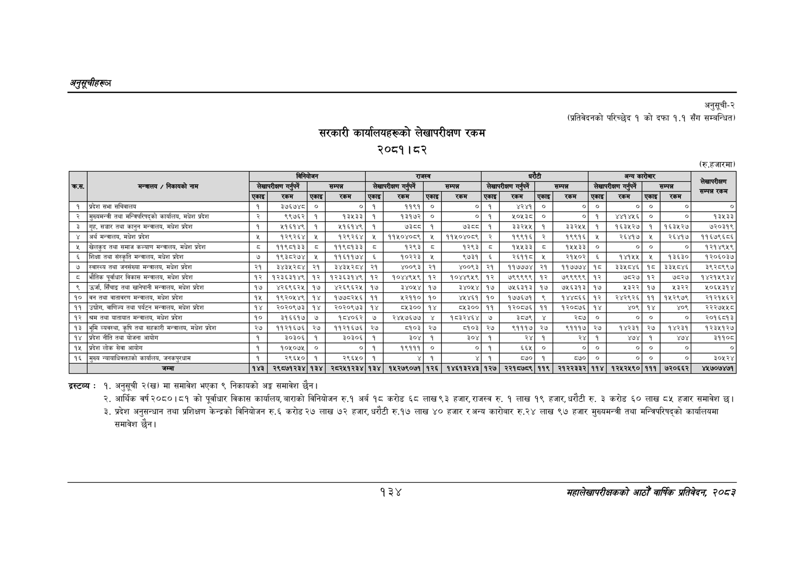

# Page 164 QA

## Rendered page


## Extracted text

```text
अनुतूचीहरूण
सरकारी कार्यालयहरूको लेखापरीक्षण रकम
२०८१।८२
अनुसूची-२ (प्रतिवेदनको परिच्छेद १ को दफा १.१ सँग सम्बन्धित)
(रु.हजारमा)
द्रस्टव्य:
१. अनुसूची २(ख) मा समावेश भएका ९ निकायको अङ्ग समावेश छैन।
आर्थिक वर्ष २०८०।८१ को पूर्वाधार विकास कार्यालय, बाराको विनियोजन रु.१ अर्ब १८ करोड ६८ लाख ९३ हजार, राजस्व रु. १ लाख १९ हजार, धरौटी रु. ३ करोड ६० लाख ८५ हजार समावेश छ।
प्रदेश अनुसन्धान तथा प्रशिक्षण केन्द्रको विनियोजन रु.६ करोड २७ लाख ७२ हजार, धरौटी रु.१७ लाख ४० हजार र अन्य कारोबार रु.२४ लाख ९७ हजार मुख्यमन्त्री तथा मन्त्रिपरिषद्को कार्यालयमा समावेश छैन।
१३४
सहालेखापरीक्षकको आठौँ वाषिकि प्रतिवेदन २०८२

|  |  |  |  | विनियोजन |  |  | राजस्व |  |  |  |  | घरोटी |  |  | अन्य | कारोबार |  | लेखापरीक्षण |
| --- | --- | --- | --- | --- | --- | --- | --- | --- | --- | --- | --- | --- | --- | --- | --- | --- | --- | --- |
| कस. | मन्त्रालय / निकायको नाम |  | लेखापरीक्षण गर्र्ने |  | सम्पन्न |  | लेखापरीक्षण गन्पर्ने |  | सम्पन्न |  | लेखापरीक्षण गन्पर्ने |  | सम्पन्न |  | लेखापरीक्षण |  | सम्पन्न | सम्म रकम |
|  |  | एकाइ | रकम | एकाइ | रकम | एकाइ | रकम | एकाइ | रकम | एकाइ | रकम | एकाइ | रकम | एकाइ | रकम | एकाइ | रकम |  |
| १ | प्रदेश सभा सचिवालय | १ | ३७६७४८ | ० | ० | १ | ११९१ | ० | ० | १ | ४२४१ | ० | ० | ० | ० | ० | ० | ० |
| २ | मुख्यमन्त्री तथा मन्त्रिपरिषद्को कार्यालय, मधेश प्रदेश | र | ९९७६२ | १ | १३५३३ | १ | १३१७२ | ० | ० | १ |  | ० | ० | १ |  |  | ० | १३४३३ |
| ३ | गृह, सञ्चार तथा कानुन मन्तालय, मधेश प्रदेश | १ | ५१६१४९ | १ | ११६१४९ | १ |  |  |  |  | ३३२५५ | १ | इ३२५५ | १ | १६३४५२७ | १ | १६३५२७ | ७२०३१९ |
| ४ | अर्थ मन्त्रालय, मधेश प्रदेश |  | १२९२६४ | ५ | १२९२६४ | ५ | ११५०४०८९ | ५ | ११५०४०५६ | २ | १९९१६ | २ | १९९१६ | ५ | र२६४१७ | ५ | २६४१७ | ११६७९६८६ |
| ५ | खेलकुद तथा समाज कल्याण मन्चालय, मधेश प्रदेश | ५ | ११९०६१३३ | ८ | ११९०१३३ | ८ | १२९३ | ८ | १२६३ | ८ | १४४५३३ | ८ | १४५५३३ | ० | ० | ० | ० | १२१४९४९ |
| ६ | शिक्षा तथा संस्कृति मन्त्रालय, मधेश प्रदेश | ७ | १९३८२७४ | ५ | ११६११७४ | ६ | १०२२३ |  | ९७३१ | ६ | २६११८ | ५ | २१५०२ | ६ | १४१५५ | ५ | १३६३० | १२०६०३७ |
| ७ | स्वास्थ्य तथा जनसंख्या मन्चरालय, मधेश प्रदेश | २१ | इ४३५२८४ | २१ | इ३४३५२८४ | २१ | ४००९३ | २१ | ४००९३ | २१ | ११७७७४ | २१ | ११७७७४ | १८ | ३३५८४६ | १८ | ३३४५८४६ | ३९२८९९७ |
| ८ | भौतिक पूर्वाधार विकास मन्वालय, मधेश प्रदेश | १२ | १२३६३१४९ | १२ | १२३६३१४९ | १२ | १०४४९४९ | १२ | १०४४९५९ | १२ | ७९९९६९ | १२ | ७९९९९९ | १२ | ७८२७ | १२ | ७८२७] | १४२१५९३४ |
| ९ | उर्जा, सिँचाइ तथा खानेपानी मन्त्रालय, मधेश प्रदेश | १७ | ४२६९६२५ | १७ | ४२६९६२५ | १७ | ३४०५४ | १७ | ३४०५४ | १७ | ७५६३१३ | १७ | ७५६३१३ | १७ | ५३२२ | १७ | %३३३ | ५०६५३१४ |
| १० | बन तथा वातावरण मन्त्रालय, मधेश प्रदेश | १५ | १९२०५४९ | १४ | १७७८२५६ | ११ | २११० | १० | ४४६१ | १० | १७७६३७१ | ९ | १४४८६६ | १२ | २४२९६२६ | ११ | १४५२९७९ | २१२१५६२ |
| ११ | उ्चोग, वाणिज्य तथा पर्यटन मन्त्रालय, मधेश प्रदेश | १४ | २०२०९७३ | १४ | २०२०९७३ | १४ | ८५३०० | १४ | ८५३०० | ११ | १२०८७६ | ११ | १२०८७६ | १४ | ४०९ | १४ | ४०९ | २२२७५५८ |
| १२ | श्रम तथा यातायात मन्त्रालय, मधेश प्रदेश | १० | इ१६६१७ | ७ | १८४०६२ | ७ | र२४५७६७७ | ४ | १८३२४६४ | ७ | ३८७९ | ४ | २८७ | ० | ० | ० | ० | र२०१६च१३ |
| १३ | भूमि व्यवस्था, कृषि तथा सहकारी मन्त्रालय, मधेश प्रदेश | २७ | ११२१६७६ | २७ | ११२१६७६ | २७ | ५१०३ | २४ | ८१०३ | २७ | ९१११७ | २७ | ९१११७ | २७ | १४२३१ | २७ | १४२३१ | ९३३४९३६ |
| १४ | प्रदेश नीति तथा योजना आयोग | १ | ३०३०६ | १ | ३०३०६ | १ | ३०४ | १ | ३०४ | १ | सश | १ | रथ | १ | ४७४ | १ | [१ | २१९०८ |
| १५ | प्रदेश लोक सेवा आयोग | १ | १०५०७५ | ० | ० | १ | १९१११ | ० | ० | १ | ६६५ | ० | ० | ० | ० | ० | ० | ० |
| १६ | मुख्य न्यायाधिवक्ताको कार्यालय, जनकपुरधाम | १ | २९६५० | १ | २९६४५० | १ | ४ | १ | ४ | १ | ५७० | १ | ५५० | ० | ० | ० | ० | ३०५२४ |
```

## Flags
- table_page
- medium_quality_table
