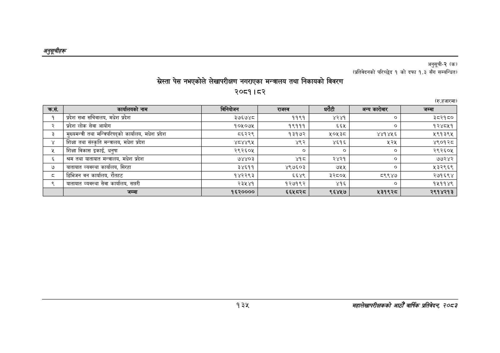

# Page 165 QA

## Rendered page


## Extracted text

```text
अनुतूचीहरू
स्ेस्ता पेस नभएकोले लेखापरीक्षण नगराएका मन्त्रालय तथा निकायको विवरण
२०८१। ८२
अनुसूची-२ (क)
(प्रतिवेदनको परिच्छेद १ को दफा १.३ सँग सम्बन्धित)
(रु.हजारमा)
१३५
महालेखापरीक्षकको आठोँ' वार्षिक प्रतिवेदक २०८२

| कस. | कार्यालयको नाम | विनियोजन | राजस्व | घरीटी | अन्य कारोबार | जम्मा |
| --- | --- | --- | --- | --- | --- | --- |
| १ | प्रदेश सभा सचिवालय, मधेश प्रदेश | ३७६७४८ | ११९१ | ४२४१ | ० | ३८२१८० |
| २ | प्रदेश लोक सेवा आयोग | १०५०७४५ | १९१११ | ६६५ | ० | १२४८५१ |
| ३ | मुख्यमन्त्री तथा मन्त्रिपरिषद्को कार्यालय, मधेश प्रदेश | ८६२२९ | १३१७२ | ४०४३५ | ४४१४५६ | ५९१३९५ |
| ४ | शिक्षा तथा संस्कृति मन्त्रालय, मधेश प्रदेश | ४८४४९४५ | ४९२ | ४६१६ | २२५ | ४९०१२८ |
| ५ | शिक्षा विकास इकाई, धनुषा | २९२६०५ | ० | ० | ० | २९२६०५ |
| ६ | श्रम तथा यातायात मन्त्रालय, मधेश प्रदेश | ७४४०३ | थ्१व | २४२१ | ० | ७७२४२ |
| ७ | यातायात व्यवस्था कार्यालय, सिरहा | ३४६११ | ४९७६०३ | ७५५ | ० | ५३२९६९ |
| ८ | डिभिजन वन कार्यालय, रौतहट | १४२२९३ | ६६४९ | ३२८०४५ | ८९९४७ | २७१६९४ |
| ९ | यातायात व्यवस्था सेवा कार्यालय, सप्तरी | २३४५४१ | १२७१९२ | ४१६ |  | १४५११४९ |
```

## Flags
- table_page
- medium_quality_table
