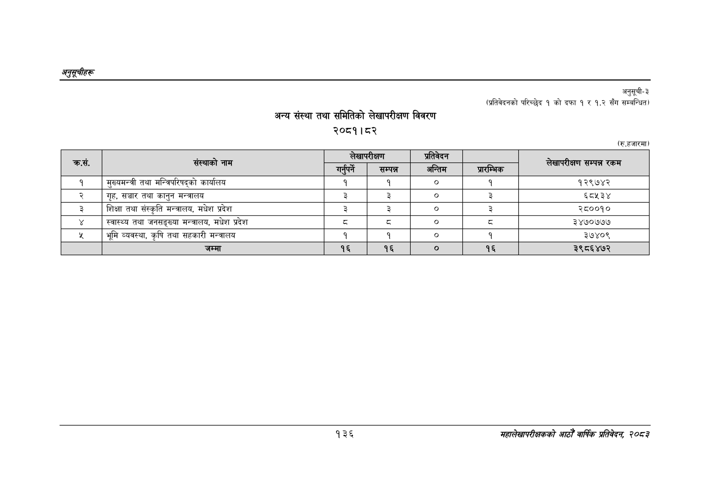

# Page 166 QA

## Rendered page


## Extracted text

```text
अनुतूचीहरू
जम्मा
अन्य संस्था तथा समितिको लेखापरीक्षण विवरण
२०८१।८२
अनुसूची-३
(प्रतिवेदनको परिच्छेद १ को दफा १ र १.२ सँग सम्बन्धित)
(रु.हजारमा)
१३६
महालेखापरीक्षकको आठौँ वार्षिक प्रतिवेदन २०८२

| कस. | संस्थाको नाम |  | सम्पन्न | अन्तिम | प्रारम्भिक | लेखापरीक्षण सम्पन्न रकम |
| --- | --- | --- | --- | --- | --- | --- |
| १ | मुख्यमन्त्री तथा मन्तिपरिषद्को कार्यालय | १ | १ | ० | १ | १२९७४२ |
| २ | गृह, सञ्चार तथा कानुन मन्त्रालय | ३ | ३ | ० | ३ | ६८५३४ |
| ३ | शिक्षा तथा संस्कृति मन्त्रालय, मधेश प्रदेश | ३ | ३ |  | ३ | २८००१० |
|  | स्वास्थ्य तथा जनसङ्ख्या मन्त्रालय, मधेश प्रदेश | ३ | ३ | ० | ५ | ३४७०७७७ |
| ३ | भूमि व्यवस्था, कृषि तथा सहकारी मन्त्रालय | १ | १ |  | १ | ३७४०९ |
|  | जम्मा | १६ | १६ |  | १६ | ३९८६४७२ |
```

## Flags
- table_page
- medium_quality_table
