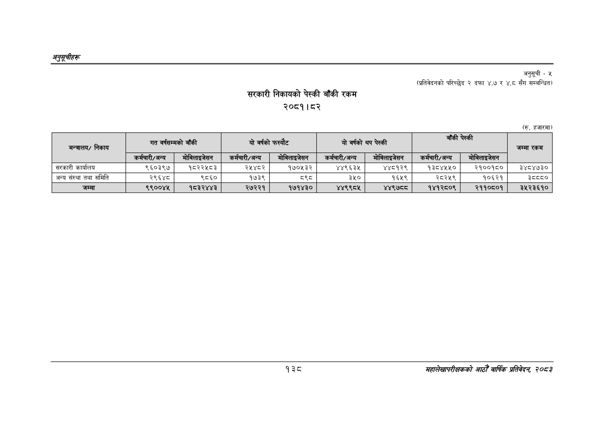

# Page 168 QA

## Rendered page


## Extracted text

```text
अनुतूचीहरु
सरकारी निकायको पेस्की बाँकी रकम २०८१।८२
अनुसूची
-५
(प्रतिवेदनको परिच्छेद २ दफा ४.७ र ४.८ सँग सम्बन्धित)
(रु. हजारमा)
१३८
महालेखापरीक्षकको आठौँ वार्षिक प्रतिवेदन २०८२

| अन्तालय; / निकाय | गत वर्षसम्मको | बाँकी | यो वर्षको | फस्यौट | यो वर्षको | थप पेस्की | बाँकी | पेस्की | जम्मा रकम |
| --- | --- | --- | --- | --- | --- | --- | --- | --- | --- |
|  | कर्मचारी/अन्य | मोबिलाइजेसत | कर्मचारी/अन्य | मोबिलाइजेसत | कर्मचारी/अन्य | मोबिलाइजेसत | कर्मचारी/अन्य | मोबिलाइजेसन |  |
| सरकारी कार्यालय | ९६०३९४ | १८२२५८३ | २५४८२ | १७०५३२ | ४४९६३४५ | ४४८१२९ | १३८४४५४५० | २१००१८० | ३४८४७३० |
| अन्य संस्था तथा समिति | २९६४८ | ९८६० | १७३९ | ८९८ | ३५० | १६५९ | २८२५९ | १०६२१ | ३५५५० |
| जम्मा | ९९००४५ | १८३२४४३ | २७२२१ | १७१४३० | ४४९९८५ | ४४९७८८ | १४१२८०९ | २११०८०१ | ३५२३६१० |
```

## Flags
- table_page
- medium_quality_table
