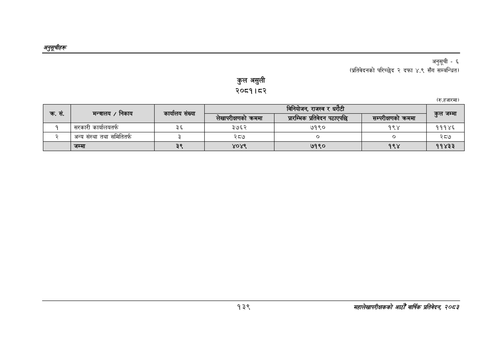

# Page 169 QA

## Rendered page


## Extracted text

```text
अनुतूचीहरु
कुल असुली
२०८१।८२
अनुसूची -६
(प्रतिवेदनको परिच्छेद २ दफा ४.९ सँग सम्बन्धित)
(रु.हजारमा)
१३९
महालेखापरीक्षकको आठौँ वार्षिक प्रतिवेदन २०८२

| सं. | निकाय | कार्यालय संख्या |  |  |  |  |
| --- | --- | --- | --- | --- | --- | --- |
| क्र. | मन्त्रालय / |  | लेखापरीक्षणको क्रममा | प्रारम्भिक प्रतिवेदन पठाएपछि | सम्परीक्षणको क्रममा | कुल जम्मा |
| १ | सरकारी कार्यालयतर्फ | ३६ | ३७६२ | ७१९० | १९४ | १११४६ |
| र्‌ | अन्य संस्था तथा समितितर्फ | ३ | २८७ |  | ० | २८७ |
|  | जम्मा | ३९ | ४०४९ | ७१९० | १९४ | ११४३३ |
```

## Flags
- table_page
- medium_quality_table
