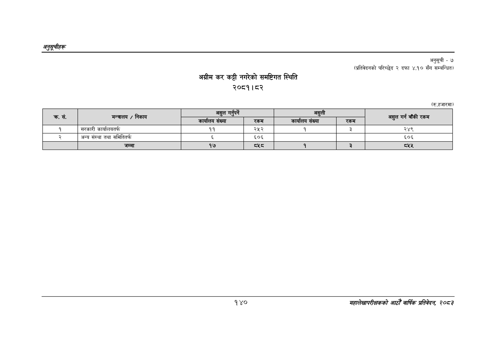

# Page 170 QA

## Rendered page


## Extracted text

```text
अनुतूचीहरु
अग्रीम कर कट्टी नगरेको समष्टिगत स्थिति २०८१। ८२
अनुसूची -७
(प्रतिवेदनको परिच्छेद २ दफा ४.१० सँग सम्बन्धित)
(रु.हजारमा)
१४०
महालेखापरीक्षकको आठौँ वार्षिक प्रतिवेदन २०८२

|  | निकाय | असुल गर्नपर्ने |  | असुली |  | गर्न बाँकी |
| --- | --- | --- | --- | --- | --- | --- |
| क्र. सं. | मन्त्रालय / | कार्यालय संख्या | रकम | कार्यालय संख्या | रकम | असुल रकम |
| १ | सरकारी कार्यालयतर्फ | ११ | २५२ | १ | ३ | २४९ |
| र्‌ | अन्य संस्था तथा समितितर्फ | ६ | ६०६ |  |  | ६५०६ |
|  | जम्मा | १७ | ५ | १ | ३ | ८५४५ |
```

## Flags
- table_page
- medium_quality_table
