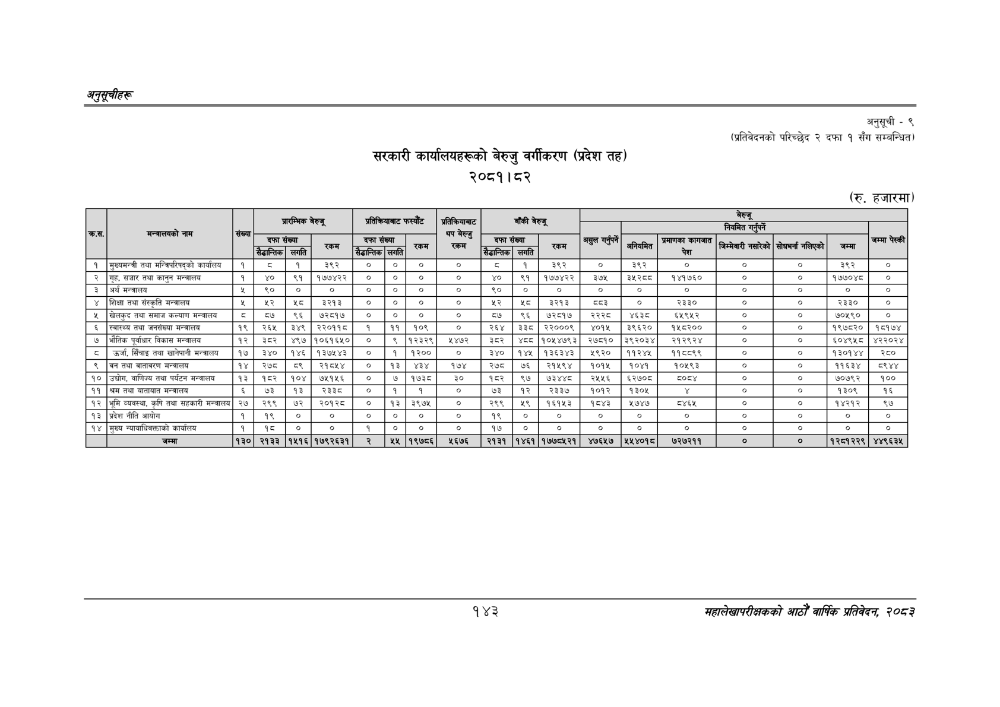

# Page 173 QA

## Rendered page


## Extracted text

```text
अनुतूचीहरु
सरकारी कार्यालयहरूको बेरुजु वर्गीकरण (प्रदेश तह) २०८१।८२
अनुसूची -९
(प्रतिवेदनको परिच्छेद २ दफा १ सँग सम्बन्धित)
(रु. हजारमा)
१४३
महालेखापरीक्षकको आठौँ वार्षिक प्रतिवेदन २०८२

|  |  |  |  | प्रारम्भिक |  | प्रतिकियाबाट |  | फस्याँट | प्रतिकियाबाट |  | बाँकी |  |  |  |  |  |  |  |  |
| --- | --- | --- | --- | --- | --- | --- | --- | --- | --- | --- | --- | --- | --- | --- | --- | --- | --- | --- | --- |
|  | पल |  |  |  | बेरुबू |  |  |  |  |  |  | चेरुजू |  |  |  |  |  |  |  |
|  |  |  | दफा | संख्या सगति | लम | दफा सेडान्तिक | संख्या लगति | फन | प्र) रकम | दफा | संख्या लगति | रि | असुल गर्नुपर्ने |  | प्रमाणका कागजात लि | २ |  |  | जम्मा पेस्की |
| १ | मुख्यमन्त्री तथा मन्त्रिपरिषद्को काय | १ | ड | १ | इ९२ | ० | ० | ० | ० | डड | १ | इ९२ | ० | ३९२ | ० | ० | ० | ३९२ | ० |
| २ | गृह, सञ्चार तथा कानुन मन्चालय | १ | ४७० | ९१ | १७३७४२२ | ० | ० | ० |  |  | ९१ | १७७४२२ | ३७४ | इ५२६८ | १४१७६० | ० | ० | १७७०४४ | ० |
| ३ | अर्थ मन्त्रालय |  | ६० |  |  | ० | ० | ० |  | ९० |  | ० |  | ० |  | ० | ० | ० | ० |
| ४ | शिक्षा तथा संस्कृति मन्त्रालय |  | श्र |  | ३२१३ | ० | ० | ० | ० | र | श््ट | ३२१३ |  | ० | २३३० | ० | ० | २३३० | ० |
| ५ | खेलकुद तथा समाज कल्याण मन्चालय | ८ | ८७ | ९६ | ७२५७ | ० | ० | ० | ० | च्छ | ९६ | ७२८७ | २२२८ | ४६३८ | ६४९४५२ | ० | ० | ७०४९० | ० |
| ६ | स्वास्थ्य तथा जनसंख्या मन्त्रालय | १९ | २६५ | इ४९ | २२०११८ | १ | ११ | १०९ |  | २६४ | ३३८ | २२०००९ | ४०१५ | ३९६२० | ४४६३०० | ० | ० | १९७८२० | १८१७४ |
| ७ | भौतिक पूर्वाधार विकास मन्त्रालय | १२ | ३८२ | ४९७ | १०६१६५० | ० | ९ | १२३२९ | २४७२ | ३८२ | ४८८ | १०५४७९३ | २७८१० | ३९२०३४ | २१२९२४ | ० | ० | ६०४९५८ | ४२२०२४ |
| ८ | उर्जा, सिँचाइ तथा खानेपानी मन्त्रालय | १७ | ३४० | १४६ | १३७५४३ | ० | १ | १२०० |  | ३४० | १४५ | १३६३४३ | २९२० | ११२४५ | ११८८९९ | ० | ० | १३०१४४ | २८० |
| ९ | बन तथा वातावरण मन्त्रालय | १४ | २७८ | [क | २१८५४ | ० | १३ | ४३४ | १७४ | २७८ | ७६ | २१५९४ | १०१५ | १०४१ | १०५९३ | ० | ० | ११६३४ | ८९४४ |
| १० | उच्चोग, वाणिज्य तथा पर्यटन मन्त्रालय | १३ | १८२ | १०४ | ७५१५६ | ० | ७ | १७३८ | ३० | १८२ | ९७ | ७३४४८ | २५५६ | ६२७०८ | य०८४ | ० | ० | ७०७९२ | १०० |
| ११ | श्रम तथा यातायात मन्त्रालय |  | ७३ | १३ | २३३्ट | ० | १ | १ |  | ७३ | १२ | २३३७ | १०१२ | १३०५ |  | ० | ० | १३०९ | १६ |
| १२ | भूमि व्यवस्था, कृषि तथा सहकारी मन्त्रालय | २७ | २९९ | ७२ | २०१२ | ० | १३ | ३९७८ |  | २९९ | ५९ | ६१४३ | १७४३ | १७४४ |  | ० | ० | १४२१२ | ९७ |
| १३ | प्रदेश नीति आयोग | १ | १९ |  |  | ० | ० |  |  | १९ |  | ० |  | ० | ० | ० | ० | ० | ० |
| १४ | मुख्य न्यायाधिकक्ताको कार्यालय | १ |  | ० | ० | १ | ० |  | ४ | १७ | ० | र | ४ |  | ० | र | ४ | र | र |
|  | जम्मा | १३० | २१३३ | १५१६ | १७९२६३१ |  | २५ | १९७८६ | ५६७६ | २१३१ | १४६१ | १७७८५२१ | ४७६५७ | २५४५४०१८ | ७२७२११ | ० |  | १२८१२२९ | ४४९६३५ |
```

## Flags
- table_page
- medium_quality_table
