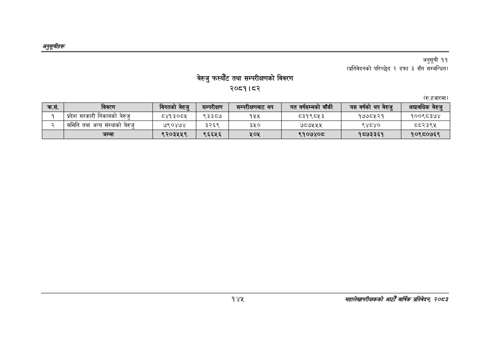

# Page 175 QA

## Rendered page


## Extracted text

```text
अनुतूचीहरु
बेरुजु फस्यौट तथा सम्परीक्षणको विवरण २०८१।८२
अनुसूची ११
(प्रतिवेदनको परिच्छेद २ दफा ३ सँग सम्बन्धित)
(रु.हजारमा)
१४२
महालेखापरीक्षकको आठौँ वार्षिक प्रतिवेदन २०८२

| कस. | विवरण | बिगतको बेरुङ | सम्परीक्षण | सम्परीक्षणबाट थप | गत वर्षसम्मको बाँकी | यस वर्षको थप | अद्यावधिक बेरुउ' |
| --- | --- | --- | --- | --- | --- | --- | --- |
| १ | प्रदेश सरकारी निकायको बेरुजु | ८४१३०८४५ | ९३३८७ | १५५ | ८३१९८५३ | १७७८५२१ | १००९८३७४ |
| २ | समिति तथा अन्य संस्थाको बेरुजु | ७९०४७४ | ३२६९ | ३५० | ७८७५५४५ | ९४८४० | द२३९५ |
|  | जम्मा | ९२०३५५९ | ९६६५६ | २५०५ | ९१०७४०८ | १८७३३६१ | १०९८०७६९ |
```

## Flags
- table_page
- medium_quality_table
