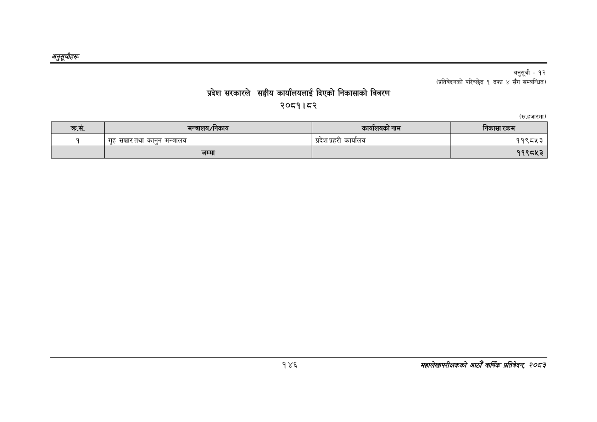

# Page 176 QA

## Rendered page


## Extracted text

```text
अनुतूचीहरु
प्रदेश सरकारले सङ्घीय कार्यालयलाई दिएको निकासाको विवरण २०८१। ८२
अनुसूची -१२ (प्रतिवेदनको परिच्छेद १ दफा ४ सँग सम्बन्धित)
(रु.हजारमा)
१४६
महालेखापरीक्षकको आठौँ वार्षिक प्रतिवेदन २०८२

| क्रस. | मन्त्रालय/निकाय | कार्वालषको नान | निकासा रकम |
| --- | --- | --- | --- |
| १ | गृह सञ्चार तथा कानुन मन्त्रालय | प्रदेश प्रहरी कार्यालय | ११९८१५३ |
```

## Flags
- table_page
- medium_quality_table
