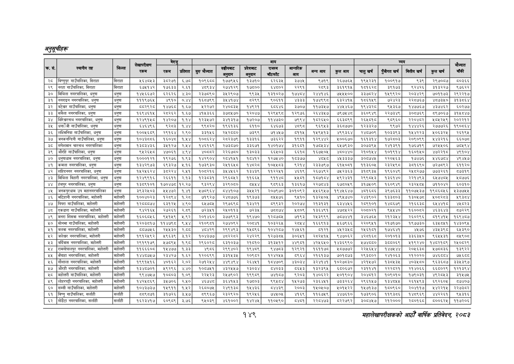

# Page 179 QA

## Rendered page


## Extracted text

```text
अनुतूचीहरु
१४९
महालेखापरीक्षकको आठौँ वार्षिक प्रतिवेदन २०८२

|  |  |  |  | बेरुउ |  |  |  |  | आय |  |  |  |  | व्यय |  |  | मौज्दात |
| --- | --- | --- | --- | --- | --- | --- | --- | --- | --- | --- | --- | --- | --- | --- | --- | --- | --- |
| २९ |  | बिल्ता | लेखापरीक्षण रकम | रकम | प्रतिशत | सुरु मौज्दात | सबाट | चाट | पमा |  | अन्यबाय | कुसबाप | बातुखर्ष | पुँजीगत र्ष | ित्तीपखर्ष | कुलखर्ष | बाँकी |
| २८ | बिष्णुपुर गाउँपालिका, सिराहा | सिराहा | १६४७४३ | ३८२७१ | ६७८ | १०९६८८ | १७७९५६ | १३७१० | ६२६३५ | ३७४५ | ९७१९ | २६७७६५ | १९४५२३१ | १००९१७ | ९३९ | २९७०८७ | ८०३६६ |
| २९ | नरहा गाउँपालिका, सिराहा | सिराहा | ६७४५१४२ | १७६३३ | २६१ | ४९३४ | २७४१२९ | १७६८०० | ४८०२ | २२९१ | २८९३ | ३६१९१५ | १८१६२८ | ३९१७३ | ९२४२६ | ३१३२२७ | ९७६२२ |
| ३० | मिथिला नगरपालिका, धनुषा | धनुषा | १४४६६७२ | ६२६२६ | ४३० | २३७८९० | ३४२९०७ | ९९३५ | १३१०२७ | ७४८४ | र२४७१४६ | ७५४४०० | इ३७८२४ | १४९९२० | २०३४२९ | ७०११७३ | २९२२१७ |
| ३१ | नगराइन नगरपालिका, धनुषा | धनुषा | १११९७६५ | ४९१० | ०,४४ | १६५७९९ | ३४४१७४ | ८२९९ | ९०६११ | ४३३३ | १७४९९८ | ६३२४१५ | १८६१५९ | ७२४२३ | २२८७६७ | ४८७३५० | ३१३८६४ |
| ३२ | बटेश्वर गाउँपालिका, धनुषा | धनुषा | ८५२९२८ | १४७६८ | १.६७ | २२२७२ | २४०८३५ | १४९२१ | ६८६४६ | ३७०७ | ११७३५७ | ४४५४६७ | १९४३२८ | ९५३६७ | १४७७६७ | ४३७४६२ | ६०२७४ |
| ३३ | सबैला नगरपालिका, धनुषा | धनुषा | १६९४६१५ | २८२६२ | १.६७ | ४१५३६६ | ३७८५७० | १२०४७ | १२९५९८ | १२९७६ | २६४३५७ | छ७९७५४८ | ३६०९४९ | २२७३४६ | ३०८७६९ | ८९७०६७ | ३१५८४७ |
| ३४ | निरेचरनाथ नगरपालिका, धनुषा | धनुषा | १२४९१५८ | १४२०७ | १.१४ | १२३५७२ | ३४१३१७ | १७२०७ | ११४७३० | ७९९४ | १८२६५० | ६६३८९९ | २६८१ | ८९६० | २२०४६२ | ८४२५९ | २०२२१२ |
| ३५ | गाउँपालिका, धनुषा | धनुषा | इ४इ४९६ | ४३८३ | १४४ | ९८२० | १९६१३६ | ११० | इ४इ७३ |  | ६९४३ | ३६८७७० | १२३३२७ | ९९७२ | १४४४२६ | २७७७२६ | १९०५६४ |
| ३६ | लक्मिनिया गाउँपालिका, धनुषा | धनुषा | १००४५६८९ | २९१६४ | २.० | इ३१५६ | र२४२८८० | ७३९९ | ७१४४७ | ११५ | १४९५१३ | ४९९३६४ | २४८७०९ | १०३३९३ | १५४२२३ | ५०६३२५ | २६१९४ |
| ३७ | जनकनन्दिनी गाउँपालिका, धनुपा | धनुषा | १०४३८८६ | १६०४८ | १,४५४ | १०८६२४ | २८२३७९ | ३३१६ | ७३६२२ | १९११ | १२९४४२ | ४००६७० | १६१३१४ | १७२८०३ | २०९०९९ | ४४३२१६ | ६०७८ |
| ३८ | गणेशमान चारनाथ नगरपालिका | धनुषा | पइ्टइ४३६ | इ३४५१२७ | २४४ | १४६१६९ | २७३८७० | इ३६७१ | १४०१७४ | इ१६८१ | १७८५३४ | ६४७९३० | इ३०७३९५ | र२४१३९१ | १७६७१९ | ७२५१०६ | ७८१९४ |
| ३९ | औरहि गाउँपालिका, धनुषा | धनुषा | ९५२६५८ | ४७०६१ | ४.९४ | ४०८२ | २२६७८० | १३०३३ | ६६५०३ | ६६१८ | १६७५०५ | ४८०४४० | २१०१५४ | १०१९१४ | १६०१५० | ४७२२१८ | ४९१०४ |
|  | धनुषाधाम नगरपालिका, धनुषा | धनुषा | १०००१२१ | १९२७६ | १.९३ | १४२९०४ | २८७१५१ | १८४७१२ | १२७४४० | १८३७७ | ४०५८ | ४५३३३७ | इ३०५७४४ | २२०५६३ | १७४७६ | ४४६७८४ | ४९४४७ |
| ४१ | कमला नगरपालिका, धनुषा | धनुषा | १३४२९७३ | ६९३२७ | ४.१६ | १७३९३० |  | ४८२८ | १०४४८३ | ९२१४ | २३३७९७ | ६१५०६१ | ११३६०५ | २३२४१९८ | ३८१६९० | ७२७८९२ | ६११२० |
| ४२ | शहिदनगर नगरपालिका, धनुषा | धनुषा | १्२४६२४ | इड२२४ | २,४५१ | १०८२१६ | इ४४५६२ | १इ४३९ | ११२२११ | ४६१९ | २६७४९२ | ७६२३६३ | ३१८९३४५ | १९६०४६ | र२४१८२७७ | ७७३२६१ | ब७३१९ |
| ४३ | मिथिला बिहारी नगरपालिका, धनुषा | धनुषा | १२४६९१६ | २६६११ | २.१३ | १२३८३१ | २९६८५२ | ११६६४ | ६११४० | २४०१ | १०७१८४ | २९२४३१ | २९९०४६३ | १३६१४० | २२१४६३ | ५७४८ | १०७७६ |
| ४४ | हेसपुर नगरपालिका, धनुषा | धनुषा | १३८९१०१ | १७०४७८ | १२.२७ | द९इ२९४ | इ२९०८० | बाट | ९८९६३ | १३६१७ | २२७८४३ | ६७८०५९ | इ३१७४०९ | १६०९४९ | रइ३२५०५ | ७११०४२ | ६०१० |
| ४५ | जनकपुरधाम उप महानगरपालिका | धनुषा | ३९३२४५०३ |  | १४१ | ५७८९६४ | ८४४१०७ | इ४१२१ | २०७९७० | ३०१०९२ | २५६९५७ | १९४४६४७ | ४८१६८६ | इ३९७६३३ | ११०७५३७ | १९८६८१६ | ५३७७५४ |
| ४६ | मटिहानी नगरपालिका, महोत्तरी | महोत्तरी | १००४०२३ | १२८९४ | १.२८ | ७१९२७ | २४८७७६ | १९३७३ | ८५५७६ | ६५१० | १३२५०५ | ४९५७४० | २४३९०२ | १३३८०३ | १३०५७८० | भ०८२८३ | ९३८४ |
| ४७ | पिपरा गाउँपालिका, महोत्तरी | महोत्ती | १२८५०७४ | ६इ१२५ | ४.० |  | २९७६९८ | १इ४२१ | ८९९३२ | २०२७४ | २१३१३१ | ब६३४४५६ | २०९१०१ | १४८६७९ | २१६६३८ | द४४४१ठ | ४८२३ |
| ४८ | एकडारा गाउँपालिका, महोत्तरी | महोत्तरी | ९४२१६५ | २७२६१ | २.८९ | ७२३५१ | २४५०११३ | ७२३५ | ७चच्छङ | २८०९ | १३६४६१ | ४७८५२२ | २०६०२१ | ९५५४० | १६००८२ | ४६३६४३ | ८७२२९ |
| ४९ | मनरा शिसवा नगरपालिका, महोत्
```

## Flags
- table_page
- medium_quality_table
