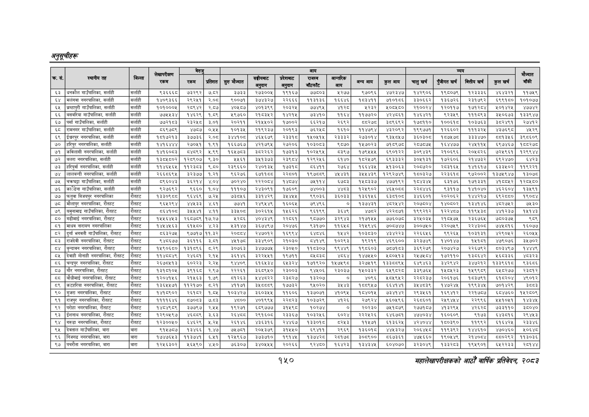

# Page 180 QA

## Rendered page


## Extracted text

```text
अनुतूचीहरु
१५०
महालेखापरीक्षकको आठौँ वार्षिक प्रतिवेदन २०८२

|  |  |  |  | बेरुउ |  |  |  |  | आय |  |  |  |  | व्यय |  |  | मौज्दात |
| --- | --- | --- | --- | --- | --- | --- | --- | --- | --- | --- | --- | --- | --- | --- | --- | --- | --- |
| २९ |  | बिल्ता | लेखापरीक्षण रकम | रकम | प्रतिशत | सुरु मौज्दात | सबाट | चाट | पमा |  | अन्यबाय | कुसबाप | बातुखर्ष | पुँजीगत र्ष | ित्तीपखर्ष | कुलखर्ष | बाँकी |
| ६३ | धनकौल गाउँपालिका, सर्लाही | सर्लाही | ९३६६६८ | ७३२९२ | ७.८२ | ३७३३ | २७३००५ | १९१६७ | ७८०३ | ५२७७ | ९७०९६ | ४७२३४७ | १४२९०६ | १९८०७९ | १२३३३६ | ४६४३२१ | ११७५९ |
| ६४ | मलंगवा नगरपालिका, सर्लाही | सर्लाही | १४०९३६६ | २९२५१ | २ | ९००७१ | ३७४३२७ | २२६६६ | ११३१३६ | १६६४६ | १८३४११ | ७१०१६६ | ३३०६६२ | १३६७२६ | २३१७९२ | ६९९१६० | १०१०७७ |
| ६५ | ब्रम्हापुरी गाउँपालिका, सर्लाही |  | १०१०००५ | २८९४२ | २.७ | ४०४८७ | ४०१३९९ | २०३२५ | ७७४९५ | ४१२८ | ५२३२ | ४०८४५८० | २१००२४ | १२०११७ | १७१२८४ | १०१४२५ | ४७७४२ |
| ६६ | बसबरिया गाउँपालिका, सर्लाही | सर्लाही | ७७५५३४ | १४६२९ | १.५ | ९७६० | २१८५३५२ | १४२१५ | ७३४१० | ११६४ | ११७७२० | ४२४८६१ | १४६४२१ | २३४९ | १११८९३ | ३४१०६७३ | १३३९४७ |
| ६७ | पर्सा गाउँपालिका, सर्लाही | सर्लाही | ७७२१८३ | २३२५८० | ३.०१ | २०२११ | २१५५०२ | १७००२ | ६६२१७ | २६९२ | दड२७० | ३८९६९२ | १७८११० | १००६१८ | १०३७६३ | ३८२४६९१ | २७४१२ |
| ६८ | रामनगर गाउँपालिका, सर्लाही | सर्लाही | ५६९७८९ | ४७८७ |  | १०१३५ | २१९२३७ | २०१९३ | ७६२५८ | १६१० | ११४७९४ | ४३२०९२ | १९९७७१ | १२६६०२ | १११३२५ | ४३७६९८ | ४५२९ |
| ६९ | ईश्वरपुर नगरपालिका, सर्लाही | सर्लाही | ९५९६७९३ | इ३७७३६ | २,०८० | इ४४१०८ | ४६५६७९ | रइइ१ठ | १५०५१५ | र२३३३२ | २७३०१४ | ९३५०४७ | ३६०३०८ | १५७४७८० | ३३३४७० | ब०१३५६ | ३९८६०९ |
| ७० | हरिपुर नगरपालिका, सर्लाही | सर्लाही | १४१६४४४ | २७०५१ | १.९१ | १६६७६३७ | ४२१७९५ | २७२०६ | १०३०८३ | ९८७० | १५७०२३ | १८९७ | २८७८७५ | १६४४७७ | २४५११५ | ६९७४६७ | १८८२७८ |
| ७१ | कविलासी नगरपालिका, स्लीही | सर्लाही | १४१६०८३ | ८४८९२ | ४.९९ | १६५७८३ | ३८२२६२ | १७३१३ | १०२४९५ | ८३९७ | १७९५४५४५ | ६९०१२२ | इ३०९४३९ | २१०६९६६ | २०६५८२६ | ७२४९६१ | १२९९४४ |
| ७२ | बलरा नगरपालिका, सर्लाही | सर्लाही | १३८५८०२ | १२८९०७ | ९.३० | ४४६१ | ३४१३७३ | २३९८४ | १२९२५६ | ६१४० | १८२४५७९ | ६९३३३२ | ३०११३१ | १७२६०६ | २१४७३२ | ६९२४७० | ६४२३ |
| ७३ | हरिपुर्वा नगरपालिका, सर्लाही |  | ११४६५६५ | ११२३८३ | ९.८० | २३९६६० | २४०१३५ | ९ | ८४११ | २७६४ | १६६४३५ | ११३०६३ | २००७२० | २८३१६५ | १४१६१७ | ६३३५०२ | ११९२२१ |
| ७४ | लालबन्दी नगरपालिका, सर्लाही | सर्लाही | २६६८६९५ | ३२३७७ | १.२१ | ९६६२७६ | ६७११८०८ | २२८०१ | १९७८८९ | ४४४३१ | ३े५४५४३९ | १२९२७४९ | १८०३२७ | २२३६१८ | ९७२००२ | १३७५९४७ | ३०७८ |
| ७५ | चक्राघट्टा गाउँपालिका, सर्लाही | सर्लाही | ८९६०४३ | ३६२१४ | ४०४ | ७०२४० | २२२०८४ | १४८७४ | ७५११४ | ५७८३ | १५८३३७ | ४७७१९२ | १८४३४५ | ६३१७६५ | १७१३३१ | ४१८८५२ | १२८५८० |
| ७६ | कारँडेना गाउँपालिका, सर्ताही | सर्लाही | ९२७६९२ | ९६६० | १.०४ | १११०७ | २४३०९१ | १७६०९ | ७४००३ | ४४३ | १२४९०२ | ४६४०६८ड | २२८४४६ | ३११७ | १४१०४० | ४६२६०४ | १३४९१ |
| ७७ | फतुवा बिजयपुर नगरपालिका | रोतहट | १३३०९८८ | ९६४६९ | ७.२५ | ७३८५६ | ३३१४२९ | ३५४५५ | ९९०३६ | ३६०३३ | १३६१५६ | ६५३८१०८ | ३४६६०१ | २०२०६२ | १४४२१७ | ६९२८८० | १९०८४ |
| ७८ | मौलापुर नगरपालिका, रौतहट | रौतहट | ९६५२९४ | ४४५३३ | ४.६१ | ७७४१ | २४९५४९ | १६०६५ | ७९४९६ | ० | १३७४३१ | ४८२५४२ | २०७८०४ | १४०८०२ | १३४१४६ | ४८२७५२ | ७५३० |
| ७९ | यमुनामाइ गाउँपालिका, रौतहट | रौतहट | ८६४१०८ | ३५५४१ | ४.११ | ३३५०८ | ३०२६१५ | १५६२६ | ९६१९९ | ३६४९ | ४७८२ | ४२२८७१ | १९९२१२ | १२२४८७ | ११९४५३८ | ४४१२३७ | १५१४३ |
| ५० | गढीमाई नगरपालिका, रौतहट | रौतहट | १५५६४५३ | २६८७८९ | १७.२७ | ५२८६ | ४०४३४९ | २२८६१ | ९८७७० | ३२९४३ | २१७१५५ | ७७६०७८ | ३२५०३५ | २१८५७५ | २३६७६५ | ७८०३७५ | ९८९ |
| ८१ | माधव नारायण नगरपालिका | 'रातहट | १४५४५६३ | ब६१५८० | ४.२३ | २३१४७ | ३६७४९७ | २०४७६ | ९३१७० | ११६४५८० | २१५९४६ | ७०८७४७ | ३००७५० | २२०७५९ | २२४३०८ | ७४५८१६ | १६०७७ |
| ८२ | दुर्गा भगवती गाउँपालिका, रौतहट | रौतहट | ८६३२७४५ | ९७७१७ | ९९.३३ | २०६८४ | २४७०१२ | १६९९४ | ६४४६ | १५४२ | १०३८३० | ४३४२२३ | २२६६५६ | ९२६५ | १०३१३१ | ४२९०५२ | २६०५४५ |
| ८३ | राजदेवी नगरपालिका, रोतहट | रोतहट | ९४८६७७ | ३६११६ | ३.५१ | ४१७० | ३३४९०९ | २१०३० | ८४१४९ | १०२९३ | १९२१९ | ४६९६०० | ३२३७४९ | १४०१४७ | १५१८१ | ४४७९०७
```

## Flags
- table_page
- medium_quality_table
