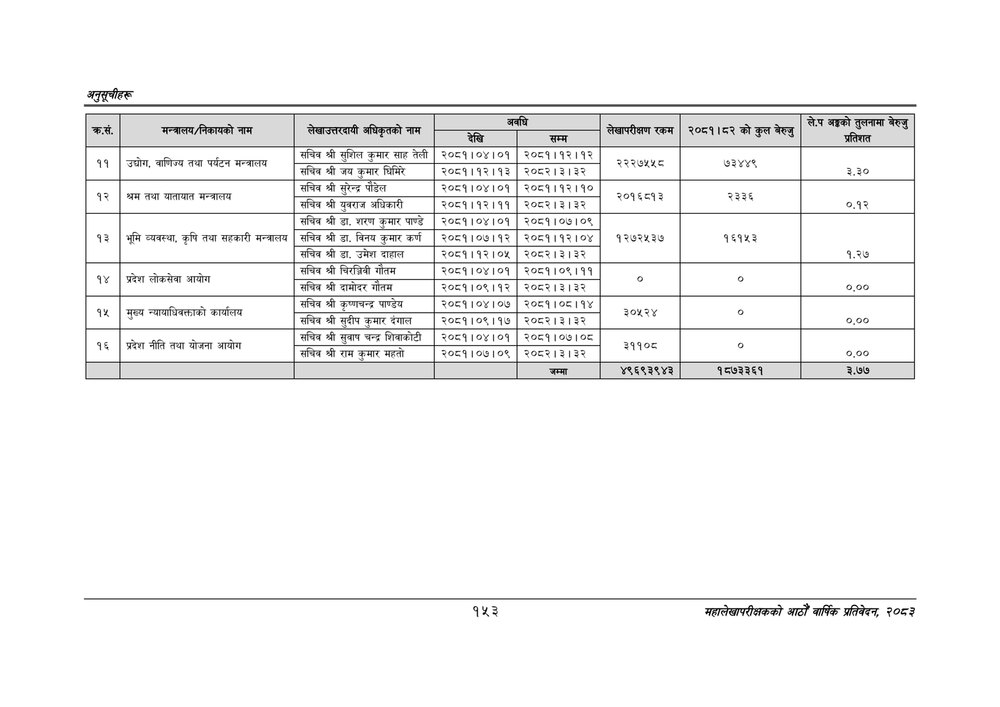

# Page 183 QA

## Rendered page


## Extracted text

```text
अनुतूचीहरु
१५३
महालेखापरीक्षकको आठौँ वार्षिक प्रतिवेदन २०८२

| . क्रस. | मन्त्रालय/निकायको नाम | 'लेखाउत्तरदायी अधिकृतको नाम | देखि | अवधि सम्म | लेखापरीक्षण रकम | २०८१।८२ को कुल बेरुजु | अङ्गको तुलनामा छस डा प्रतिशत |
| --- | --- | --- | --- | --- | --- | --- | --- |
|  | उद्योग, वाणिज्य पर्यटन | सचिव श्री सुशिल कुमार साह तेली कुमार साह | २०८१।०४।० देहछे। ०४१० \| | ०६ २०७३। ३२३२ |  |  |  |
| ११ | , तथा मन्त्रालय | जय सचिव श्री जय कुमार घिमिरे | २०८१।१२।१३ | २०८२।३।३२ | २२२७५५८ | ७३४४९ | ३.३० |
|  | अन्वालय | सचिव श्री सुरेन्द्र पौडेल | २०८१।०४।०१ | २०८१।१२।१० |  |  |  |
| १२ | श्रम तथा यातायात मन्त | 'सचिव श्री युवराज अधिकारी | २०८१।१२।११ | २०८२।३।३२ | २०९८५९३ | २३३६ | ०.१२ |
|  |  | सचिव श्री डा. शरण कुमार पाण्डे | २०८१।०४।०१ | २०८१।०७।०९ |  |  |  |
| १३ | भूमि व्यवस्था, कृषि तथा सहकारी मन्त्रालय | सचिव श्री डा. विनय कुमार कर्ण | २०८१।०७।१२ | २०८१।१२।०४ | १२७२५३७ | १६१५३ |  |
|  |  | सचिव श्री डा. उमेश दाहाल | २०८१।१२।०५ | २०८२।३।३२ |  |  | १.२७ |
|  | आयोग | सचिव श्री चिरञ्जिवी गौतम | २०८१।०४।०१ | २०८१।०९।११ |  |  |  |
| १४ | प्रदेश लोकसेवा | सचिव श्री दामोदर गौतम | २०८१।०९।१२ | २०८२।३।३२ |  |  | ०.०० |
|  | मुख्य कार्यालय | सचिव श्री कृष्णचन्द्र पाण्डेय | २०८१।०४।०७ | २०८१।०८।१४ |  | ० |  |
| १५ | न्यावाधिवक्ताको = | सचिव श्री सुदीप कुमार दंगाल | २०८१।०९।१७ | २०८२।३।३२ | ३०५२४ |  | ०.०० |
|  | - नीति | सचिव श्री सुवाष चन्द्र शिवाकोटी सा ४ टी | २०६१।०४।०१ | ७ रे ९५११०७।०५ |  |  |  |
| १६ | प्रदेश तथा योजना आयोग | सचिव श्री राम कुमार महतो | २०८१।०७।०९ | २०८२।३।३२ | ३११०८ |  | ०.०० |
|  |  |  |  | जम्मा | ४९६९३९४३ | १८७३३६१ | ३.७७ |
```

## Flags
- table_page
- medium_quality_table
