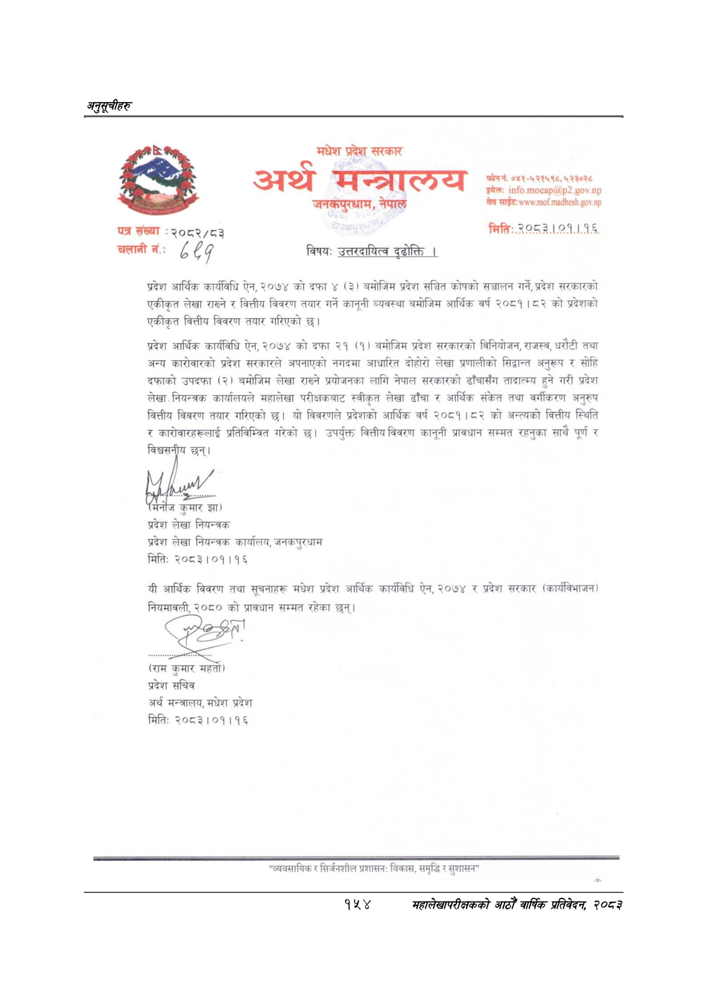

# Page 184 QA

## Rendered page


## Extracted text

```text
अनुत्चीहरु
पत्र संख्या
२०८२/८३
चलानी नं:
८ ८?
८ ८?
मधेश प्रदेश सरकार
अथ अआअन्तातलय
जनर्कपुरधाम,
नेपाल
विषय:
उत्तरदायित्व दुढोक्ति |
प्रदेश आर्थिक कार्यविधि ऐन, २०७४ को दफा ४ (३) वमोजिम प्रदेश सञ्चित कोषको सञ्चालन गर्ने, प्रदेश सरकारको एकीकृत लेखा राख्ने र वित्तीय विवरण तयार गर्ने कानूनी व्यवस्था वमोजिम आर्थिक वर्ष २०८१।८२ को प्रदेशको एकीकृत वित्तीय विवरण तयार गरिएको छ।
प्रदेश आर्थिक कार्यविधि ऐन, २०७४ को दफा २१ (१) बमोजिम प्रदेश सरकारको विनियोजन, राजस्व, धरौटी तथा अन्य कारोवारको प्रदेश सरकारले अपनाएको नगदमा आधारित दोहोरो लेखा प्रणालीको सिदान्त अनुरूप र सोहि दफाको उपदफा () बमोजिम लेखा राख्ने प्रयोजनका लागि नेपाल सरकारको ढाँचासँग तादात्म्य हुने गरी प्रदेश लेखा, नियन्त्रक कार्यालयले महालेखा परीक्षकबाट स्वीकृत लेखा ढाँचा र आर्थिक संकेत तथा वर्गीकरण अनुरुप वित्तीय विवरण तयार गरिएको छ। यो विवरणले प्रदेशको आर्थिक वर्ष २०८१।८२ को अन्त्यको वित्तीय स्थिति र कारोवारहरूलाई प्रतिविम्वित गरेको छ। उपर्युक्त वित्तीय विवरण कानूनी प्रावधान सम्मत रहनुका साथै पूर्ण र विश्वसनीय छन्‌।
५ झा) प्रदेश लेखा नियन्त्रक प्रदेश लेखा नियन्त्रक कार्यालय, जनकपुरधाम
मितिः
२०८३।०१।१६
यी आर्थिक विवरण तथा सूचनाहरू मधेश प्रदेश आर्थिक कार्यविधि ऐन, २०७४ र प्रदेश सरकार (कार्यविभाजन) नियमावली, २०८० को प्रावधान सम्मत रहेका छन्‌।
(राम कुमार महतो) प्रदेश सचिव अर्थ मन्त्रालय, मधेश प्रदेश मिति: २०८३।०१।१६
"व्यवसायिक र सिर्जनशील प्रशासन: विकास, समृद्धि र सुशासन"
फोन नं. ०४१-५२१५९८, ५२३०२८ इमेलः .२.. चेव साईट:
मिति:.२०८३.।.०१.१.१६.
महालेखापरीककको आठौं बाकि प्रतिवेधक २००३
```

## Flags
- None
