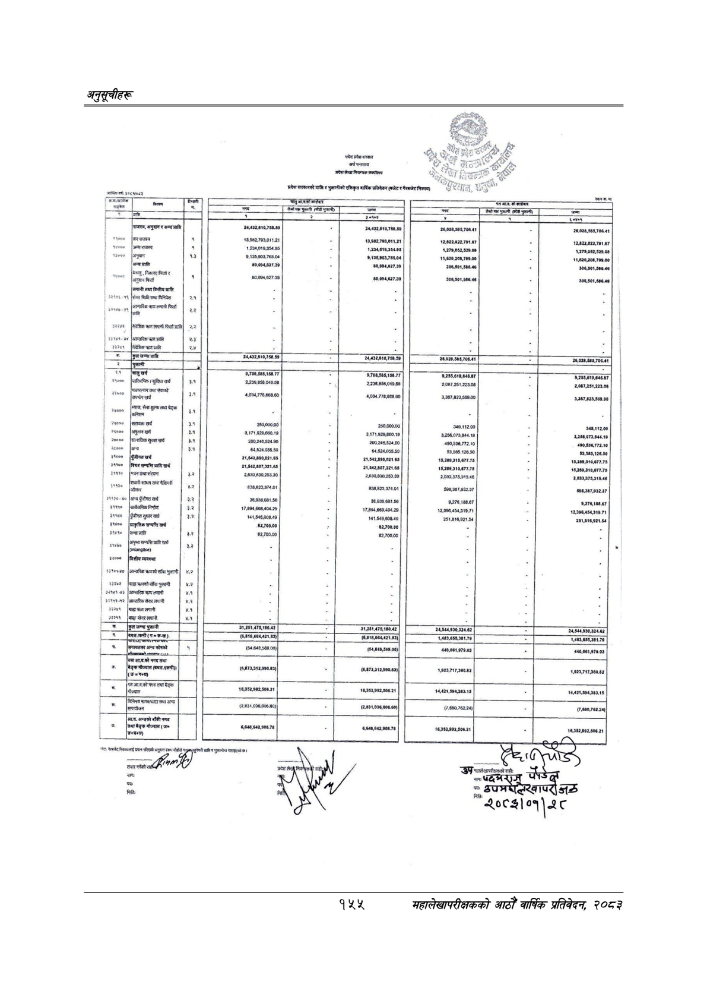

# Page 185 QA

## Rendered page


## Extracted text

```text
हा
१२९०५२६६२५०९१
१२'९०५'२६५°२६८'९१
८८९०६/२०९०७९९.
छ
'००९')
(२२९०°००९'१)
(०९:९०९१९८०१
६४२)
९/९००/९८०१
६८८)
[का
८७७७
२६६/२५६७।.
१२४०५/२६६२५७९।.
न
-०,०.
७»
।
=२
(४०६६
३
२०७७)
००७७)
क
'०
[ला
(००७०
२९)
छिन्न
नन)
हस
हिरा
ति
को
१०११
[समभा५०७०/८
७७२५]
२
।
त
क
र
[म
कामा
५
हर
२५
इन
१२
२७४७
[गा
३
ङ्‌
हट
२
००८८
००००/२३.
[र
६२४८]
मा
क
सि
११२६१९:४१५२
६०९०९९१५१०।
६०९००९०५१९.
ब्‌
[१
[उ
हट००७९०९०६०:२१.
२९००
९८र६.
२२८१
५८८८
९५१०९९६६९
छै
९७:००९०६९८
पमरक
म
१
न
९७५
५/र७७०४
७७०४
०'
२२२९
०२०
७०]
[त
[क
न
२८
क
२९०७:२०:७|
[उ
८८७०
सल
९७४२०७७४२७४
०
२२:२०)
००१.
०५९२१
'६६५°
०'०'
०५५५०९२५
९
०८
०१''९
०८
०४०८५७४८००८
०६'२५'००२'००२
६/४००२/०
५२५
८०००६८०
५५८४
६१,०९९
६२६१२१
'०९९/६२६१२११.
४२७६
०२०७
००००५
००
००६८
५२४८९०५
००'८५५२८"
४९६"
००९३०°८४'
९००"
०४७९४७८८%६०१
०
०००
७९७
७०८८
गु
लल
र
२८९/९१६१९
५२६
खा
२०९१९९४९०८१६.
र
०
ला
०५०८
७७२०
७४
करमा]
हा
पटता
०
डट
९०९७७१०७५०.
९०९७
०७५०.
९०९७
१०७५८
००/६६/-९०२०२९।.
००°६८२'९०२°०७९"४
१०९९/७०६९८१६.
०५९८
७०६
५६१६.
९०६२५२५०६८२१
९०
६०५२५०७८८५.
६१५७
६०
पट.
९६७८
६१०
७८५.
ाह/व्यच्याया
८
स्टार्ट
१११
१
४
क
प्ि००६८र७६७४।
१
५०/५७/१८०७८
छ
१०
९०/५७५/७८०७८
४१००
४०१
१००
२००२
२
:--२---
[१
[ना
तर
सकल
काममा
११.
८२०९ २२८८ ( २%/४०७०/७७७/८४

| 2 :--2--- et काममा   | = Eon                    | २००२   |                                     | R Ty Y   |                                   |                                          |     | [1                                         | [1                                         | [1                                         |
|----------------------|--------------------------|--------|-------------------------------------|----------|-----------------------------------|------------------------------------------|-----|--------------------------------------------|--------------------------------------------|--------------------------------------------|
| i                    |                          | E      |                                     |          |                                   |                                          |     | )                                          | )                                          | )                                          |
|                      |                          |        | 967८ 610 ७८५. प्ि०06८र७6७४। 401 100 | .        | 4100                              | 10 90/५७5/७८०७८                          | छ   | 1 ५०/५७/१८०७८ )                            | 1 ५०/५७/१८०७८ )                            | 1 ५०/५७/१८०७८ )                            |
|                      |                          |        | 059८ ७06 ५६16.                      | क        | १099/7069८16. 6157 60 पट. 111 1 4 | ) 90 6052५०७८८५. 8 स्टार्ट               | ¥   | 00/66/-902029।. 906252506८21 &ाह/व्यच्याया | 00/66/-902029।. 906252506८21 &ाह/व्यच्याया | 00/66/-902029।. 906252506८21 &ाह/व्यच्याया |
|                      |                          |        | [ [                                 | - .      |                                   | v sesiiosisa 9०9७ 107५८ 00°682'902°079"4 | . = | 909७7107५0£. 909७ 07५०.                    | 909७7107५0£. 909७ 07५०.                    | 909७7107५0£. 909७ 07५०.                    |
|                      |                          | &#124; |                                     |          |                                   |                                          |     | .                                          | .                                          | .                                          |
| &#124;               |                          | डट     |                                     |          | ०                                 | .                                        | .   | .                                          | .                                          | .                                          |
|                      |                          |        | हा पटता                             |          |                                   |                                          |     |                              
```

## Flags
- table_page
- low_quality_table
