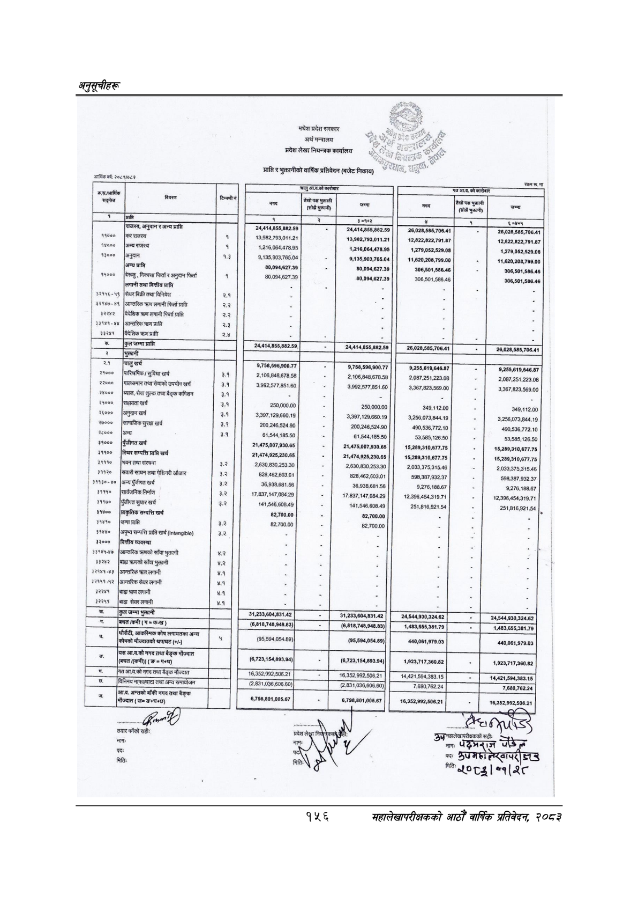

# Page 186 QA

## Rendered page


## Extracted text

```text
अनुतूचीहरू
मधेश
प्रदेश
सरकार
अर्थ
मन्त्रालय
प्रदेश
लेखा
नियन्त्रक
कार्यालय
आर्थिक
वर्ष:
२०८१/०८२
रकम
रू.मा
का
[राजस्व,
अनुवान
र
अन्य
प्राप्ति
२४,४१४,८५५,८८२.५०
२४,४१४,८५५,८८२.५९
२६,०२८,५६५,७०६.४१
२६,०२६,५८५,७०६.४१
११०००
|किरिराजस्व
१
१३.९८२,७९३,०११.२१
१३,९६२,७९३,०११.२१
१२,८२२,८२२,७९१.८७
१२,६२२,८२२,७९१.८७
१४०००
।अन्यराजस्व
१
१,२१६,०६४,४७८,९५
१,२१६,०६४,४७६.९५
१,२७९,०५२,५२९.०८
१,२७९,०५२,५२९.०८
९०००
अनुदान
१.३
९,१३५,९०३.७६५.०४
९,१३५,९०३,७६५.०४
११,६२०,२०८,७९९.००
११,६२०,२०८,७९९.००
अन्य
प्राप्ति
८०,०९४,६२७.३९
८०,०९४,६२७.३९
३०६,५०१,५८६.४६
३०६,५०१,५८६.४८
।
१५०००
निकासा
फिर्ता
र
अनुदान
फिर्ता
१
८०,०९४,६२७.३९
८०,०९४,६२७.३९
३०६,५०१,६८६.४६
३०६,५०१,५८६.४६
लगानी
तथा
वित्तीय
प्राप्त
३२१५६-५६
[सेयर
बिक्री
तथा
विनिवेश
२.१
३२९४७-४९
|आन्तरिक
लगानी
फिर्ता
प्राप्त
२.२
इ२२४२
।विँदेशिक
क्रण
लगानी
फिर्ता
प्राप्त
२.२
३३१४१-४४
|आन्तरिक
क्रण
प्राप्ति
२३
३३२४१
विदेशिक
क्र
प्राप्ति
२.४
५
५
क.
कुल
जम्मा
प्राप्त
डो
२४४१४५६५८८२५०
२६०२०५०५७०६४१
२६,०२०,५८५,७०६.४१
१
रे
पो
।
२१
चितुखर्च
।
९,७५८,५९६,९००.७७
९,२५५,६१९,६४६,८७
२१०००
पारिश्रमिक
सुविधा
खर्च
३.१
२,१०६,८४८,६७८.५८
२,१०६,८४८,६७८.५८
२,०८७,२५१,२२३.०८
२,०८७,२५१,२२३.०८
२े२०००
।]ुमालसमान
तथा
सेवाको
उपभोग
खर्च
३.१
३.९९२,५७७.८५१.६०
३,९९२,५७७,८५१.६०
३,३६७,८२९,५६९.००
३,३६७,८२३,५६९.००
२४०००
|ब्याज,
सेवा
शुल्क
तथा
बैङ्क
कमिशन
३९
५
२५०००
।सिहायता
खर्च
३.१
२५०,०००.००
२५०,०००.००
३४९,११२.००
३४९,११२.००
२६०००
अनुदान
खर्च
३.१
३,३९७,१२९,६६०.१९
३,३९७,१२०,६६०.१९
३,२५६,०७३,८४४.१९
३,२५६,०७३,८४४.१९
२७०००
सामाजिक
सुरक्षा
खर्च
३.१
२००,२४६,५२४.९०
२००,२४६,५२४.९०
४९०,५३६,७७२.१०
४९०,५३६,७७२.१०
२८०००
अन्य
३९
६१,५४४,१८५.५०
६१,५४४,१८५.५०
५३,५६५,१२६.५०
५३,५८५,१२६.५०
इ१०००
पुँजीगत
खर्च
२१,४७५,००७,९३०.६५
२१,४७५,००७,९३०.६५
१५,२८९,३१०,६७७.७५
१५,२६९,३१०,६७७.७५
३११००
स्थिर
सम्पत्ति
प्राप्ति
खर्च
२१,४७४,९२५,२३०.६५
२१,४७४,९२५,२३०.६५
१५,२८९,३१०,६७७.७५
१५,२८९,३१०,६७७.७५
{३०
तथा
संरचना
३२
२,६३०,८३०,२५३.३०
२,६३०,८३०.२५३.३०
२,०३३,३७५,३१५.४६
२,०३३,३७५,३१५.४६
११२०
।सिवारी
राधन
तथा
मेशिनरी
औजार
३.२
८२८,४६२,६०३.०१
८२८,४६२,६०३.०१
५९८,३८७,९३२.३७
५९८,३८७,९३२.३७
$११३०-४०
|अन्य
पुँजीगत
खर्च
३२
३६,९३८,६८१.५६
३६.९३६,६८१.५६
९,२७६,१८८.६७
९,२७६,१८८.६७
३११५०
सार्वजनिक
निर्माण
१७.८३७,१४७,०८४.२९
१७.८३७,१४७,०८४.२९
१२,३९६,४५४,३१९.७१
१२,३९६,४५४,३१९.७१
३११७०
पुँजीगत
सुधार
खर्च
३२
१४१,५४६,६०८.४९
१४१,५४६,६०८.४९
२५१,८१६,९२१.५४
२५१८१६.९२१.५४
३१४००
प्राकृतिक
सम्पत्ति
खर्च
८२,७००.००
८२,७००.००
३१४१०
जिमा
प्राप्ति
३
८२,७००.००
८२,७००.००
ङ्‌
३१४४०
।|आपृष्य
सम्पत्ति
प्राप्ति
खर्च
३.२
२०००
वित्तीय
व्यवस्था
'१४५-४७
[आन्तरिक
करणको
साँवा
भुक्तानी
५
२४२
बिहा
क्रणको
साँवा
भुक्तानी
३९८८८३
|आन्तरिक
कण
लगानी
४.१
#२९४९
४२
|आन्तरिक
सेयर
लगानी
४.१
बाहा
करण
लगानी
४.१
।
३२२५१
|बाहा
सेयर
लगानी
४.१
कुल
जम्मा
भुक्तानी
३१२३३,६०४,८३१४२]-
२४५४४९००३२४६२
२४५४४,०३०३२४६२
ग-
बिचत/कमी
[ग
क-ख)
(६८१८,७४८९४८८३)]
(६,८१८,७४८,९४०.८९)
१४८३८५५३८१७९
पहल
हेन
४
(९५,५०४,०५४.८९)
४४०,०६१,९७९.०३
४४०,०६१,९७९.०३
उ
डङ
०
क
सवा
जज
हत्त
३
छ
१,९२३,७१७,३६०.८२
१,९२३,७१७,३६०.८२
नितआवको
नगद
तथा
बैङ्क
मौज्दात
जिल
१६३५२००२५०६२१
१६.३५२,९९२,५०६:
१४,४२१,५९४,३८३.१५
१४,४२१,५९४,३८३.१५
लत
छ.
विनिमय
नाफाघाटा
तथा
अन्य
समायोजन
ङ्
(२.८३१,०३६,६०६.६०)
(२.८३१,०३६,६०६.६०)
७,६८०,७६२.२४
७,६८०,७६२.२४
१
६,७९८,८०१,००५.६७
६७९०,८०१,००५.६७
१६,३५२,९९२,५०६.२१
१६,३५२,९९२,५०६.२१
तयार
गर्नेको
सहीः
सहीः
[नर
भन
नामः
नामः
उर्मरेहप्लापत
छड
पदः
षक
क्रेपमछा
हेरउाप
मितिः
्त्व००३।
०१२८
१५६
महालेखापरीक्षकको आठौ वाषिकि प्रतिवेदन २०८२
```

## Flags
- None
