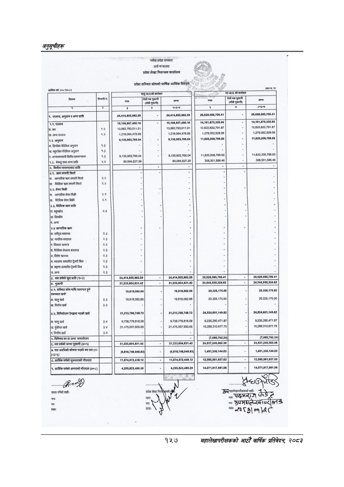

# Page 187 QA

## Rendered page


## Extracted text

```text
अनुतूचीहरू
आर्थिक
वर्ष:
२०८%/०८२
मधेश
प्रदेश
सरकार
अर्थ
मन्त्रालय
प्रदेश
लेखा
नियन्त्रक
कार्यालय
छ
चहुमास्मोकाीबाा
आ.व.को
कारोबार
का
पर
विवरण
[न]
मुखमी
रै
हु
[क
५०३१४
लका
।
१.
राजस्व,
अनुदान
र
अन्य
प्राप्ति
छि
त
रा
२४४१४८५५८८२६०
२६,०२८,५८५,७०६.४१
२६,०२८,५८५,७०६.४१
९.९,
राजस्व
१५,१०८,८५७,४९०.१६
१५,१९८,८५७,४९०.१६
१४,१०१,८७५,३२०९५
१४,१०१,८७५,३२०.९५
[क.
कर
४२
१३,९८२,७९३,०११.२१
१३,९८२.७९३,०११.२१
१२,८२२,८२२,७९१.८७
१२८२२८२२७९१८७
[ख.
अन्य
राजस्व
१.२
१,२१६,०६४,४७८.९५
१,२१६,०६४,४७८,९५
१,२७९,०५२,५२९.०८
१,२७९,०५२,५२९.०८
९.३,
अनुदान
९,१३५,००३,७६५.०४
९,१३५,९०३,७६५.०४
११,६२०,२०८,७९९.००
११,६२०,२०८,७९९.००
द्विपश्चिय
वैदेशिक
अनुदान
१.३
|ख.
बहुपश्चिय
वैदेशिक
अनुदान
१.३
भन
[ग.
अन्तरसरकारी
वितीय
हस्तान्तरण
१३
९,१३५,००३,७६५.०४
९,१३५,९०३,७६५.०४
११,६२०,२०८.७०९.००
११,६२०२०८,७९९.००
९.३,
बेरूजु
तथा
अन्य
प्रा
१.२
८०,०९४,६२७.३९
८०,०९४,६२७.३९
३०६,५०१.५८६.४६
३०८,५०१,५८६.४६
२,
वित्तीय
व्यवस्थाबाट
प्राप्त
छा
जि
र
लि
२.१.
क्रण
लगानी
फिर्ता
॥ै
।
छ
|क.
आन्तरिक
क्रण
लगानी
फिर्ता
२.२
[ख.
वैदेशिक
क्रण
लगानी
फिर्ता
२.२
२.२.
शेयर
बिक्री
आन्तरिक
शैयर
बिक्री
२.१
[ख.
वैदेशिक
शेयर
बिक्री
२.१
५
३.३.
वैदेशिक
क्रण
प्राप्त
५
२
बहुपक्षीय
२.४
द्विपक्षीय
छ
ग.
अन्य
२.४
आन्तरिक
क्रण
क.
राष्ट्रिय
बचतपत्र
२.३
[ख.
नागरिक
बचतपत्र
२.३
क
दिकास
क्रणपत्र
२.३
७.
वैदेशिक
रोजगार
बचतपत्र
२.३
[ङ.
विशेष
क्रणपत्र
२.३
९.
ब्याजमा
आधारित
ट्रेजरी
बिल
४
२४,४१४,८५५,८६२.५०
२६,०२८,५८५,७०६४१
२६०२६५८५७०६४१
३१,२३३,६०४,८३१.४२
२४,५४४,९३०,३२४.६२
४.१.
सञ्चित
कोष
माथि
व्ययभार
हुने
[रकमबाट
खर्च”
क.
चालु
खर्च
वित्तीय
खर्च
(४.२.
विनियोजन
ऐनद्वारा
भएको
खर्च
५.
विनिमय
दर
वा
अन्य
समायोजन
३३
३३
१९,८१८,०८२.६९
१९,८१८,०८२.६९
३१,२१३,७८६,७४८.७३
९,७३८,७७८,८१८.०८
२१,४७५,००७,९३०.८५
१९,८१८,०८२.६९
१९,८१८,०८२.६९
३१,२१३,७८६,७४८.७३
ङ्‌
९,७३८,७७८,८१८.०८
२१४७५,००७,९३०.६५
२०,३२९,१७५.००
२०,३२०,१७५.००
२४,५२४,६०१,१४९.६२
९,२३५,२९०,४७१.८७
१६,२८९,३१०.६७७.७५
२०,३२९,१७५.००
२०,३२९,१७५.००
२४,५२४,६०१,१४९.६२
९,२३५,२००,४७१.८७
१५,२८९,३१०,६७७.७५
छ
(७,६८०,७६२.२४)
यस
वर्षको
जम्मा
भुक्तानी
३१,२३३,६०४,८३१.४२
१,२३३,६०४,८३१.४२
(३-%)
५.
यस
अवधिको
कोषमा
भएको
थप
धट
(४
(६
८,७४८,९४८.८३)
(६,८१८,७४८,९४८.८३)
,४९१,३३६,१४४,
१,४९१,३३६,१४४.०३
११,०७४,६७२,४३८.१२
११,०७४,५७२,४३८.१२
१२,५८०,५८१,८३७.०३
१२,५८०,५८१,८३७.०३
४,२५५,८२३,४८९.२०
४,२५५,८२३,४८९.२९
१४,०७१,९१७,९८१.०६
१४,०७१,९१७,०८१.०६
सहीः
नाक
प्भन्ए
३\
४१:१७
फेरे
१४५७
महालेखापरीक्षकको आठौ वाषिकि प्रतिवेदन २०८२
```

## Flags
- None
