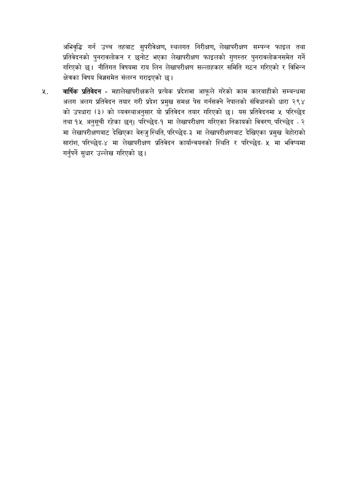

# Page 12 QA

## Rendered page


## Extracted text

```text
अभिवृद्धि गर्न उच्च तहबाट सुपरीवेक्षण, स्थलगत निरीक्षण, लेखापरीक्षण सम्पन्न फाइल तथा प्रतिवेदनको पुनरावलोकन र छनोट भएका लेखापरीक्षण फाइलको गुणस्तर पुनरावलोकनसमेत गर्ने गरिएको छ। नीतिगत विषयमा राय लिन लेखापरीक्षण सल्लाहकार समिति गठन गरिएको र विभिन्न क्षेत्रका विषय विज्ञमेत संलग्न गराइएको |
वार्षिक प्रतिवेदन -महालेखापरीक्षकले प्रत्येक प्रदेशमा आफूले गरेको काम कारबाहीको सम्बन्धमा अलग अलग प्रतिवेदन तयार गरी प्रदेश प्रमुख समक्ष पेस गर्नसक्ने नेपालको संविधानको धारा २९४ को उपधारा (३) को व्यवस्थाअनुसार यो प्रतिवेदन तयार गरिएको छ। यस प्रतिवेदनमा ५ परिच्छेद तथा १५ अनुसूची रहेका छन्‌। परिच्छेद-१ मा लेखापरीक्षण गरिएका निकायको विवरण, परिच्छेद -२ मा लेखापरीक्षणबाट देखिएका बेरुजु स्थिति, परिच्छेद-३ मा लेखापरीक्षणबाट देखिएका प्रमुख बेहोराको सारांश, परिच्छेद-४ मा लेखापरीक्षण प्रतिवेदन कार्यान्वयनको स्थिति र परिच्छेद४ मा भविष्यमा गर्नुपर्ने सुधार उल्लेख गरिएको छ।
```

## Flags
- None
