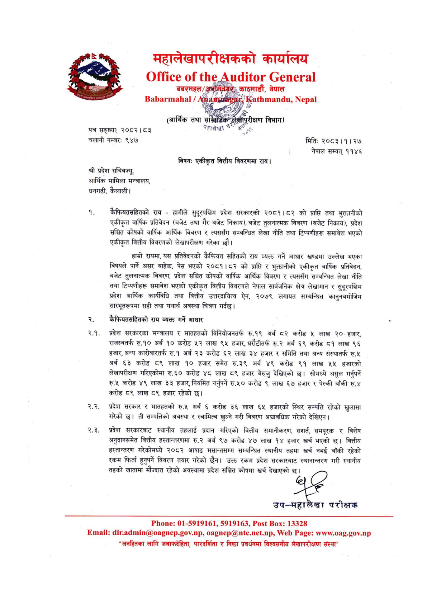

# Page 13 QA

## Rendered page


## Extracted text

```text
महालेखापरीक्षकको कार्यालय
बबरमहल/ ;, काठमाडौं, नेपाल / शन [छ /,
पत्र सङ्ख्या: २०८२। ८३ चलानी नम्बर: ९४७
श्री प्रदेश सचिवज्यु, आर्थिक मामिला मन्त्रालय, धनगढी, कैलाली।
कैफियतसहितको राय -हामीले सुदूरपश्चिम प्रदेश सरकारको २०८१।८२ को प्राप्ति तथा भुक्तानीको एकीकृत वार्षिक प्रतिवेदन (बजेट तथा गैर बजेट निकाय), बजेट तुलनात्मक विवरण (बजेट निकाय), प्रदेश सञ्चित कोषको वार्षिक आर्थिक विवरण र त्यससँग सम्बन्धित लेखा नीति तथा टिप्पणीहरू समावेश भएको एकीकृत वित्तीय विवरणको लेखापरीक्षण गरेका छौं।
हाम्रो रायमा, यस प्रतिवेदनको कैफियत सहितको राय व्यक्त गर्ने आधार खण्डमा उल्लेख भएका विषयले पार्ने असर बाहेक, पेस भएको २०८१।८२ को प्राप्ति र भुक्तानीको एकीकृत वार्षिक प्रतिवेदन, बजेट तुलनात्मक विवरण, प्रदेश सञ्चित कोषको वार्षिक आर्थिक विवरण र त्यससँग सम्बन्धित लेखा नीति तथा टिप्पणीहरू समावेश भएको एकीकृत वित्तीय विवरणले नेपाल सार्वजनिक क्षेत्र लेखामान र सुदूरपश्चिम प्रदेश आर्थिक कार्यविधि तथा वित्तीय उत्तरदायित्व ऐन, २०७९ लगायत सम्बन्धित कानुनबमोजिम सारभूतरूपमा सही तथा यथार्थ अवस्था चित्रण गर्दछ।
क्रैफियतसहितको राय व्यक्त गर्ने आधार
प्रदेश सरकारका मन्त्रालय र मातहतको विनियोजनतर्फ रु.१९ अर्ब ८२ करोड ५ लाख २०. हजार, राजस्वतर्फ रु.१० अर्ब १० करोड ५२ लाख ९४५ हजार, धरौटीतर्फ रु.२ अर्ब ६९ करोड ८१ लाख ९६ हजार, अन्य कारोबारतर्फ रु.१ अर्ब २३ करोड ६२ लाख ३४ हजार र समिति तथा अन्य संस्थातर्फ रु.५ अर्ब ६३ करोड ८९ लाख १० हजार समेत रु.३९ अर्ब ४९ करोड ९१ लाख ५५ हजारको लेखापरीक्षण गरिएकोमा रु.६० करोड ४८ लाख ८९ हजार बेरुजु देखिएको छ। सोमध्ये असुल गर्नुपर्ने रु.५ करोड ४९ लाख ३३ हजार, नियमित गर्नुपर्ने रु.५० करोड ९ लाख ६७ हजार र पेस्की बाँकी रु.४ करोड ८९ लाख ८९ हजार रहेको छ।
कक प्रदेश सरकार र मातहतको रु.५ अर्ब ६ करोड ३६ लाख ६५ हजारको स्थिर सम्पत्ति रहेको खुलासा गरेको छ। ती सम्पत्तिको अवस्था र स्वामित्व खुल्ने गरी विवरण अद्यावधिक गरेको देखिएन |
२.३. प्रदेश सरकारबाट स्थानीय तहलाई प्रदान गरिएको वित्तीय समानीकरण, सशार्त, समपूरक र विशेष अनुदानसमेत वित्तीय हस्तान्तरणमा रु.२ अर्ब ९७ करोड ४७ लाख १४ हजार खर्च भएको छ। वित्तीय हस्तान्तरण गरेकोमध्ये २०८२ आषाढ मसान्तसम्म सम्बन्धित स्थानीय तहमा खर्च नभई बाँकी रहेको रकम फिर्ता हुनुपर्ने विवरण तयार गरेको छैन। उक्त रकम प्रदेश सरकारबाट स्थानान्तरण गरी स्थानीय तहको खातामा मौज्दात रहेको अवस्थामा प्रदेश सञ्चित कोषमा खर्च देखाएको।
बह
उप-महालेखा परीक्षक
बह
छ
विभाग)
हाले,”
उ
उ
मितिः २०८३।१। २७ नेपाल सम्वत्‌ ११४६
विषय: एकीकृत वित्तीय विवरणमा राय।
: ०१-५९१९१६१, ५९१९१६३, : १३३२८ : ..., .., : ...
"ज्नहितका लागि जवाफदेहिता, पारदर्शिता र निष्ठा प्रवर्धनमा विश्वसनीय लेखापरीक्षण संस्था"
```

## Flags
- None
